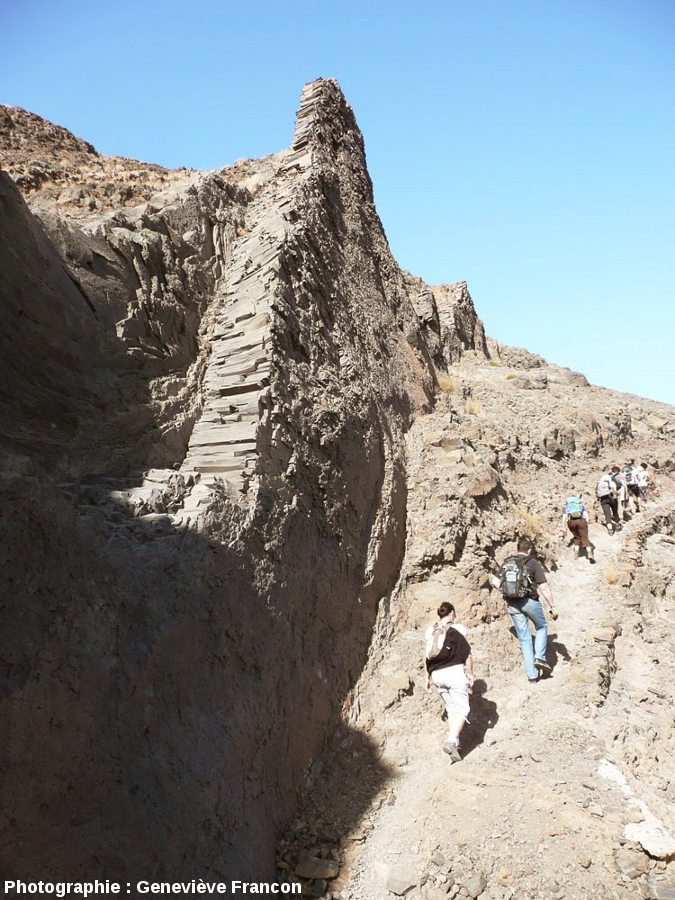
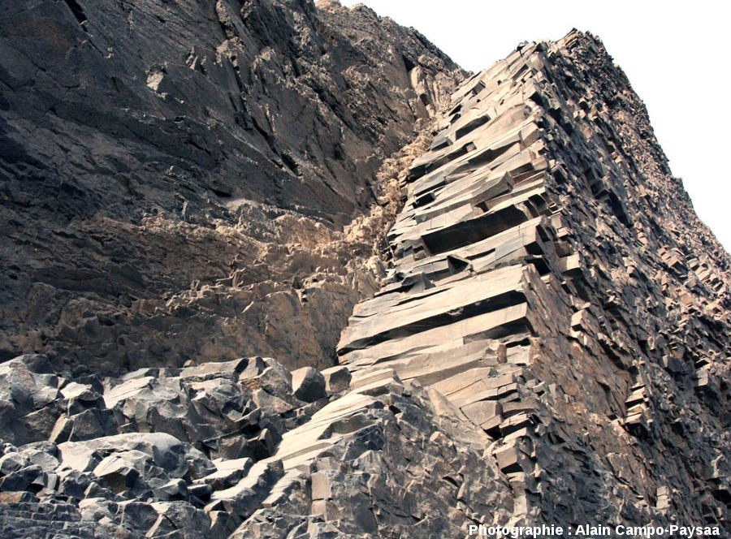
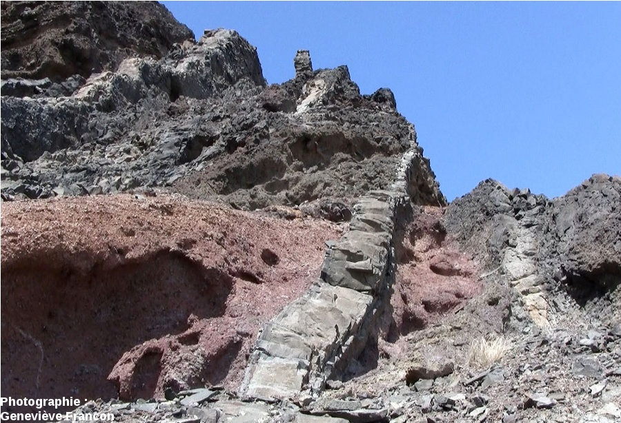

En ballade sur l'île de [São Vicente](https://fr.wikipedia.org/wiki/São_Vicente_(Cap-Vert)) au Cap-Vert j'ai remarqué des structures géologiques surprenantes : des murs de [basalte](https://fr.wikipedia.org/wiki/basalte) quasi verticaux, parfois encastrés dans des couches horizontales, parfois se détachant sur le ciel.

Sur beaucoup, la "prismation" du basalte est très visible mais ... horizontale [[2]](#ref-2). Et comme on en voit souvent plusieurs parallèles et que je suis très nul en géologie, je me suis demandé un moment si toute l'île n'avait pas basculé de 90° et mis ainsi à la verticale des coulées de lave horizontales...

 

Mais ce n'est pas ça du tout. Ce sont des "[dykes](https://fr.wikipedia.org/wiki/dyke)"\*, produits par de la lave très fluide qui s'infiltre dans des fissures que l'éruption crée dans des roches plus anciennes [[2]](#ref-2), [[3]](#ref-3). Bien isolée de l'air, la lave peut remplir des kilomètres de fissures très rapidement puis refroidir très lentement. Le basalte ainsi formé est beaucoup plus dur que les vieilles roches environnantes qui s'érodent beaucoup plus vite. Après quelques centaines de milliers d'années, d'étonnants murs naturels apparaissent.

J'ai un peu honte, mais je n'avais pas d'appareil photo décent à portée de main alors cet article est illustré par de très bonnes photos trouvées sur [[2]](#ref-2) où vous pouvez en admirer d'autres.

A part ça le Cap-Vert est un pays magnifique avec plein de choses à découvrir et des gens adorables dont beaucoup parlent français et le reste anglais. Destination chaudement recommandée.

Note \*: "dyke", ça veut dire "mur" en celte.

### Références

1. Alain Guillon "[La prismation des roches magmatiques](https://docs.google.com/viewer?url=http%3A%2F%2Fwww.volcanogeol.com%2Fprismation%2Fprismation.pdf)", 2003, Saga No 227
2. Pierre Thomas "[La prismation interne des dykes : exemple des dykes de l'île de Sao Vincente, Cap Vert](http://planet-terre.ens-lyon.fr/image-de-la-semaine/Img424-2013-05-20.xml)", 2013, ENS Lyon - Laboratoire de Géologie de Lyon
3. Bernard Duyck, "[Les structures ignées intrusives - dykes et sills.](http://www.earth-of-fire.com/article-les-structures-ignees-intrusives-dykes-et-sills-89423253.html "Parmi les plutons ")" 2011 sur Earth of Fire
