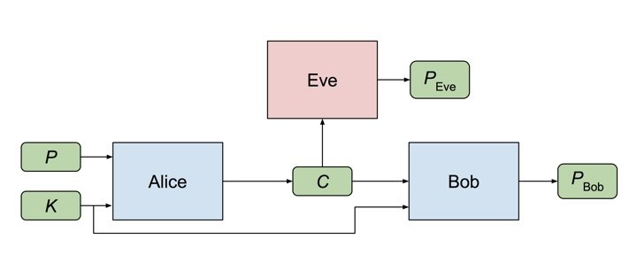
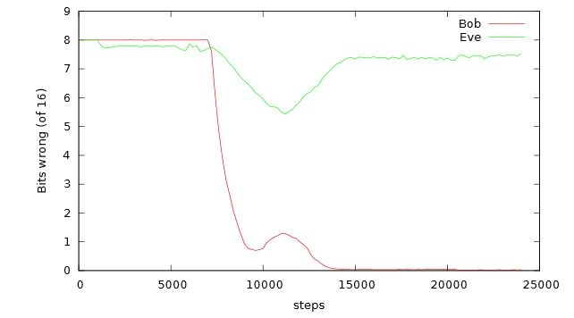

Des chercheurs de Google viennent de nous rapprocher un peu plus de la [singularité technologique](w:) en permettant à deux réseaux de neurones, [Alice et Bob](w:) de développer entre eux une méthode de cryptage qu'un troisième réseau de neurone, Eve, ne soit pas capable de décrypter [[1]](#ref-1)

Le schéma utilisé est celui de la [cryptographie symétrique](w:), illustré ci-dessus. Alice doit apprendre à crypter le message P, et Bob et Eve doivent apprendre à décrypter le message C. Le mot "adversial" dans le titre de l'article [[1]](#ref-1) peut se traduire par "carotte et bâton numériques": à chaque essai, l'apprentissage d'Alice et Bob est récompensé si plus de la moitié\* des bits de PBob correspondent à P, et puni si plus de la moitié de PEve correspond à P. Et Eve est récompensée si PEve correspond à P. Le seul avantage de Bob est qu'il reçoit également une "clé" K qu'Alice peut utiliser pour le cryptage, alors qu'Eve ne possède pas cette clé.

Les résultats se trouvent ci-dessous : pendant les 7000 premières itérations, Bob et Eve ne comprennent rien aux messages d'Alice. Puis tout à coup, en 2000 itérations supplémentaires, Bob "comprend" le cryptage d'Alice, mais Eve fait des progrès également. Alors, après 10000 étapes environ, Alice change un peu  son cryptage, probablement en y intégrant mieux la clé, et Alice Eve n'y comprend presque plus rien, alors que Bob, après une petite hésitation, arrive à décrypter parfaitement les messages d'Alice après 15000 étapes. Beau match !

Ce qui pourrait faire peur, c'est qu'aucun humain ne sait vraiment quelle méthode de cryptage Alice et Bob ont ainsi mis au point entre eux. On peut imaginer qu'un de ces jours Google pourra dire à la NSA : "désolés, on ne sait pas nous-mêmes comment décrypter les messages que vous voulez...". Mais ça prendra encore du temps, parce que ça ne marche pas (encore) pour la [cryptographie asymétrique](w:), mais aussi à cause de la "loi de Schneier".

### La loi de Schneier

[Bruce Schneier](w:) est mon gourou de sécurité informatique, et de sécurité tout court. Je suis assidument [son blog](https://www.schneier.com/blog) depuis que j'ai lu son excellent bouquin "[Liars and outliers](/2013/08/25/liars-and-outliers/)". Et à propos de la nouvelle ci-dessus, il s'est fendu d'un tout petit article [[2]](#ref-2) pour le moins critique que je vous traduis intégralement :

> Cette histoire concerne plus l'intelligence artificielle et les réseaux de neurones que la cryptographie. L'algorithme ne vaut rien mais est un parfait exemple de ce que j'ai entendu nommer "la loi de Schneier": n'importe qui peut concevoir un [chiffrement](w:) qu'il n'est pas capable de casser lui-même.

Son lien vers "Schneier's Law" mène à un de ses article datant de 2011 [[3]](#ref-3), où il relève que l'origine de cette idée remonte en fait au moins jusqu'à 1864, lorsque [Charles Babbage](w:) (oui, celui d'[Ada Lovelace](/2016/06/26/la-premiere-boucle/) !) écrivit dans son autobiographie [[4]](#ref-4):

> Une des caractéristiques les plus singulières dans l'art du déchiffrage est la forte conviction de chaque personne, même si elle n'est que modérément familiarisé avec cet art, qu'elle est capable de construire un chiffrement que personne d'autre ne peut décrypter.

En 1998, Schneier l'a reformulée ainsi:

> Tout le monde, de l'amateur le plus ingénu au meilleur cryptographe, peut créer un chiffrement qu'il n'est pas capable de casser. Ce n'est même pas difficile. Ce qui est difficile est de créer un algorithme que personne d'autre ne peut casser, même après des années d'analyse. Et la seule manière de prouver ceci est de soumettre l'algorithme à des années d'analyse par les meilleurs cryptographes disponibles.

C'est cette version que [Cory Doctorow](w:) a nommé "Loi de Schneier" dans une conférence en 2004 [[5]](#ref-5). Schneier considère aujourd'hui que "sa" loi est un exemple de l'[effet Dunning-Kruger](w:), le [biais cognitif](w:) selon lequel les moins qualifiés dans un domaine surestiment leur compétence...

Reste à voir si ce biais ne touche que les humains, ou aussi les réseaux de neurones artificiels...

Note\* : en tirant les bits à pile ou face, on obtient la moitié des bits du message original par hasard...

### Références:

1. Martin Abadi and David G. Andersen "[Learning to protect communications with adversarial neural cryptograph](https://arxiv.org/pdf/1610.06918v1.pdf)", 2016, arxiv=1610.06918v1
2. Bruce Schneier "[Teaching a Neural Network to Encrypt](https://www.schneier.com/blog/archives/2016/11/teaching_a_neur.html)" 2016
3. Bruce Schneier "[Schneier's Law](https://www.schneier.com/blog/archives/2011/04/schneiers_law.html)" 2011
4. Charles Babbage "Passages from the Life of a Philosopher", 1864 (extrait "[Charles Babbage and deciphering codes](http://www-history.mcs.st-and.ac.uk/history/Extras/Babbage_deciphering.html)")
5. Cory Doctorow, "[Microsoft Research DRM talk](http://craphound.com/msftdrm.txt)", June 17, 2004
6. Kruger, J., & Dunning, D. "[Unskilled and Unaware of It: How Difficulties in Recognizing One’s Own Incompetence Lead to Inflated Self-Assessments](http://citeseerx.ist.psu.edu/viewdoc/download?doi=10.1.1.64.2655&rep=rep1&type=pdf)", 1999. Journal of Personality and Social Psychology, 77(6), 121–1134. DOI:10.1.1.64.2655 PMID:10626367
