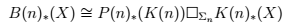



Urs Würgler, ancien recteur de l'Université de Berne et ou mathématicien est décédé il y a un an. Sur sa tombe, son épouse a fait graver la formule dont il était le plus fier\* qu'il avait trouvée :

Mais comme elle ne savait pas ce que ça signifie, j'ai été appelé à la rescousse par maman interposée. Ce fut l'occasion d'une intéressante plongée, ou plutôt ascension dans l'abstraction mathématique.

Au début je me suis dit qu'un problème de [LaTeX](https://fr.wikipedia.org/wiki/LaTeX) avait transformé un symbole bizarre en tofu\*\*, mais même sans ça cette formule ne ressemble pas du tout à une équation d'ingénieur.

En cherchant un peu dans les publications scientifiques d'Urs Würgler, j'ai découvert que sa formule est celle du Théorème 3.1 p. 121 de son (long) article [[1]](#ref-1) qui cause de [K-théorie de Morava](https://en.wikipedia.org/wiki/Morava_K-theory).

Vous ne savez pas ce que c'est ? Moi non plus. J'ai eu beau parcourir pas mal de pages Wikipédia et d'abstracts d'articles, je n'ai absolument pas réussi à saisir de quoi il s'agissait, sauf qu'apparemment les K(n) de la formule correspondent carrément à des "théories" mathématiques.

Alors je me suis dit que Lê, le jeune et fringant mathématicien de [Science4All](https://fr.science4all.org/) pourrait peut-être y voir plus clair, mais sa réponse m'a confirmé que ça vole très très haut dans les nuages de l'abstraction mathématique :

> J'ai bien peur que ça me dépasse très, très, très largement. J'estime à des années le temps qu'il me faudrait pour comprendre quelques éléments de cette K-théorie de Morava...  
> Je crois comprendre que ça a quelque chose à voir avec [cette vidéo Hardcore](https://www.youtube.com/watch?v=yHE4HC4vf3g) que j'ai faite (or cette vidéo fait déjà 1 heure et est Hardcore...).

Je confirme : la vidéo est hardcore. Mais elle vaut le détour ne serait-ce que pour l'enthousiasme légendaire de Lê :-) Et aussi pour cette citation d'[Henri Poincaré](https://fr.wikipedia.org/wiki/Henri_Poincaré) qui y est mentionnée:

> ### la mathématique est l'art de donner le même nom à des choses différentes

En effet, ce qui m'a surpris lors de cette immersion en maths inconnues, c'est d'y trouver ça et là des îlots connus au moins par leur nom (nombres premiers, [morphisme](https://fr.wikipedia.org/wiki/morphisme), [géométrie hyperbolique](https://fr.wikipedia.org/wiki/géométrie_hyperbolique)), des récifs aux noms trompeusement rassurants ([cohomologie](https://fr.wikipedia.org/wiki/cohomologie), [suite exacte](https://fr.wikipedia.org/wiki/suite_exacte)) et des monstres comme les [spectres topologiques](https://en.wikipedia.org/wiki/Spectrum_(topology)) .

Toutes ces choses semblent donc connectées dans le monde abstrait des mathématiques, mais que vient donc faire la fameuse formule là-dedans ?

J'ai alors cherché des pistes sur [MathOverflow](http://mathoverflow.net/), un site de questions/réponses souvent pointues. Je n'y ai trouvé qu'une seule référence à Urs Würgler dans la seule et unique réponse à une question intitulée "[Morava K(n)'s are not E∞](http://mathoverflow.net/questions/179204/morava-kns-are-not-e-infty)" qui se réfère à un autre de ses articles [[2]](#ref-2).



On trouve aussi sur MathOverflow une [cinquantaine de questions relatives à la K-theorie de Morava](http://mathoverflow.net/search?q=Morava+K-theory), mais elles n'ont qu'une réponse, voire moins ce qui confirme qu'il s'agit là d'un domaine très très pointu...

Mais j'y ai quand même trouvé une figure décorant une question (intéressante) où la K-théorie de Morava est mentionnée : [Que sait-on de la somme $x^{n^2}/n$ ?](http://mathoverflow.net/questions/146139/what-is-known-about-the-sum-xn2-n) . Aucune idée de ce qu'elle représente, mais comme elle est un peu colorée, elle va au moins servir à égayer un peu cet article.

### Les maths sont elles encore vulgarisables ?

A ce stade, je me suis demandé si les maths échappaient désormais à la vulgarisation, si les chercheurs avaient atteint un tel niveau d'abstraction qu'il ne leur était plus possible d'expliquer leur travail en langage humain.

Comme j'avais gagné une [toute petite réputation](http://mathoverflow.net/users/88768/dr-goulu) sur MathOverflow grâce à [ma réponse](http://mathoverflow.net/questions/178139/examples-of-unexpected-mathematical-images/233385#233385) sur [le fossé de Sloane](/2011/04/10/le-fosse-de-sloane/), j'y ai posé une question que j'ai intitulée "[Morava k-theories for dummies ?](http://mathoverflow.net/questions/255265/morava-k-theories-for-dummies)". Et à ma grande surprise j'ai reçu des réponses lisibles.

Ce qui m'a été le plus utile est un commentaire de [Denis Nardin](http://mathoverflow.net/users/43054/denis-nardin), doctorant en [topologie algébrique](https://fr.wikipedia.org/wiki/topologie_algébrique) au MIT:

> Ici K(n) et B(n) sont des [théories d'homologie](https://fr.wikipedia.org/wiki/Catégorie:Théorie_d'homologie), et la formule dit qu'on peut calculer l'homologie B(n) de X en termes de la K(n)-homologie de X (...). En termes intuitifs, ça dit que la K(n)-homologie donne l'information nécessaire pour aller du niveau n-1 au niveau n dans la tour chromatique. Mais je ne crois pas être capable d'expliquer pourquoi c'est un résultat important sans décrire toute la "chromatic homotopy theory".

Fort heureusement il y a une [page Wikipedia sur le sujet](https://en.wikipedia.org/wiki/chromatic_homotopy_theory) avec un lien vers [cette page-ci](https://ncatlab.org/nlab/show/chromatic+homotopy+theory) dans laquelle on trouve ce tableau:

| chromatic level | complex oriented cohomology theory | E-∞ ring / A-∞ ring | real oriented cohomology theory |
| --- | --- | --- | --- |
| 0 | ordinary cohomology | Eilenberg-MacLane spectrum | HZR-theory |
|  | 0th Morava K-theory | K(0) |  |
| 1 | complex K-theory | complex K-theory spectrum KU | KR-theory |
|  | first Morava K-theory | K(1) |  |
|  | first Morava E-theory | E(1) |  |
| 2 | elliptic cohomology | elliptic spectrum $Ell_E$ |  |
|  | second Morava K-theory | K(2) |  |
|  | second Morava E-theory | E(2) |  |
|  | algebraic K-theory of KU | K(KU) |  |
| 3 …10 | K3 cohomology | K3 spectrum |  |
| n | nth Morava K-theory | K(n) |  |
|  | nth Morava E-theory | E(n) | BPR-theory |
| n+1 | algebraic K-theory applied to chrom. level n | $K(E_n)$ (red-shift conjecture) |  |
| $\inf$ | complex cobordism cohomology | MU | MR-theory |

Un petit mail à [l'auteur](https://ncatlab.org/nlab/show/Urs+Schreiber) plus tard, j'avais la confirmation que cette table est bien la "tour chromatique", à l'envers car le niveau 0 est en haut, et le niveau infini en bas (aucun matheux ne peut s'arrêter au niveau n s'il peut apercevoir le niveau n+1 ...)

Donc voilà, Hélène : ce que je crois avoir compris, c'est que la formule d'Urs  dit comment passer d'une ligne de ce tableau à l'autre, ce qui permet en quelque sorte de "donner le même nom aux choses différentes" qui se trouvent dans les cases du tableau.

C'est donc du grand art mathématique. De l'art très abstrait, mais désormais gravé dans le marbre pour l'éternité.

### Références

1. Urs Würgler "[Morava K-theories-a-survey](/wp-content/uploads/2016/11/Wurgler-Morava-K-theories-A-survey.pdf)" 2006, in Lecture Notes in Mathematics Vol. 1474 (pp. 111–138). Springer Berlin Heidelberg. DOI : [10.1007/BFb0084741](http://doi.org/10.1007/BFb0084741)
2. Urs Würgler "Commutative ring-spectra of characteristic 2", 1986. Commentarii Mathematici Helvetici, 61(1), 33–45 DOI:[10.1007/BF02621900](http://doi.org/10.1007/BF02621900)

### Notes

\* édité le 7.12.16 après un e-mail de Mme Würgler disant:

> Une remarque cependant concernant  " une formule dont il était le plus fier " avez - vous écrit , c'est comme je l'avais compris , mais Urs n'était jamais content , il en voulait encore plus , donc tout est resté bien relatif . Très discret et humble , il ne se serait jamais vanté ayant trop de respect pour " les plus grands " .
> 
> (...)
> 
> Il voulait avancer toujours plus loin et ça s'est arrêté quand il a dû choisir  " recteur ou chercheur " et pas ... recteur et chercheur ! Vous pourriez peut - être écrire :  " la formule trouvée par ... "

\*\* en informatique, le "tofu" est ce carré blanc que les ordinateurs affichent à la place d'un caractère spécial qu'ils ne savent pas afficher
