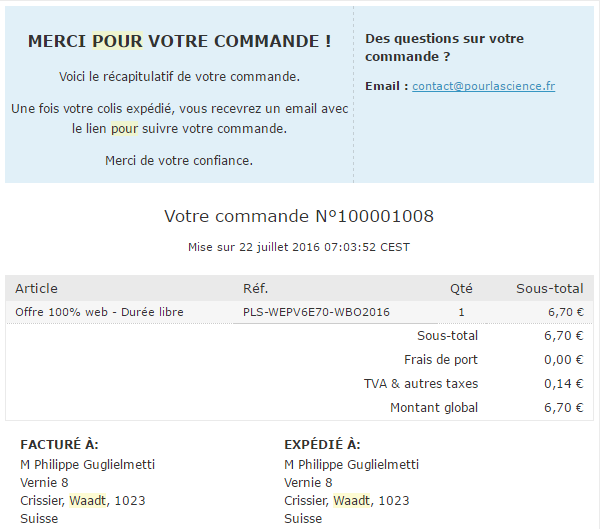
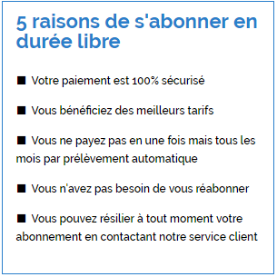
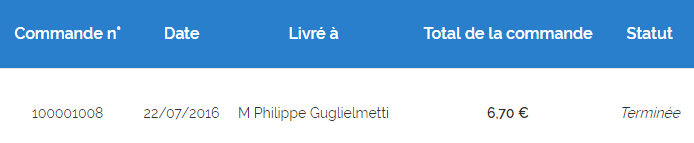
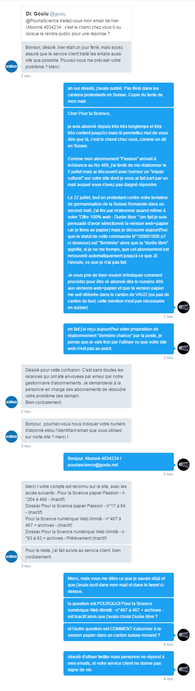



> Il n'y a qu'un patron : le client. Et il peut licencier tout le personnel, depuis le directeur jusqu'à l'employé, tout simplement en allant dépenser son argent ailleurs. ([Sam Walton](https://fr.wikipedia.org/wiki/Sam_Walton))

[Pour la science](https://fr.wikipedia.org/wiki/Pour_la_science) a beau être un excellent journal, il a oublié ce principe essentiel au point que je n'y suis plus abonné. Je recevrai désormais [Scientific American](https://fr.wikipedia.org/wiki/Scientific_American) à la place.

Mon père était abonné à Pour la science depuis le Numéro 2, en 1977. Grâce à eux, mon père et cet excellent journal, je suis "tombé dans la science quand j'étais petit", comme je l'écris parfois sur mes profils numériques. Vers 1988 je me suis abonné aussi et aujourd'hui, le numéro 1 est le seul qui manque à notre collection stockée avec amour dans le galetas. Mais le No 468 d'octobre 2016 sera probablement le dernier à y figurer.

Les lamentables services clients et abonnements de cet excellent journal font tout pour que je ne me réabonne pas. Et quand j'y parviens tout de même, ils "terminent" unilatéralement mon abonnement.

Le 5 juillet, sachant que mon abonnement arrivait à échéance, j'ai tenté de me réabonner sur leur site, mais un truc m'a fait bondir. J'ai immédiatement envoyé l'e-mail suivant à l'adresse pourlascience@abopress.fr  indiquée sur [ce formulaire](http://boutique.pourlascience.fr/contacts/):

> Bonjour, en remplissant mon adresse sous [http://boutique.pourlascience.fr/customer/address/edit/id/1957/](http://boutique.pourlascience.fr/customer/address/edit/id/1957/) je constate que vous forcez les lecteurs suisses à introduire un champ sous Etat/Region (alors que nous avons des Cantons), mais PIRE que les noms des Cantons francophones sont en allemand ! NON Madame ou Monsieur, je ne veux pas habiter le Canton du Wallis, de Genf ou de Waadt ! Né en Valais, j'ai quitté Genève pour Vaud. Et ailleurs en Suisse je me serais abonné à [Spektrum der Wissenschaft](https://de.wikipedia.org/wiki/Spektrum_der_Wissenschaft), pas à Pour la Science. Je renouvellerai mon abonnement quand vous aurez corrigé ça ;-)

Le petit smiley clin d'oeil n'a pas aidé : je n'ai jamais reçu de réponse. Alors le 22 juillet j'ai craqué et me suis abonné quand-même, avec une adresse pourrie : et j'ai envoyé cet e-mail à l'adresse indiquée pour les "questions sur votre commande" :

> Bonjour, sans nouvelles de vous suite à mon mail ci-dessous, je me suis résigné à renouveler mon abonnement germanisé. Mais si vous faites figurer "Waadt" sur l'adresse d'expédition de mon journal préféré depuis, il y a des chances non négligeables qu'un postier suisse vous le renvoie pour adresse inconnue, et votre barbarisme fera à coup sur l'objet de mon premier article négatif sur votre journal (les autres sont là : [http://drgoulu.local/tag/pour-la-science](http://drgoulu.local/tag/pour-la-science/) ) Oui c'est une menace ;-) Bon été, Franzosen.

Pas de réponse non plus... Mais bon au moins j'étais réabonné. Du moins je le croyais. Car je n'ai reçu aucun numéro !

Bon, en relisant le bulletin ci-dessus, je me suis aperçu que j'avais l' "Offre 100% web". Je suis persuadé avoir choisi la version papier+web, mais bon, peut-être ai-je cliqué au mauvais endroit... Par contre "Durée libre" est clairement défini [sur le site](http://boutique.pourlascience.fr/abonnement-web-illimite) et ci-contre: "Vous ne payez pas en une fois ... vous n'avez pas besoin de vous réabonner".

Mais là, avec le numéro d'octobre, je reçois un papier me disant que c'est le dernier numéro de mon abonnement. Et je constate que je ne peux plus accéder aux archives web que j'utilise abondamment et qui sont incluses dans les [abonnements web](http://boutique.pourlascience.fr/nos-offres-d-abonnement.html). Alors je vais consulter mon compte et je vois ceci :

 Mon abonnement "durée libre" est étrangement "terminé"... Alors j'envoie un 3ème mail le 1er novembre:

> Cher Pour la Science, je suis abonné depuis très très longtemps et très très content jusqu'ici mais là permettez-moi de vous dire que là, c'est le chenil chez vous, comme on dit en Suisse. Comme mon abonnement "Passion" arrivait à échéance au No 468, j'ai tenté de me réabonner le 5 juillet mais ai découvert avec horreur un "impair culturel" sur votre site dont je vous ai fait part par un mail auquel vous n'avez pas daigné répondre. Le 22 juillet, tout en protestant contre votre tentative de germanisation de la Suisse Romande dans un second mail, j'ai fini par m'abonner quand même à votre "Offre 100% web - Durée libre " (en fait je suis persuadé d'avoir sélectionné la version web+papier car je tiens au papier) mais je découvre aujourd'hui que le statut de cette commande N°100001008 (cf ci-dessous) est "Terminée" alors que la "durée libre" signifie, si je ne me trompe, que cet abonnement est renouvelé automatiquement jusqu'à ce que JE l'annule, ce que je n'ai pas fait. Je vous prie de bien vouloir m'indiquer comment procéder pour être ré-abonné dès le numéro 469 aux versions web+papier et que la version papier me soit délivrée dans le canton de VAUD (ou pas de canton du tout, cette mention n'est pas nécessaire en Suisse)

Cette fois je l'adresse aux deux adresses ci-dessus + à la responsable des abonnements dont le nom figure sur le bulletin d'abonnement "papier" que j'ai reçu en octobre. Toujours pas de réponse... Dernière chance : twitter. La conversation complète se trouve ci-dessous:

La réactivité est bonne, mais le twitteur n'a visiblement pas accès à mes mails (jamais confirmés), et ne lit pas ce que je lui écris puisqu'il me redemande mon No d'abonné qui figurait clairement dans mon premier tweet... Et un mois après, je n'ai toujours pas reçu de réponse. Mais j'ai reçu encore une lettre de réabonnement de la "dernière chance" adressée sans numéro postal (alors qu'il figure clairement sur mes données), preuve que Pour la Science a décidé de ne plus s'intéresser aux abonnés dépassant de l'hexagone.

En terminant cet article le 21 novembre je me suis encore dit que je devais laisser encore un chance à mon journal préféré d'éclaircir un éventuel malentendu et j'ai envoyé ce mail à la directrice de la rédaction et à la responsable des abonnements:

> Mesdames, je vous transmets ci-joint l'article que je publierai à grand regret sur mon blog d'ici une semaine. En signe de reconnaissance pour les presque 40 ans où votre excellent journal a grandement contribué à ma culture et ma formation, je vous laisse ainsi l'occasion d'y réagir rapidement. Ou pas.

3 semaines plus tard je n'ai toujours aucune réponse.

Mais j'ai reçu mon premier numéro de "Scientific American"...
