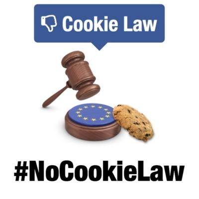
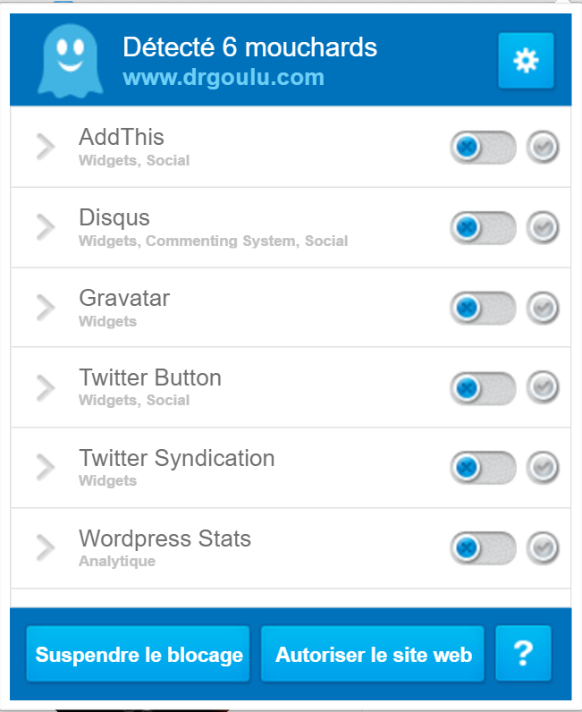

Quelques nouvelles en vrac à propos de ce site

### Cookies, DoNotTrack

L'Union Européenne ne me fait pas envie, surtout quand je vois une bande de technocrates désœuvrés (car apparemment il n'y avait rien de plus important à faire) édicter des lois inutiles, coûteuses et chiantes comme la "loi sur les cookies" [[1]](#ref-1). Elle est:

- Chiante parce qu'elle force de millions de gens à cliquer sur des millions de boutons \[OK\] chaque fois qu'ils arrivent sur un site.
- Coûteuse parce que des des milliers de propriétaires de sites web ont du ajouter des bannières du type "ce site bla bla cookies bla bla accepter \[OK\] " A 10 Euro par site, c'est une blague à centaines de millions. Et je ne sais pas combien de milliards de clicks seront fait sur les boutons \[OK\], mais un milliard de clicks à une seconde pièce, c'est 32 ans de précieuse vie humaine gâchée.
- Inutile parce que:
    - 99.99% des visiteurs ne savent pas ce qu'est un [cookie](w:cookie_(informatique)). La preuve : je ne sais pas très bien non plus comment ça marche. Donc on clique sur \[OK\] sans comprendre. Ou on installe des trucs comme [Cookie OK](https://chrome.google.com/webstore/detail/cookiesok/afmkbjoakcacgljcdccofbffloabfbni) ...
    - Sur 99% des sites, on ne peut pas continuer la visite en refusant les cookies. J'ai regardé comment implanter le "opt-out" et ce n'est pas simple parce qu'on ne sait pas vraiment quels cookies sont créés à quel moment, donc quand l'utilisateur clique le bouton \[Refuser\] s'il existe, les cookies sont déjà là. Et pour effacer après coup ceux qui ont été créés, c'est encore moins simple.
    - Il est beaucoup plus simple de [bloquer les cookies dans le navigateur](https://www.cnil.fr/fr/cookies-les-outils-pour-les-maitriser) ou en utilisant des outils comme [Ghostery](https://www.ghostery.com/), mon préféré

Ce blog étant hébergé en Suisse avec un nom de domaine en .com et ne visant pas particulièrement les visiteurs européens, je ne me sens absolument pas obligé de respecter la loi européenne en mettant une bannière. Mais j'ai tout de même réfléchi à la problématique et essayé pendant quelques heures les extensions WordPress "Cookie Law Info" et "Cookie Notice" avant d'opter pour une autre solution : [Do Not Track](w:) (DNT) via l'extension [WP DoNotTrack](https://fr.wordpress.org/plugins/wp-donottrack/) .

DNT est une recommandation du W3C [[2]](#ref-2) qui est bien mieux foutue que la loi européenne. Elle vous permet de configurer vos browsers ([Chrome](https://web.archive.org/web/20140722004930/https://support.google.com/chrome/answer/2790761?hl=fr) ou [autres](https://allaboutdnt.com/)) pour "interdire le suivi" de vos visites par des cookies. En réalité DNT est plutôt le mécanisme permettant d'informer les sites visités de ce choix, et il faudra encore quelques temps pour que les sites gèrent DNT. Sur drgoulu.com c'est déjà fait, donc vous disposez ici d'un site qui respecte vos droits et volonté sans bannière ni perte de temps.

J'utilise depuis assez longtemps [Ghostery](https://www.ghostery.com/) pour bloquer un certain nombre de [mouchards](w:logiciel_espion), alors je veille à ce que ce site n'en utilise qu'un minimum que je considère comme acceptables par moi-même. Actuellement, drgoulu.com n'utilise que les 6 listés ci-contre. Sur le site [LeMonde.fr](http://www.lemonde.fr/) (choisi totalement au hasard) il y en a 18, dont 6 qui figurent dans la (longue) liste des mouchards publicitaires.

### 2 minutes de publicité

Le blocage de publicité est un sujet largement débattu sur internet. Je sais et je comprends que la publicité est une, sinon LA source de revenus pour bon nombre de sites et pour les gens qui travaillent à fournir du contenu de qualité pour vivre et non pour le plaisir comme moi. Je désactive donc la publicité non par principe ou conviction, mais parce que les mouchards publicitaires sont selon moi les plus intrusifs et les plus discutables au sujet  du respect de la vie privée. En agrégeant vos données personnelles et les mots clés de multiples sites que vous visitez ils tracent votre profil pour vous proposer des publicités ciblées. Ca peut avoir de la valeur : il m'arrive souvent de cliquer sur un lien publicitaire dans Google lors d'une recherche professionnelle car la pub correspond alors effectivement à ce que je cherche.

Par contre, comme blogueur visitant de nombreux sites pour satisfaire ma curiosité, je saute au plafond lorsque je vois des pubs de voyantes et d'astrologues apparaître sur un site scientifique, "ciblées" sous prétexte que j'ai fait quelques recherches pour contrecarrer un [dangereux projet en cours sur la Wikipedia](w:Projet:Astrologie). Dans l'esprit des publicitaires "s'intéresser à" signifie trop automatiquement "être un client potentiel pour", or je refuse absolument que mon intérêt pour une croyance moyenâgeuse me fiche où que ce soit comme moyenâgeux ou pire, croyant. Donc je désactive.

Sauf que de plus en plus de sites détectent qu'on désactive les pubs et affichent un joli texte pour dire qu'on est méchants, et qu'il faut être gentil en acceptant les pubs pour qu'ils puissent payer leurs pauvres journalistes etc. Dans ce cas Ghostery permet d' "autoriser le site" le temps d'une visite. Mais les sites encore plus malins proposent de continuer à surfer sans pub pour pas cher, genre 1h pour 1€, et il m'est arrivé de payer. C'est peut-être un bon "business model" pour un site d'intérêt général.

En creusant la [problématique des ad-blockers](http://h16free.com/2016/03/25/50656-lerreur-persistante-de-la-presse-francaise), je suis tombé sur une autre approche très séduisante techniquement mais qui viole tous mes principes énoncés plus haut alors je ne veux pas en parler. Mais comme c'est un blog scientifique, ou technique en l'espèce, je le dois. Il s'agit de remplacer le fichier [hosts](w:) de votre machine par [un autre](https://web.archive.org/web/20160617013818/https://sourceforge.net/projects/adzhosts/), qui redirige tous les appels aux sites délivrant le contenu publicitaire dans le vide. Mais comme ça se fait sur votre machine, le site n'a aucun moyen de voir que les pubs ne s'affichent pas chez vous. Etil touche quand même les fractions de centimes de la pub. Et vos données personnelles sont collectées par les mouchards comme si vous aviez vu la pub. Donc peu d'intérêt de mon point de vue. Mais beau hack...

### Perles de recherche

Petit intermède sur une utilité amusante des mouchards ; le "WordPress Stats" mémorise les mots recherchés sur Google par les internautes avant qu'ils n'arrivent sur drgoulu.com. Je me régale en les parcourant de temps à autres. Petit florilège en V.O.:

- coment devenir paranormal
- je suis une scientifique et je n'ai pas le temps de prendre soin de moi
- de l amiente dans le plafond
- panthéisme cosmique
- heinstein et la religion

### Curation v.4

"Rien ne sert d'écrire, il faut curer à point" dirait la tortue virtuelle au lièvre du 21ème siècle. Je découvre parfois des sites très intéressants en me demandant pourquoi je ne les ai pas trouvés plus tôt. La réponse est toujours la même : parce qu'ils sont très mal référencés, voire pas du tout, sur les moteurs de recherche et les réseaux sociaux. Etre bien référencé demande un réel travail que j'ai pour ma part intégré à mon activité de [curation de contenu](w:).

En 2014 j'ai commencé le [paragraphe "Curation V.3" du "Bits en Vrac](/2014/04/09/bits-en-vrac/)" par ces mots : il n’y a toujours pas mieux pour suivre les sites intéressants que les [flux RSS](http://www.wikipedia.org/search-redirect.php?language=fr&go=Go&search=flux+RSS). Deux ans plus tard je maintiens, mais j'ai remplacé récemment [CommaFeed](https://www.commafeed.com/) par [InnoReader](http://www.inoreader.com/), encore meilleur pour les raisons que voici:

1. il permet d'intégrer aussi des fils Twitters, qui deviennent peu à peu une alternative aux flux RSS
2. On peut intégrer des règles pour automatiser certaines opérations comme classer les articles relatifs à un certain sujet dans un dossier spécifique, ou marquer automatiquement les publications des membres du Café des Sciences comme particulièrement intéressantes, ou encore marquer comme lus les articles qui ont le même titre qu'un autre paru moins de 24h plus tôt
3. Chaque dossier peut être partagé indépendamment. InnoReader génère par exemple [cette page listant tous les articles que je trouve intéressants](http://www.inoreader.com/stream/user/1005806813/tag/user-broadcasted/view/html) (et  évidemment aussi [le flux RSS correspondant](http://www.inoreader.com/stream/user/1005806813/tag/user-broadcasted)). Mais je partage aussi d'autres dossiers plus spécifiques, dont certains à usage professionnel : je peux ainsi faire de la "veille technologique" semi-automatisée sur certains sujets en consultant de temps en temps un flux d'articles de presse, de nouveaux brevets et de tweets de concurrents. Très utile...
4. Innoreader a un API vachement bien intégré par [IFTTT](https://ifttt.com/), permettant de partager automatiquement sur les réseaux sociaux le contenu que je marque comme intéressant. En particulier j'ai mis au point la [règle](https://ifttt.com/recipes/453739-tweet-innoreader-news) suivante qui twitte automatiquement en utilisant au mieux les 140 caractères autorisés sur Twitter:

En plus du titre et url qui sont disponibles dans n'importe quel flux, cette règle permet de mentionner clairement:

- l'auteur de l'article initial,
- un message que je peux ajouter au moment de la curation, et qui est parfois un lien vers un de mes propres articles sur le même sujet, parfois des #tags relevants
- des tags associés à l'article par Innoreader. Et il y en a joujours au moins un : le nom du dossier dans lequel l'article est rangé. Et ça, ça permet deux astuces:
    - si on a la bonne idée de faire commencer le nom des dossiers par un caractère #, le tweet aura automatiquement le hashtag correspondant
    - si on a l'idée tordue de le faire commencer par un @, on peut mentionner un compte twitter dans des tweets automatiques. C'est en principe interdit par les "Twitter Rules and Terms of Service" car ça permet de spammer un compte, mais je me suis permis de le faire pour en regroupant dans un dossier nommé "@cafe\_sciences" les articles des membres du Café, qui sont ainsi twittés et crédités 100% automatiquement.

Mon prochain article sera plus dépaysant, consacré à ma découverte de Islande. D'ici-là bonne reprise !

### Références

1. [Directive 2002/58 vie privée et communications électroniques](w:)
2. "[Tracking Preference Expression (DNT)](https://web.archive.org/web/20160913115638/https://www.w3.org/TR/tracking-dnt/)" W3C Candidate Recommendation 20 August 2015
