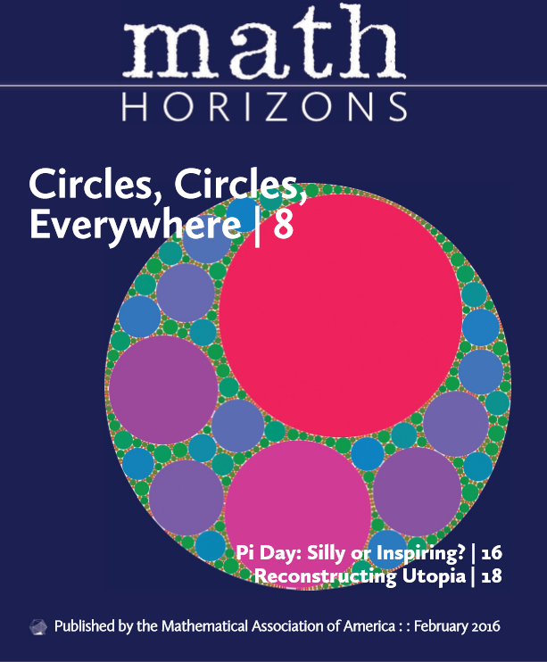



Suite à [mon article](/2011/10/03/pavages-aleatoires/) sur ses travaux en 2011, [John Shier](http://www.john-art.com/) m'a tenu au courant de l'avancement de ses recherches  sur les pavages aléatoires, application esthétique de ce qu'il appelle désormais la "[géométrie statistique](http://john-art.com/stat_geom.html)":

J'ai ainsi reçu un exemplaire papier de son livre (non encore publié) "Fractalize That" [[1]](#ref-1), deux articles co-écrits avec [Paul Bourke](http://paulbourke.net/) [[2]](#ref-2), [[3]](#ref-3), et tout récemment un article [[4]](#ref-4) sur lequel je reviendrai plus bas.

L'introduction du livre présente les [pavages](w:pavage) périodiques et [de Penrose](w:pavage_de_Penrose), mais aussi les pavages "fractals" comme le [Triangle de Sierpiński](w:) et les [cercles appoloniens](w:Cercle_d'Apollonius) avant d'introduire le principe du pavage aléatoire ("random tiling") par des pavés d'aire \\(A_i\\) décroissante selon la loi : \[mathjax\]$$A_i = {A \over \zeta(c,N)(N+i)^{c}}$$

où A est l'aire totale à recouvrir, et

$$\zeta(c,N) = \sum_{k=0}^\infty (N+k)^{-c}$$ la [fonction zêta de Hurwitz](w:fonction_zêta_de_Hurwitz),

et c et N deux constantes.

L'algorithme du pavage aléatoire de Shier s'énonce alors ainsi:

1. l'aire A étant donnée, choisir c>1 et N>0
2. évaluer \\(f=1/\\zeta(c,N)\\) et poser i=1
3. calculer l'aire du pavé \\(A_i = {Af \\over (N+i)^{c}}\\)
4. tirer au hasard des coordonnées x,y uniformément distribuées dans la surface A, plus éventuellement un angle a
5. si le pavé positionné en x,y,(a) empiète sur des pavés déjà placés, recommencer l'étape 4
6. si non, placer le pavé en x,y,(a)
7. incrémenter i et recommencer à l'étape 3

Le livre "Fractalize That" présente ensuite les applications à différentes formes carrés et rectangles, triangles et losanges, puis cercles, couronnes et autres pavés "troués", car l'algorithme ne concernant que les surfaces des pavés, il fonctionne en principe avec des pavés de n'importe quelle forme, permettant même de mixer des pavés de formes différentes dans un même pavage. John a ainsi produit une [incroyable variété d'oeuvres](http://john-art.com/stat_geom_sampler.html) dont le summum est à mon avis atteint avec des pavages de textes comme celui ci-contre. Je m'étais attaqué à ceci en 2011, mais je n'avais alors pas trouvé de librairie permettant de calculer la surface des caractères d'une police donnée.

D'autre part, la détection de collisions nécessaire au point 5 de l'algorithme est affreusement lente pour des formes complexes. En fait, l'algorithme est lent même pour la forme la plus simple qui est le cercle. Il a fallu 14,7 heures de calcul à l'ordinateur de John pour placer [un million de cercles](http://john-art.com/stat_geom_1meg.html) en faisant 1'690'697'421 essais de placement (étape 4 de l'algorithme). De plus, chaque essai de placement du i-ème pavé nécessite en fait i-1 vérifications à l'étape 5. La [complexité](w:complexité_algorithmique) de l'algorithme est donc au minimum de \\(O(n.log_2{n})\\) dans le cas miraculeux où les coordonnées x,y,(a) tirées aux hasard sont possibles du premier coup.

Ce que je trouve génial

 

 

### Références

1. [John Shier](http://www.john-art.com/) "Fractalize That : a Visual Essay on Statistical Geometry", 2014 (disponible sur demande auprès de l'auteur)
2. [John Shier](http://www.john-art.com/), Paul Bourke "[An Algorithm for Random Fractal Filling of Space](http://paulbourke.net/papers/shier2013/)", 2013, Computer Graphics Forum. The Eurographics Association and John Wiley & Sons Ltd.
3. [John Shier](http://www.john-art.com/), "[Wallpaper Groups and Statistical Geometry](http://john-art.com/wallpaper_symmetry_v2.pdf)", 2015
4. Christopher Ennis "(Always) Room for One More", [2016, Math Horizons, february](https://web.archive.org/web/20160207202313/http://www.maa.org/math-horizons-contents-february-2016)
