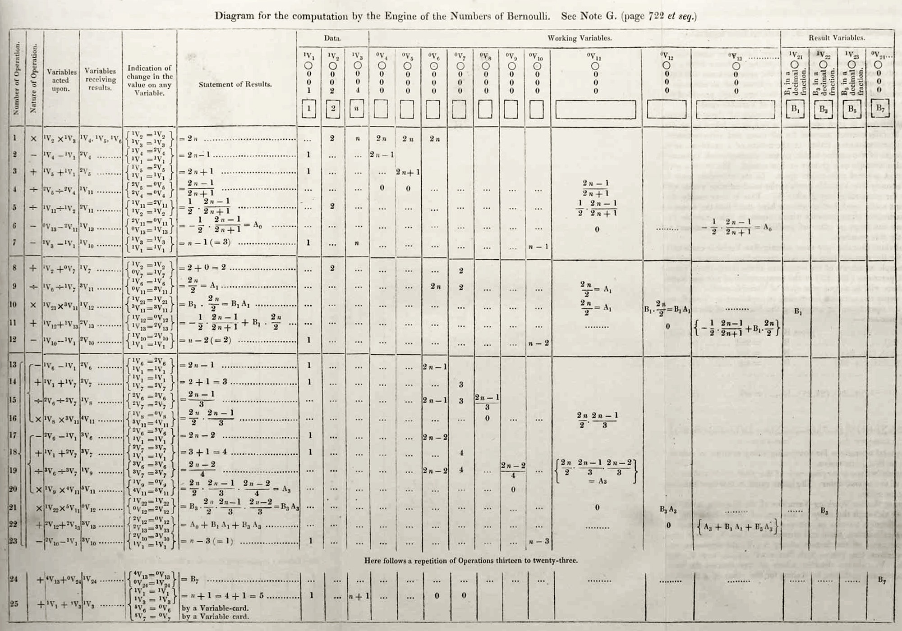



Comme d'autres sources fort sérieuses, Sirtin a récemment fait remonter l'origine de l'informatique aux métiers à tisser Jacquard, "programmables" par cartes perforées au tout début du XIXème siècle déjà [[1]](#ref-1). Pour ma part je n'adhère pas à cette filiation car les métiers Jacquard ne connaissaient pas la notion de [boucle conditionnelle](w:boucle_while) : si on voulait qu'ils tissent 123 fois un motif, il fallait répéter 123 fois la même séquence de petits trous sur les cartes perforées. Autrement dit ces cartes perforées ne contenaient pas un programme mais des données pour un lecteur qui ne faisait que commander des éléments mécaniques indépendants.

Une idée fondatrice de la programmation, c'est de pouvoir coder "répète 123 fois ceci:", et que la machine ait un moyen de compter jusqu'à 123, ce qui implique l'existence d'une mémoire dont le contenu est modifié par les instructions du programme. Comme l'a très bien exprimé Alan Perlis dans un de ses [fameux "perlisismes"](/2008/01/21/perlisismes-les-dictons-informatiques-dalan-perlis/) :

> Un programme sans boucle et sans structure de données ne vaut pas la peine d’être écrit.



Alors qui a écrit le premier programme valant la peine d'être écrit, la première boucle ? C'est [Augusta Ada King, comtesse de Lovelace](w:Ada_Lovelace). Parfaitement : une femme [[3]](#ref-3). Et ceci bien avant qu'[Alan Turing](w:) ne propose sa [machine](w:Machine_de_Turing), dont l'intérêt est surtout théorique.

Au contraire, Ada Lovelace a travaillé avec [Charles Babbage](w:) sur un problème bien pratique : établir des tables nautiques, astronomiques et mathématiques exactes en automatisant leur calcul, car à l'époque ces tables calculées à la main étaient truffées d'erreurs. Des [calculatrices mécaniques](w:calculatrice_mécanique) comme la [Pascaline](w:) ou la "multiplicatrice" de [Leibniz](w:) facilitaient déjà le travail, mais Babbage voulut construire une "[machine à différences](w:)" capable de produire des tables en évaluant des polynômes de manière itérative. Tout en la construisant, il se lança dans la conception d'une "[machine analytique](w:)"  réellement programmable, et dotée notamment d'une mémoire et d'un mécanisme de [branchement conditionnel](w:branchement) qui permettait l'exécution de boucles. Un hardware au sens propre : tout en rouages et cames propulsées à la vapeur...

Et c'est Ada Lovelace qui s'est attaquée au "software". Imaginez que vous soyez à sa place et que vous disposiez de la première et unique calculatrice programmable de l'histoire, qui coûte des millions de livres de l'époque et dont la fiabilité précaire rend chaque opération précieuse. Que proposez-vous comme programme qui "vaut la peine d'être écrit" ? Certainement pas for i=1 to 100:print i; ni les nombres de Fibonacci ou les nombres premiers qu'on connait déjà. Ce qu'Ada a choisi pour le premier programme de l'histoire, c'est de calculer les [nombres de Bernoulli](w:) dont je vous ai [causé très récemment](/2016/05/31/pyramides-et-sommes-de-puissances/). Pourquoi ? Parce qu'avec eux et la [Formule d'Euler-Maclaurin](w:) on peut calculer plein de tables et d'intégrales utiles.

Lady Ada a donc écrit le premier programme utile de l'histoire, que voici [[4]](#ref-4), [[5]](#ref-5):

Les boucles sont indiquées par les accolades dans les premières colonnes et par le texte "here follows a repetition of Operations thirteen to twenty-three". La fameuse "Note G" rédigée par Ada Lovelace au base de [[6]](#ref-6) montre clairement qu'elle a inventé les notions de variables et de boucle en programmation:

> It will be perceived that every unit added to _n_ in B2_n_-1, entails an additional repetition of operations (13…23) for the computation of B2_n_-1. Not only are all the _operations_ precisely the same however for every such repetition, but they require to be respectively supplied with numbers from the very_same pairs of columns_; with only the one exception of Operation 21, which will of course need B5 (from V23) instead of B3 (from V22). This identity in the _columns_ which supply the requisite numbers must not be confounded with identity in the _values_ those columns have upon them and give out to the mill. Most of those values undergo alterations during a performance of the operations (13…23), and consequently the columns present a new set of values for the _next_ performance of (13…23) to work on



Et accessoirement que Madame Lovelace commentait son code en prose intelligible, une habitude qui se perd. Exemple : le code ci-contre qui calcule les nombres de Bernoulli en  [JavaScript](w:JavaScript) et hélas pas en [langage ADA](w:Ada_\(langage\)), baptisé ainsi en l'honneur de la première véritable programmeuse de l'histoire.

Mais on l'a longtemps oubliée car son code n'a hélas jamais pu être exécuté : la machine analytique de Babbage avait trop de frottements, trop d'imprécisions mécaniques, elle n'a jamais fonctionné...

Le premier calculateur réellement programmable ayant fonctionné est, n'en déplaise aux cow-boys, allemand. Le [Zuse 3](w:) de [Konrad Zuse](w:) a été construit en 1941 et détruit lors d'un bombardement en 1943, mais entre deux il a été utilisé pour calculer des choses et donné naissance au premier "vrai" langage de programmation de l'histoire : [Plankalkül](w:) [[7]](#ref-7). Cependant, le Z3 ne permettait pas le [branchement conditionnel](w:) qui semble aujourd'hui indispensable à toute boucle utile. Mais comme expliqué dans [[8]](#ref-8) et [[9]](#ref-9), le Z3 était bel et bien [Turing-complet](w:) grâce à deux horribles magouilles:

1. on pouvait assigner le résultat binaire d'un test à une variable, par exemple if i>123 then t=0 else t=1; puis utiliser cette variable pour coder les deux "branches" correspondant au "then" et au "else" en codant des formules comme a=t\*x+(1-t)\*y; qui fait a=x ou a=y selon la valeur de t
2. on pouvait effectuer une boucle infinie en scotchant la fin de la bande perforée au début pour qu'elle tourne en rond, et rendre la boucle finie avec un code du genre a=a/t qui ne faisait rien tant que t=1, et provoquait une erreur "division par zéro" quand t=0, ce qui arrêtait la machine. Beark! Mais efficace.

C'est sans aucun doute Konrad Zuse qui a fait tourner la première boucle conditionnelle de l'histoire, mais hélas on ne sait plus quel était le premier programme à utiliser cette possibilité.



Comme ce sont les vainqueurs qui écrivent l'histoire, je termine en mentionnant tout de même l'[ENIAC](w:), qui fut la première machine Turing-complète électronique. Conçue par [John von Neumann](w:) selon l'architecture qui est toujours celle des ordinateurs actuels. Cette machine est la première a être programmable au sens moderne du terme avec mémoire, branchements conditionnels, boucles, et femmes.

En effet, avant chaque calcul, les différentes unités de l'ENIAC doivent être reconfigurées par câblage, une tâche dévolue aux 6 "[ENIAC Girls](w:en:ENIAC#ENIAC_Girls)" Kay McNulty, Betty Jennings, Betty Snyder, Marlyn Wescoff, Fran Bilas et Ruth Lichterman. Elles aussi longtemps oubliées par l'histoire, un récent reportage [[10]](#ref-10) leur rend un hommage mérité. J'en ai retenu une phrase :

> "The ENIAC was a son of a bitch to program"

On dit souvent que l'ENIAC a servi au calcul de la bombe atomique. Ca dépend laquelle : [Trinity](w:Trinity_\(essai_atomique\)), Hiroshima et Nagasaki ont eu lieu en 1945, avant qu'ENIAC soit opérationnelle en 1946. Mais ENIAC a effectivement été utilisée pour le développement des armes nucléaires américaines dans les années 1950. Par exemple le petit bout de code ci-contre provient d'un programme de calcul par la [méthode de Monte-Carlo](w:) des neutrons diffusés lors de la fission nucléaire. Et ce code est du à [Klara von Neumann](w:en:Klara_Dan_von_Neumann), la femme de John. Oui, encore une femme.

Qui ose encore prétendre que l'informatique est un truc de mecs ?

### Références

1. "Le tissage à l’origine de l’informatique ?" [part 1](https://web.archive.org/web/20160617230601/http://www.sirtin.fr/2016/06/11/le-tissage-a-lorigine-de-linformatique-2/), [part 2](https://web.archive.org/web/20160617230601/http://www.sirtin.fr/2016/06/11/le-tissage-a-lorigine-de-linformatique-2/) et [part 3](https://web.archive.org/web/20160621144848/http://www.sirtin.fr/2016/06/18/le-tissage-a-lorigine-de-linformatique-3/) chez Sirtin
2. Christian Braesch "[Les origines de l'informatique](http://www.christian.braesch.fr/page/les-origines-de-linformatique)"
3. Anne-Marie Kermarrec "[La visionnaire Ada Lovelace](http://binaire.blog.lemonde.fr/2015/03/07/la-visionnaire-ada-lovelace/)", 2015, Binaire, Le Monde
4. Steven Goodwin "[Ada99 : computing the Bernoulli numbers"](https://marquisdegeek.com/code_ada99)
5. Eugene Eric Kim, Betty Alexandra Toole, "Lady Ada et le premier ordinateur", 1999, Pour la science No 261,p 64‑69. ([pdf de la version Scientific American)](https://docs.google.com/viewer?url=http%3A%2F%2Fwww.cs.virginia.edu%2F~robins%2FAda_and_the_First_Computer.pdf)
6. L. F. Menebrea, "[Sketch of the Analytical engine invented by Charles Babbage](https://www.fourmilab.ch/babbage/sketch.html)" Bibliothèque Universelle de Genève,  Octobre 1842, No. 82, ([sur fourmilab](https://www.fourmilab.ch/babbage/sketch.html))
7. Bram Bruines "[Plankalkül](https://laacz.lv/f/txt/Bram_Bruines___0213837___Plankalkul.pdf)", 2010
8. [Is conditional branching a requirement of Turing-completeness?](https://web.archive.org/web/20160722071456/http://stackoverflow.com/questions/4029769/is-conditional-branching-a-requirement-of-turing-completeness) sur StackOverflow
9. Raul Rojas"[How to Make Zuse's Z3 a Universal Computer](http://citeseerx.ist.psu.edu/viewdoc/download?doi=10.1.1.37.665&rep=rep1&type=pdf)", 1998
10. [The Computers: The Remarkable Story of the ENIAC Programmers](http://eniacprogrammers.org/) sur [Vimeo](https://web.archive.org/web/20160625054910/https://vimeo.com/ondemand/eniac6)
11. Len Shustek "[Programming the ENIAC: an example of why computer history is hard](http://www.computerhistory.org/atchm/programming-the-eniac-an-example-of-why-computer-history-is-hard/)", 2016
