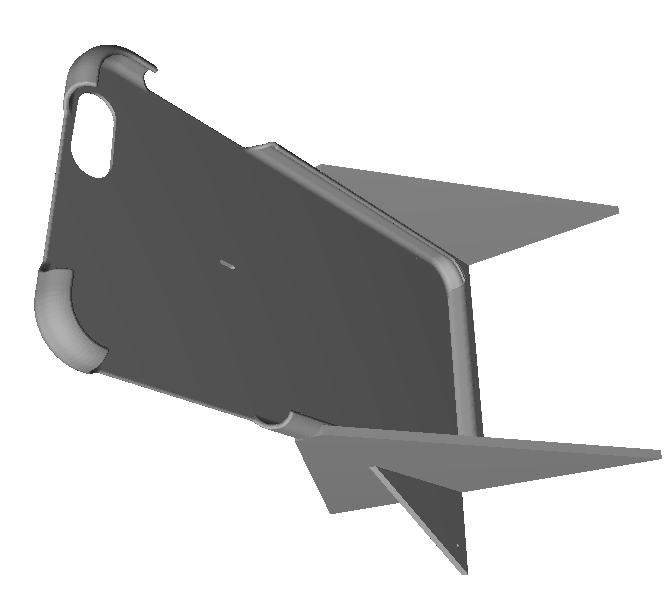

[Nicolas Vuignier](http://www.nico.ski/) est un freerider professionnel (suisse) et un inventeur génial : en faisant tournoyer sa caméra autour de lui comme une fronde, il a réussi à réaliser un effet spectaculaire similaire au [bullet time](w:) . Séquence émotion :



La première chose qu'on se dit en voyant ça est qu'on veut faire la même chose, et la seconde est "oui, mais comment stabiliser la caméra ?".

Combien faut-il de fils ? Faut-il des ailes ? Et on imagine le nombre de précieux smartphones, éjectés, crashés, perdus dans la poudreuse ou pulvérisés contre les rochers lors des essais...

Heureusement Nicolas Vuignier est sympa, et pense plus à notre porte-monnaie qu'au sien : au lieu de breveter son système, il en fait cadeau.

Sur [http://open.centriphone.me/](https://web.archive.org/web/20160302215950/http://open.centriphone.me/) il offre les plans de deux versions de son montage, simple, mais pas évident de prime abord :

1. la version "2D" à découper dans une mince planche de bois, mais plutôt pour une caméra GoPro ou similaire que pour un iPhone
2. la version coque pour iPhone imprimable en 3D

Sur [sa chaîne YouTube](https://www.youtube.com/user/nicolascsz) magnifique par ailleurs, on trouve le "[making of](https://www.youtube.com/watch?v=d45oGNv8H98)" de la video ci-dessus qui montre que ça n'a pas été sans difficultés.

Alors merci et bravo Nicolas pour le partage de cette idée et de sa réalisation, ainsi que pour ces magnifiques images de saison. Et pour le sujet de ce bref article qui montre qu'on peut encore inventer des trucs simples dans ce monde très technologique.
