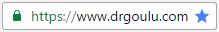

Ca fait un moment que je pensais le faire, et je craignais que ce soit compliqué. Mais hier soir je me suis lancé, et en un peu plus d'une heure ce site est passé sous [HTTPS](https://fr.wikipedia.org/wiki/HTTPS) : 

### Pourquoi ?

Les révélations de Snowden\* et les piratages de plus en plus massifs ont fini de convaincre la plupart des géants du web, mais aussi des petits nains comme vous (?) et moi: internet sera encrypté, ou ne sera plus. Pour encourager la sécurisation du web, Google Chrome va très bientôt marquer comme "Not secure" les sites encore en HTTP  ainsi : . Google va probablement aussi les défavoriser dans les résultats du moteur de recherche le plus utilisé du système solaire et environs. Rien que pour ça, il faut convertir les sites à HTTPS.



J'espère aussi être débarrassé de la nuisance que représente le "[SmartScreen](https://en.wikipedia.org/wiki/SmartScreen)" de Microsoft sur Internet Explorer. Il semblerait qu'il suffise à quelques personnes mal intentionnées de cocher "Report this website as unsafe" dans IE pour que mon tout beau site tout propre affiche la page ci-contre, fort dissuasive. Il aurait apparemment suffi que suffisamment de gentils lecteurs cliquent "Report that this site does not contain threats", mais il faut évidemment cliquer sur "More information" d'abord pour le voir... On m'a informé 3x de ceci, et à chaque fois j'ai du remplir un gros formulaire, tellement caché sur le monstrueux site de Microsoft que je ne le retrouve plus, pour dire que j'étais un gentil. Hier c'était la fois de trop : ma propre maman m'a suspecté de phishing ! ;-) Alors j'ai commencé par me dire "tant pis pour les 7% de [laggards](https://en.wikipedia.org/wiki/Diffusion_of_innovations) qui utilisent encore IE", puis "y'en a peut-être que 7% parce que les autres ont eu peur à cause de SmartScreen" puis "peut-être qu'en HTTPS ça ira mieux, on y va!"

### Comment

Il y a peu de temps encore, obtenir un [certificat électronique](https://fr.wikipedia.org/wiki/certificat_électronique) (SSL) était cher et compliqué car il fallait prouver son identité réelle à un organisme distant et très virtuel. Puis mon excellent hébergeur Infomaniak a annoncé qu'ils offraient des certificats gratuitement à leurs clients, authentifiés par leurs factures, via l'initiative [Let's Encrypt](https://letsencrypt.org/). Concrètement il m'a suffi de cocher une case de l'interface d'administration et un certificat a été installé en quelques secondes.

Ensuite il faut reconfigurer le site pour qu'il utilise HTTPS plutôt qu'HTTP. Suivant [ces instructions](https://www.infomaniak.com/fr/support/faq/1961/rediriger-tous-les-visiteurs-sur-le-site-avec-https-ssl) , j'ai installé le plugin WordPress [Really Simple SSL](https://fr.wordpress.org/plugins/really-simple-ssl/), et constaté qu'il était bien nommé: rien à configurer, presque tout roulait après quelques minutes. Mais seulement "presque".

D'abord, mon site n'affichait pas le joli cadenas vert mais une info comme quoi mes pages avaient  du "contenu hybride", à savoir que certains objets provenaient de la version HTTP non sécurisée de drgoulu.com. A l'aide du génial inspecteur Chrome, j'ai rapidement identifié que le coupable était... mon [image de bannière](/2008/05/30/le-big-bang-en-une-image/) ! En effet, j'avais bêtement mis "/wp-content/uploads/2013/04/drgbanner.png" comme background dans la feuille de style CSS du "[thème](http://docs.presscustomizr.com/article/24-creating-a-child-theme-for-customizr)" de ce site. Un petit coup d'éditeur après c'était résolu : le cadenas vert était là !

Puis je me suis aperçu que le widget de [Scoop.it](http://www.scoop.it/t/c-fe-des-sciences) qui affiche les derniers articles de mes camarades du Café des Sciences dans la colonne de droite avait purement et simplement disparu. En découvrant que le code du widget fourni par scoop.it était dorénavant

\[html\]<iframe src="//www.scoop.it/embed-topic/803493.html?maxwidth=300"  width='300' height='300' frameBorder='0' scrolling='no'></iframe>\[/html\]

j'ai appris quelque chose : il n'est pas/plus obligatoire de spécifier http: ou https: dans une url ! On peut utiliser  une "[PRURL](https://en.wikipedia.org/wiki/Uniform_Resource_Locator#prurl)". C'est actuellement âprement discuté dans les "milieux autorisés", mais en attendant mieux, ça a l'intérêt de marcher.

Enfin j'ai remarqué que tous les commentaires avaient disparu du bas des articles ! Pas de panique, c'est juste [Disqus](https://disqus.com/) qui a perdu le fil puisque les URL de toutes les pages ont changé. En suivant [leurs instructions](https://help.disqus.com/customer/portal/articles/286778-migration-tools) je me suis dit qu'ils auraient quand même pu se fendre d'un truc simple pour passer de HTTP à HTTPS... Mais comme ils ne l'ont pas fait, j'ai téléchargé le "[URL map CSV](https://help.disqus.com/customer/portal/articles/912757-url-mapper)" contenant l'url des 734 pages de ce site sur lesquelles il y a des commentaires, je l'ai ouvert dans [Google Sheets](https://www.google.com/intl/fr_ch/sheets/about/) car je n'ai pas et n'achèterai plus jamais de licence MS Excel, j'ai copié/collé la première colonne dans la seconde, et cherché/remplacé tous les "http:" par "https:" dans celle-ci, exporté en csv, uploadé sur le site Disqus, et après quelques minutes les commentaires ont réapparu.

### Combien

Reste encore un petit problème à traiter par ceux qui utilisent  [Google Analytics](https://fr.wikipedia.org/wiki/Google_Analytics) ou similaire. ( Je le fais plus par curiosité que par nécessité.) Les données ne seront plus collectées si on change l'adresse de base du site : il faut reconfigurer sa "propriété" dans Analytics en définissant la nouvelle adresse de base https:// ...

Voilà, tout est donc bien encrypté dans le meilleur des monde paranoïaque. Mais dans un prochain épisode je vous montrerai que le sentiment de sécurité que vous inspire le petit cadenas vert peut être fort illusoire ...

Note \* : ayant vu le [film sur Snowden](https://fr.wikipedia.org/wiki/Snowden_(film)) et quelques uns de ses interviews notamment le ["Pardonnez moi" avec Darius Rochebin](http://www.rts.ch/info/suisse/6637002-edward-snowden-la-suisse-la-cia-et-son-possible-refuge-en-suisse.html), je pense que ce type remarquable entrera dans l'Histoire. Il est de la trempe d'un Nelson Mandela, prêt à se sacrifier, et probablement à passer de nombreuses années en prison pour des principes fondamentaux. Peut-être qu'il sera Président, un jour ...

### Références

1. Emily Schechter "[Moving towards a more secure web](https://security.googleblog.com/2016/09/moving-towards-more-secure-web.html)", September 8, 2016, Google Chrome Security Team
2. Christophe Kasse "[Le point sur les certificats SSL, obligatoires en 2017](https://wpchannel.com/point-certificats-ssl-obligatoires-2017/)", 28 novembre 2016 sur WPChannel
3. "[2017, l’année pour sécuriser vos sites avec un certificat SSL](https://news.infomaniak.com/securiser-site-avec-certificat-ssl/)" sur Infomaniak.com
