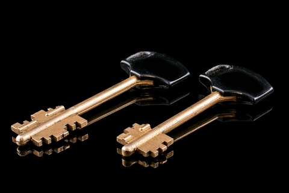
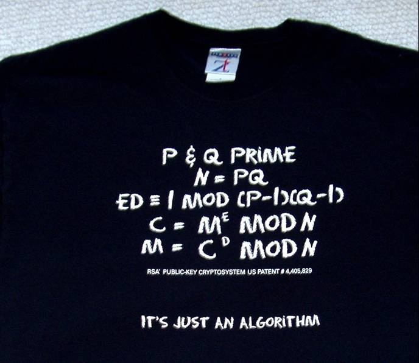

A la fin de mon [article sur HTTPS](http://drgoulu.local/2017/01/11/drgoulu-com-passe-en-https/), j'ai promis d'expliquer pourquoi il ne faut pas trop se fier au petit cadenas vert que vous voyez de plus en plus souvent en haut de votre navigateur favori.  Mais pour éviter un article trop long, je dois d'abord expliquer comment Alice et Bob s'échangent des messages sécurisés depuis 1977.

### Petit rappel historique

Depuis l'Antiquité, [Alice et Bob](https://fr.wikipedia.org/wiki/Alice et_Bob) ont utilisé des [clefs symétriques](https://fr.wikipedia.org/wiki/Cryptographie_symétrique) pour chiffrer et déchiffrer leurs messages secrets. La sécurité de leur transmission [chiffrée](https://fr.wikipedia.org/wiki/chiffrement) reposait donc sur le secret de la clé : si [Trudy l'ennemie](https://fr.wikipedia.org/wiki/Alice_et_Bob#Adversaires) arrivait à l'intercepter, c'était cuit.

Pourtant, [comme nous l'avions vu](http://drgoulu.local/2013/03/09/alice-bob-coffre-xor/) dans un épisode précédent, il existe des méthodes étonnamment simples permettant à Alice et Bob de s'envoyer des messages indécryptables utilisant des clés qu'ils n'ont pas besoin de s'échanger. Mais si [Eve la curieuse](https://fr.wikipedia.org/wiki/Alice_et_Bob#Adversaires) parvient à écouter les 3 messages échangés, elle peut reconstituer les clés, et c'est cuit aussi.

### Les géniales clés de Ronald, Adi et Leonard

Puis, en 1977, [Ronald Rivest](https://fr.wikipedia.org/wiki/Ronald_Rivest), [Adi Shamir](https://fr.wikipedia.org/wiki/Adi_Shamir) et [Leonard Adleman](https://fr.wikipedia.org/wiki/Leonard_Adleman) ont inventé quelque chose d'incroyable : le [chiffrement RSA](https://fr.wikipedia.org/wiki/chiffrement_RSA). Avec leur méthode, la clé permettant le déchiffrement\* d'un message n'est pas la même que la clé qui permet de le chiffrer : les [clés sont "asymétriques"](https://fr.wikipedia.org/wiki/cryptographie_asymétrique). En voici le principe simplifié (pour les détails, voir le T-shirt ci-contre, ou le brevet [[1]](#ref-1)) :

1. Bob choisit 2 nombres premiers P et Q assez grands, disons d'environ 150 chiffres. C'est très facile, comme [je l'avais expliqué ici](http://drgoulu.local/2012/04/15/comment-produire-des-nombres-premiers/). Ces deux nombres permettent à Bob de calculer sa "clé privée" D, qu'il garde jalousement pour lui.
2. Il calcule le produit des deux nombres N=P.Q, ainsi qu'un nombre E qui forment sa "clé publique", qu'il transmet sans crainte à Alice. En effet, si Trudy intercepte cette clé publique, ce n'est pas grave, car elle ne disposera pas avant [quelques décennies](http://drgoulu.local/2011/05/19/et-un-ordinateur-quantique-un/) d'un ordinateur assez puissant pour factoriser N et retrouver les nombres P,Q et de là le D nécessaire au déchiffrement.
3. Pour envoyer un message à Bob, Alice le découpe en blocs de nombres M qu'elle élève à la puissance E avant de calculer les restes C modulo N, qu'elle envoie à Bob. Si Eve écoute les messages C, elle ne peut pas reconstituer le message M, même en connaissant E et N car elle aurait besoin de quelques siècles pour qu'un ordinateur calcule le  [logarithme discret](https://fr.wikipedia.org/wiki/logarithme_discret) nécessaire.
4. Utilisant sa clé privée, Bob élève C à la puissance D,  et le reste modulo N n'est autre que le message M d'Alice en clair, par la grâce et la beauté des maths, et l'ingéniosité de Ronald, Adi et Leonard.

### "Bisous, Alice"

Mais Eve peut faire quelque chose de presque aussi embêtant que de décrypter\* les messages d'Alice : elle peut envoyer de faux messages à Bob en se faisant passer pour Alice. En fait, comme Bob a transmis sa "clé publique" sans précautions, tout le monde peut lui envoyer des messages cryptés signés "Bisous, Alice" sans qu'il soit capable d'en authentifier l'auteur réel.

Heureusement, Ronald, Adi et Leonard ont pensé à ça: leur méthode permet d'utiliser les clés publiques et privées "à l'envers" pour réaliser une [signature numérique](https://fr.wikipedia.org/wiki/signature_numérique):

1. Alice a également une clé privée qu'elle est la seule à connaître, et une clé publique que Bob a reçue, mais qu'Eve, vous et moi pouvons aussi connaître.
2. Lorsqu'elle envoie un message M à Bob, elle utilise une "fonction de hachage" comme les fameuses [SHA](https://fr.wikipedia.org/wiki/Secure_Hash_Algorithm) pour obtenir une [empreinte numérique](https://fr.wikipedia.org/wiki/empreinte_numérique) E de son message
3. Là elle fait un truc bizarre : elle encrypte l'empreinte E avec sa clé privée. Oui, privée ! Elle obtient ainsi une signature S
4. Elle "signe" le message M en lui ajoutant l'empreinte cryptée S, crypte le tout avec la clé publique de Bob, et lui envoie le message C.
5. Comme ci-dessus, Bob déchiffre le message avec sa propre clé privée, lit le message M et la signature S à la suite
6. Et là, Bob peut déchiffrer S avec la clé publique (oui, publique!) d'Alice et obtient E.
7. Bob calcule aussi l'empreinte de M, et s'il obtient le même E, il est sur que c'est bien Alice qui lui envoyé le message car elle est la seule à pouvoir calculer un S qui corresponde au message et qui puisse être déchiffré avec sa clé publique. Génial, non ?

Après des siècles de cryptographie militaire à l'aide de méthodes top-secrètes et de machines aussi ingénieuses qu'[Enigma](https://fr.wikipedia.org/wiki/Enigma_(machine)), Alice, Bob, vous et moi nous échangeons désormais quotidiennement des messages totalement sécurisés sans même nous en apercevoir, avec des algorithmes publics et des téléphones portables. Du moins sécurisés contre Eve, qui ne peut qu'écouter les messages échangés.

Dans le prochain article, promis, je vous parle enfin du petit cadenas vert. Mais en attendant réfléchissez à comment vous pourriez tout de même obtenir les messages d'Alice et Bob en clair, quitte à être nettement plus fourbe qu'Eve...

### Références:

1. Ronald L. Rivest, Adi Shamir, Leonard M. Adleman "[Cryptographic communications system and method](https://www.google.com/patents/US4405829)" , 1977, US patent 4405829 A
2. [Les codes secrets (et un peu de MCMC)](https://sciencetonnante.wordpress.com/2015/05/18/video-les-codes-secrets-et-un-peu-de-mcmc/) en vidéo sur Science Etonnante

### Note:

\* la convention est d'utiliser le verbe "déchiffrer" pour Bob, qui a le droit (= la clé) permettant d'obtenir le message en clair, et "décrypter" pour un opposant comme Eve, qui ne l'a pas.
