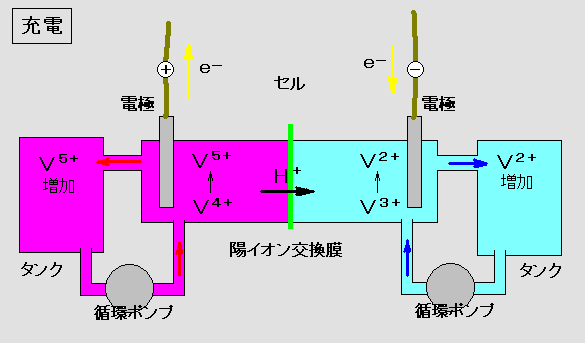



Je visite le [Salon International de l'Automobile de Genève](w:) une fois tous les 10 ans environ, quand un neveu ou le fils d'une ami me supplie assez longtemps de l'y emmener.

Cette année, les voitures avaient toujours 4 roues, les hôtesses d'accueil toujours aussi charmantes, et les badauds se pressaient toujours le plus autour des voitures les moins écolo.

La seule vraie surprise que j'aie eue était le stand de la marque Quant, qui présentait des voitures électriques munies de [batterie à flux](w:) redox. J'ignorais totalement que cette technologie dont j'ai parlé dans ["comment stocker l'énergie"](/2012/10/06/comment-stocker-lenergie/) avait été adaptée aux véhicules par l'entreprise [NanoFlowcell](w:), mais ce n'est pas bête du tout.

L'avantage de ces batteries est d'utiliser des électrolytes liquides

Batterie\_redox\_vanadium

NanoFlowcell

 

 

Bon, sinon j'ai quand même lorgné sur les incroyables carrosseries en carbone des supercars Bugatti ou [Koenigsegg](w:).


