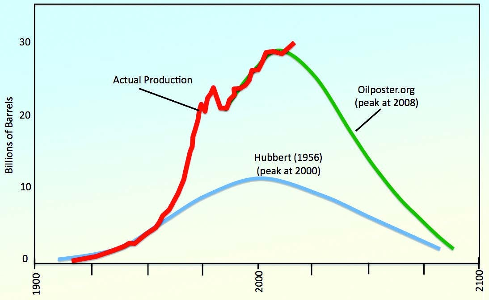

Une équipe internationale de chercheurs met à mal l'idée selon laquelle l'humanité manquera bientôt de certains minerais. Selon la vaste étude [[1]](#ref-1) de [Lluis Fontboté](http://cms.unige.ch/sciences/terre/people/personal_pages/LluisFontbote/LluisFontbote.php) de l'Université de Genève et ses cinq collègues d'autres universités,  les ressources\* géologiques de la plupart des minéraux sont nettement plus élevées que les réserves\* connues sur lesquelles se basent les estimations.

Le problème est que l'exploration, mais surtout le progrès des techniques d'extraction rendent économiquement exploitables des ressources qui n'ont pas été comptabilisées comme réserves car elles n'étaient pas rentables précédemment. Par exemple l'[USGS](w:) a estimé les réserves de lithium à  13.8 millions de tonnes (MT) en 2009, et à 39.5 MT en 2016, le triple 7 ans plus tard !

Même le fameux [pic du pétrole](w:) est remis en question par les auteurs : les données de production (en rouge dans le graphique ci-dessous) montrent clairement que le maximum de production prévu pour 2000 par Hubbert en 1956 (en bleu) est complètement faux, et la réactualisation récente affirmant que le pic a été atteint en 2008 (en vert) semble infirmée par les dernières valeurs de production.

L'article se concentre sur le [cuivre](w:) car c'est un métal pour lequel la demande (chinoise et indienne principalement) a augmenté plus vite que les capacités de production (dans les Andes notamment) et que le recyclage, entraînant une hausse des prix spectaculaire ces dernières années. Les auteurs, mais aussi d'autres avant eux [[3]](#ref-3), montrent que la formation des gisements de cuivre rend très vraisemblable qu'il en reste pour plusieurs millénaires de consommation actuelle rien que dans les Andes.

Mais l'article mentionne aussi d'autres minerais, allant du fer et l'aluminium aux terres rares en passant par l'uranium, et selon les auteurs les réserves de toutes ces substances sont suffisantes pour faire face à l'augmentation considérable de la demande attendue ce siècle. Pour eux, il faut surtout veiller à ce que l'exploitation de ces ressources ne se fasse pas trop au détriment de l'environnement, puisqu'il ne faut pas s'attendre à ce que l'industrie minière s'arrête toute seule...

En passant, la lecture des références m'a rappelé deux choses:

1. la possibilité technique d'extraire de l'Uranium de [l'eau, de mer ou du Rhône](w:Uranium#Dans_l.27eau_de_mer_et_les_eaux_naturelles). Pour l'instant ça coûte 5x plus cher que de l'extraire d'une mine, mais il y en a pour des milliers d'années ...
2. en écrivant [cet autre article](/2017/01/08/applications-des-elements-du-tableau-periodique/),  j'avais découvert que beaucoup de "terres rares"\*\* se trouvent dans la [monazite](w:), le minerai du [thorium](/2013/05/18/latome-vert-le-thorium/) ! On n'en sort pas ...

Bon, pour une fois voilà à quoi ressemble un "scoop" sur drgoulu.com : basé sur un communiqué de presse lu hier (qui sera copié/collé sans autres par de nombreux media), j'ai trouvé et lu les 4 références, un peu réfléchi, écrit cet article vite fait, et programmé sa parution pour 1 minute après la fin de l'embargo !

### Notes:

\* la distinction entre "ressource" et "réserve" est importante. La "réserve" est le stock de minerai connu et économiquement exploitable à un moment donné. La "ressource" est le stock non encore découvert ou pas encore exploitable.

\*\* On devrait plutôt les appeler [lanthanides](w:) car les "terres rares" ne sont pas rares, mais plutôt diluées, en faible concentration.

### Références:

1. Arndt, N. T., [Fontboté, L.](http://cms.unige.ch/sciences/terre/people/personal_pages/LluisFontbote/LluisFontbote.php), Hedenquist, J. W., Kesler, S. E., Thompson, J. F. H., & Wood, D. G. (2017). Future Global Mineral Resources. Geochemical Perspectives, 2017, 6(1)  ([pdf](http://www.geochemicalperspectives.org/wp-content/uploads/2017/04/v6n1.pdf) 28Mb, 184 pages)
2. Pierre-Alexandre Salier et [Lluis Fontboté](http://cms.unige.ch/sciences/terre/people/personal_pages/LluisFontbote/LluisFontbote.php) "Epuisement des ressources minières: aux sources du mythe", 21 juillet 2009, Le Temps ([pdf](http://cms.unige.ch/sciences/terre/people/personal_pages/LluisFontbote/LluisFontbote_files/fontbote_sallier_le_temps20090721.pdf) )
3. Alain Cheilletz "[Y a-t-il vraiment un risque d’épuisement des ressources ?](http://www.pseudo-sciences.org/spip.php?article2185)" SPS n° 305, juillet 2013
4. "[Ressources minérales - la pénurie n’était qu’un mythe](/wp-content/uploads/2017/04/Ressources-minerales-la-penurie-netait-quun-mythe-.pdf)", 27 avril 2017, Communiqué de presse Université de Genève
