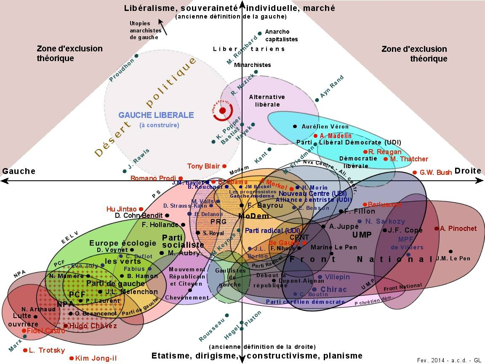



Parmi les questions que je me suis posées lors du traditionnel raout quinquennal de mes voisins français, il en est une qui me turlupine d'autant plus que je n'ai pas trouvé les données permettant d'y répondre : se pourrait-il que l'axe "libéral / conservateur" \* soit devenu prépondérant par rapport au traditionnel "gauche / droite ?"

## Le deuxième axe politique

J'ai découvert la "[politique à deux dimensions"](/2007/08/24/politique-a-2-dimensions/) il y a 10 ans grâce à Smartvote.ch, dont je reparlerai plus bas : plusieurs politologues considèrent que le positionnement "[gauche / droite](https://fr.wikipedia.org/wiki/gauche_et_droite_en_politique)" n'est pas suffisant pour représenter la variété des opinions politiques et ont proposé des représentations bidimensionnelle comme le [diagramme de Nolan](https://fr.wikipedia.org/wiki/diagramme_de_Nolan) ou le [quadrant politique](https://fr.wikipedia.org/wiki/quadrant_politique).

Mais dans ces représentations, le deuxième axe est défini a priori : "Libertarien / Populiste" pour certains, "Progressiste / Conservateur" pour d'autres, "Autoritaire / Libertaire" pour d'autres encore, le deuxième axe est moins bien défini, moins clair que l'axe gauche / droite.

De plus, il paraît difficile d'éviter une certaine subjectivité lorsqu'on représente le positionnement politique de personnes et de partis, comme on le devine dans la carte ci-dessous, la seule que j'ai pu trouver pour la France [[1]](#ref-1):

(edit du 9.1.2018 : notez que les directions verticales sont nommées "ancienne définition de la gauche/droite", ce qui suggère que l'axe principal a tourné de 90° au cours du temps...)

## Smartvote et la science des axes

Ces problèmes ont été traités en profondeur en Suisse, je dirais même résolus par [Smartvote.ch](https://www.smartvote.ch/about/idea) grâce à une approche beaucoup plus rationnelle

La plateforme Smartvote propose aux candidats à chaque élection en Suisse de remplir un questionnaire sur quelques dizaines de questions de l'actualité politique, puis permet aux électeurs de répondre aux mêmes questions pour trouver les candidats ayant les opinions les plus proches.  Smartvote doit donc pouvoir calculer  des "distances" dans un espace ayant autant de dimensions que de questions, mais comme ces questions/dimensions ne sont pas indépendantes/orthogonales, on ne peut pas utiliser valablement une simple [distance euclidienne](https://fr.wikipedia.org/wiki/distance_euclidienne) par exemple.

Smartvote réduit donc le nombres de dimensions de N à 2 , en utilisant une méthode purement mathématique décrite dans [[2]](#ref-2), et dont voici quelques passages clé :

> Le calcul du système de coordonnées politiques est effectué à l'aide d'une méthode statistique appelée « [analyse factorielle des correspondances](https://fr.wikipedia.org/wiki/analyse_factorielle_des_correspondances) », connue également sous le nom d’ « [analyse en composantes principales](https://fr.wikipedia.org/wiki/analyse_en_composantes_principales) qualitatives»

> En règle générale, les deux dimensions les plus importantes de l'analyse à base multidimensionnelle sont représentées. En raison de l'application de l'analyse factorielle des correspondances, **l'attribution manuelle des questions, sur les axes prédéfinis de la smartmap, est supprimée**.

> La qualification des deux axes (gauche/droite, libéral/conservateur) est effectuée ici **a posteriori et est subjective**. D'autres désignations – notamment au regard de la deuxième dimension – sont alors possibles et pertinentes

Autrement dit, les deux axes sont déterminés automatiquement à partir de réponses à des questions qui ne doivent pas être positionnées a priori sur ces axes !



Outre la correspondance électeur/candidat déjà mentionnée, il devient possible :

- De produire très facilement des cartes du "paysage politique" comme celle-ci contre
- D'appliquer une approche similaire aux consignes de vote des partis lors des nombreux référendums en Suisse, pour obtenir une [carte animée de l'évolution](http://sotomo.ch/wp/wp-content/uploads/2014/06/polraum1_optimiert.gif) du "positionnement marketing" des partis sur 30 ans a été produite [[3]](#ref-3). On y voit en particulier le spectaculaire repositionnement de l'UDC (SVP en allemand) comme parti conservateur.
- De vérifier que le positionnement habituel des votants de chaque circonscription ne varie pas brutalement lors d'un vote, ce qui donne une méthode de [détection de fraude électorale](/2012/12/07/fraudez-benford/) (peu) connue sous le nom de "test du modèle binomial robuste sur-dispersé". J'ai eu l'occasion de la découvrir lors de mon passage à la Commission Electorale Centrale du Canton de Genève.

## Axe principal, secondaire, et 3ème axe

Un point important est que ces méthodes déterminent "toutes seules" les axes politiques "statistiquement significatifs", l'un après l'autre. Elles déterminent d'abord le principal un peu comme dans une [régression linéaire](https://fr.wikipedia.org/wiki/régression_linéaire), puis le secondaire à partir des "résidus" que l'axe principal ne modélise pas bien, et ainsi de suite. Peut-être qu'avec beaucoup de données dans un grand pays, un troisième axe (religieux, culturel, linguistique, écologiste ...) apparaîtrait comme significatif, mais à Genève en tout cas, le troisième axe est non significatif, et smartvote laisse entendre que c'est le cas en Suisse. Et dans les autres pays, il n'y a pas assez de données pour le mesurer.

Car l'essentiel est là : il faut beaucoup de données pour faire de la "politique statistique"© . Les sondages sur les intentions de vote ne suffisent pas, il faut que de nombreux candidats répondent à de nombreuses questions pour pouvoir cartographier leur positionnement valablement.

## Retour en France

A ma connaissance, il n'existe pas de telles données en France, donc pas de moyen de vérifier mon hypothèse selon laquelle l'axe secondaire\* est devenu le principal, éclipsant le "gauche / droite"  lors de cette élection présidentielle. Donc voilà, je n'ai aucune preuve de ce que j'avance. Mais voici les quelques indices qui m'ont conduit à cette idée:

1. Evidemment, le second tour entre 2 candidats qui n'appartiennent ni au PS ni à l'UMPRPRépublicains
2. L'article [[5]](#ref-5) qui montre qu'il y a dix ans déjà, il fallait distinguer plusieurs droites et plusieurs gauches pour décrire le paysage politique valablement. Malheureusement les auteurs ne vont pas jusqu'à établir un positionnement 2D alors qu'ils évoquent pourtant "deux dimensions structurantes des valeurs - libéralisme économique et libéralisme culturel" qui rappellent celles du [diagramme de Nolan](https://fr.wikipedia.org/wiki/diagramme_de_Nolan)
3. Le fait documenté par de nombreuses sources que des électeurs traditionnels de la gauche sont devenus électeurs du FN. Selon [[5]](#ref-5) ils appartiennent à la "gauche conservatrice", ce qui soutient l'idée que le FN est désormais perçu par ces électeurs comme conservateur plutôt que d'extrême droite. \*\*

### Notes:

\* J'ai nommé le 2ème axe "libéral / conservateur" dans l'introduction pour qu'il ne soit pas trop abstrait, mais comme l'indique smartvote "D'autres désignations sont possibles et pertinentes". Ne voulant pas m'avancer sur le cas français par manque de données, j'en suis resté à "axe secondaire"

\*\* En aucun cas je ne suggère que le FN n'est pas le parti français le plus à droite. Mais je suspecte qu'il se distingue des autres partis de droite plutôt par son conservatisme, d'une manière similaire à celle de l'[UDC suisse](https://fr.wikipedia.org/wiki/Union_démocratique_du_centre) (SVP en allemand sur la [spectaculaire carte animée](http://sotomo.ch/wp/wp-content/uploads/2014/06/polraum1_optimiert.gif) ).

### Références:

1. Alain Cohen-Dumouchel, ["Carte 2D du Paysage Politique Français (PPF) "](http://www.gaucheliberale.org/post/2014/02/18/Carte-2D-du-Paysage-Politique-Fran%C3%A7ais-%28PPF%29-mise-%C3%A0-jour-f%C3%A9vrier-2014) février 2014
2. "[Méthode de calcul de la carte des positions smartmap](https://www.smartvote.ch/downloads/methodology_smartmap_fr_CH.pdf) ", Smartvote
3. "[Auswertung der Parteiparolen von 1985-2014](https://sotomo.ch/site/auswertung-der-parteiparolen-von-1985-2014/)", Sotomo ([données](https://docs.google.com/spreadsheets/d/1YV1QiCGKkoffrydb9zeYNIFVAzVAPD5ggzC24Iw7-4w/pubhtml#) !)
4. TA Korrektorat, "[Wie sich die SVP aus dem Bürgerblock verabschiedet hat](http://blog.tagesanzeiger.ch/datenblog/index.php/1791/wie-sich-die-svp-aus-dem-buergerblock-verabschiedet-hat)", Tages Anzeiger 21\. April 2014
5. S. Brouard, H.Rey "[La Gauche, la Droite : les limites d'une identification politique](http://www.cevipof.com/bpf/barometre/vague4/002/GaucheDroite_HR-SB.pdf)" , Février 2007, Sciences Po, [CEVIPOF](http://www.cevipof.com/)
