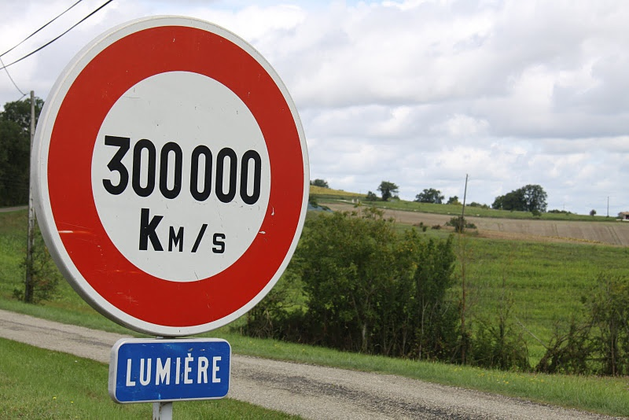

Sur Quora, il y a souvent des questions stupides. Par exemple, quelqu'un a récemment demandé "[Pourquoi on ne peut techniquement pas mesurer la vitesse de la lumière ?](https://www.quora.com/Why-cant-we-technically-measure-the-speed-of-light)". Au moment où j'hésitais entre "downvoter" la question ou répondre "pfff, ben bien sur qu'on peut!" en étalant ma science sur [Ole Rømer](https://fr.wikipedia.org/wiki/Ole_Christensen_Rømer)  (découvert grâce au livre "[Longitude](http://drgoulu.local/2009/10/04/longitude/)") puisque tout le monde connait déjà l'[expérience de Fizeau](https://fr.wikipedia.org/wiki/expérience_de_Fizeau), je suis tombé sur [cette réponse](https://www.quora.com/Why-cant-we-technically-measure-the-speed-of-light/answer/Gary-Novosielski?srid=pzDv) qui me colle une baffe : depuis 1983, on ne peut effectivement plus mesurer la vitesse de la lumière !

Car en 1983, la [Conférence générale des poids et mesures](https://fr.wikipedia.org/wiki/Conférence_générale_des_poids_et_mesures) a défini le [mètre](https://fr.wikipedia.org/wiki/mètre) comme étant 1/299'792'458 ème de la distance parcourue par la lumière dans le vide en une seconde. Depuis, la vitesse de la lumière dans le vide est forcément et très exactement égale à 299'792'458 m/s, sans aucune marge d'erreur. Si une expérience donnait un résultat différent, ce serait obligatoirement à cause d'une erreur expérimentale sur la mesure de la distance et/ou du temps. La vitesse de la lumière est devenue une constante, une définition.

Et si comme moi vous avez de la peine à vous souvenir de cette constante et avez tendance à l'arrondir à 300'000 km/s, voici la phrase mnémotechnique ad-hoc:

> La constante lumineuse restera désormais là, dans votre cervelle

On compte les lettres de chaque mot : 2 9 9 7 9 2 4 5 8 !

### Peut mieux faire

Je me suis demandé si la CGPM n'aurait pas du en profiter pour mettre un peu d'ordre dans tout ça, parce que la [seconde](https://fr.wikipedia.org/wiki/seconde_(temps)) étant définie comme la durée de 9192631770 oscillations d'une horloge à césium, il n'est pas très pratique de faire un mètre étalon en comptant 9192631770/299792458 =30.663318988498369762190615254354779665604529650976076256... oscillations. Ce n'est pas une jolie fraction\* car le [pgcd](https://fr.wikipedia.org/wiki/pgcd)  de 9192631770 et de 299792458 n'est que 14. S'il est désormais très difficile de changer la durée de la seconde, peut-être aurait-on pu redéfinir légèrement le mètre en utilisant un dénominateur légèrement supérieur à 299792458 (pour se rapprocher des 300'000 km/s) donnant un pgcd plus grand.

En [cherchant un peu](https://www.pythonanywhere.com/gists/a7332063593056348c6de43239f7f119/metercst.py/python3/?gist-runner-auth-key=7176d4139a344ab18816c7d2b1b232f1), je trouve que 299901462 aurait bien convenu. Le pgcd vaut alors 13039194, ce qui permettrait de mesurer 23 "nouveaux mètres" comme étant la distance parcourue par la lumière en 705 oscillations de césium pile poil. Mais cela aurait raccourci le mètre de 0.4 mm soit 0.04%  environ... Où aurait-ce causé des problèmes ?

Note \* : exercice pour la prochaine fois : trouver le [développement décimal périodique](https://fr.wikipedia.org/wiki/développement_décimal_périodique) de cette fraction.
