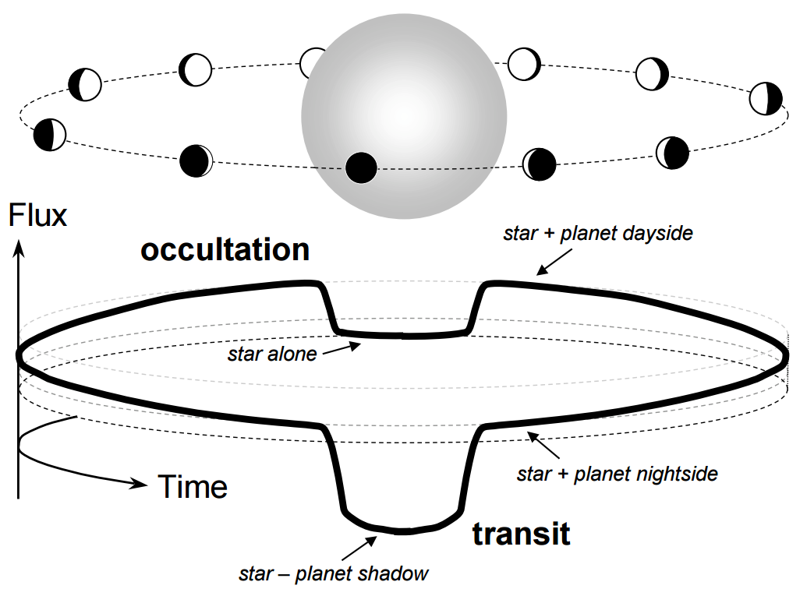
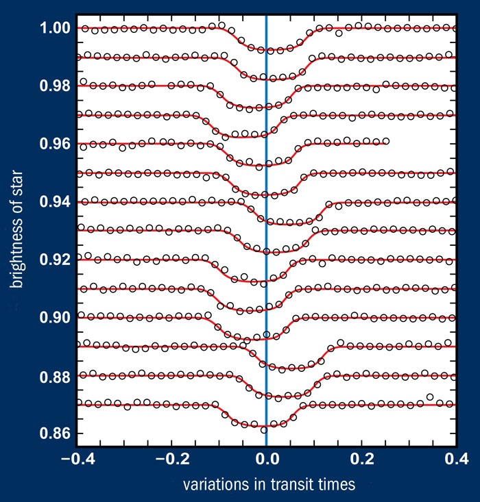
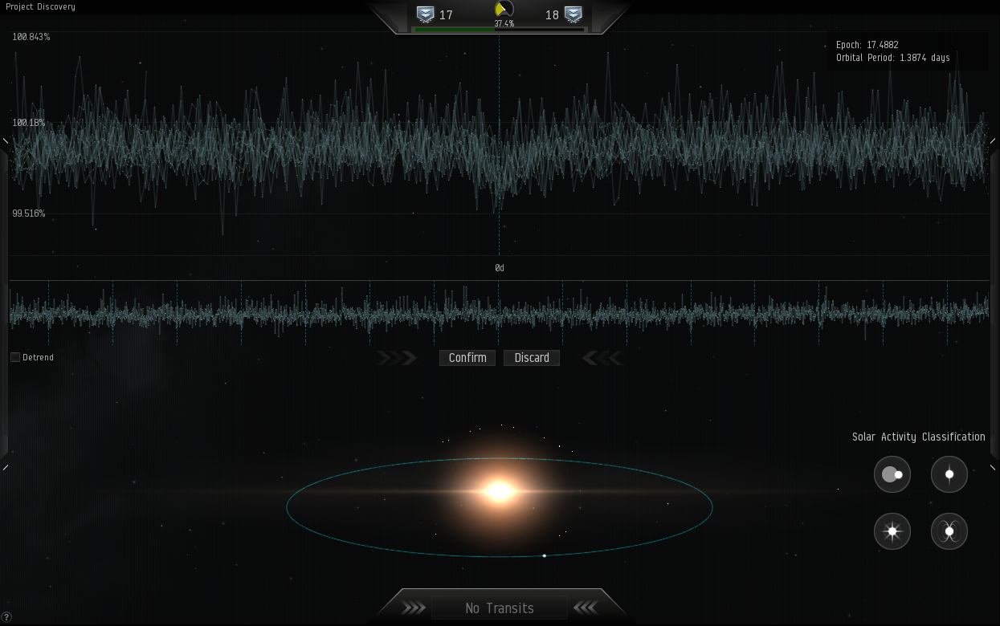
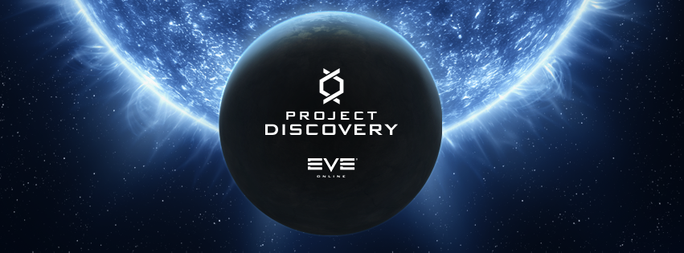

Je suis un gamer. J'ai parfois un peu honte en pensant à tout ce temps "perdu", mais une nouvelle [[1]](#ref-1), [[2]](#ref-2) me remotive à jouer fièrement à [Eve Online](w:) : les joueurs vont y contribuer à la recherche d'exoplanètes en analysant de vraies données mesurées par les télescopes spatiaux [CoRoT](w:) et  [Kepler](w:Kepler_(télescope_spatial)).

Lors de la "fanfest" qui réunit chaque année joueurs et développeurs du jeu en Islande, [Michel Mayor](w:) a expliqué (en anglais très francisé...) le "Project Discovery", intégré au jeu ces jours-ci.



Sa conférence étant assez longue, j'en recommande quelques passages aux lecteurs pressés:

- dès 13:30, il décrit la [méthode des transits](w:), utilisée par le télescope spatial Kepler.
- à 16:30, il explique à l'aide de la figure ci-dessous que cette méthode permet de connaître aussi la taille et la température de la planète, voire la chimie de son atmosphère (20:20) ! En effet la planète ne fait pas seulement de l'ombre à l'étoile lorsqu'elle passe devant, mais son croissant augmente progressivement l'intensité de la lumière reçue par le télescope jusqu'au moment où la planète passe derrière l'étoile. Là la luminosité baisse à nouveau 
- En pratique, la variation de luminosité est extrêmement faible comme on peut le deviner en regardant les photos de transits devant le Soleil de Mercure et de Vénus ci-dessous. Si des E.T. (ou des Aliens...) sont en train de mesurer la luminosité du Soleil il leur faudrait un système capable de détecter une variation de 84 [ppm](w:partie_par_million) une fois par an pour détecter le transit de la Terre. Kepler aurait du être capable de mesurer 20 ppm, mais quelques problèmes techniques le limitent à environ 50 ppm.
    
    {{< figure src="images/160505_f9134_mercure-venus-passage-ok_sn635.jpg" alt="Transit devant le Soleil de Mercure (à gauche , 9 nov. 2006) et de Vénus, (à droite, 5 juin 2012). Photo : Montage Planétarium Rio Tinto Alcan; Brocken Inaglory/Wikimedia Commons (Mercure); Marc Jobin (Vénus)" caption="Transit devant le Soleil de Mercure (à gauche , 9 nov. 2006) et de Vénus, (à droite, 5 juin 2012). Photo : Montage Planétarium Rio Tinto Alcan; Brocken Inaglory/Wikimedia Commons (Mercure); Marc Jobin (Vénus)" align="aligncenter" width="635" >}}
- dès 21:00, Michel Mayor montre que, logiquement, les premières exoplanètes découvertes par cette méthode en 2000 avaient environ la taille de Jupiter, mais qu'en suite, en intégrant les mesures sur de longues périodes, on est parvenus à détecter des planètes plus petites, jusqu'à la taille de Neptune environ en 2009, et vers 2013 quelques "[super Terres](w:Super-Terre)" comme [Kepler-62_f](w:), à peine plus grosse que notre bonne vieille planète d'origine (mais qui tourne autour d'une étoile plus petite que le Soleil)
- à 26:00 il explique que les ordinateurs sont très performants pour détecter des variations périodiques de la luminosité, mais plusieurs difficultés surviennent en pratique:
    - La période n'est pas toujours régulière. Des planètes proches peuvent se perturber mutuellement au point d'avancer ou reculer le transit. C'est très visible à l'oeil humain (ci-contre), mais pas évident du tout pour ce [barbare de Fourier](/2010/03/06/succes-hollywoodiens-et-transformee-de-fourier/) .
    - La luminosité de l'étoile varie. Celle du Soleil varie de 0.1% (1000 ppm...) au cours du [cycle solaire](w:) qui dure environ 11 ans. En plus il tourne, en un mois environ, entraînant des taches solaires qui ressemblent vachement à des transits, de loin. Et beaucoup d'étoiles sont beaucoup moins stables que le Soleil...
    - Beaucoup d'étoiles sont [doubles](w:étoile_double) : il y a en fait deux étoiles pour le prix d'une ! Elles se perturbent mutuellement, et peuvent s'occulter en transitant l'une devant l'autre ... Pour de tels systèmes on ne recherche pas forcément d'exoplanètes, mais les mesures de CoRoT et de Kepler permettent d'obtenir les caractéristiques des deux étoiles.c'est là que les humains interviennent, en l'occurrence des joueurs prêts à analyser des milliers de signaux à la main pour un salaire virtuel, dont moi.
- à partir de 30:00 on voit (enfin) à quoi ressemblent ces données dans l'interface du jeu : dans la moitié du bas on voit le signal complet et une simulation du système solaire qu'on est en train d'analyser. Dans la moitié du haut, on peut zoomer et "replier" le signal pour faire apparaître des corrélations comme le "trou" qu'on devine au centre, et qui correspondrait à une planète orbitant l'étoile en 1.3874 jours. Peu probable, mais il y a tant de choses étranges dans l'univers ...

Si plusieurs joueurs identifient les mêmes exoplanètes, ils sont récompensés dans le jeu et leur découverte est transmise à des pros. Si un joueur ne trouve pas une exoplanète déjà connue ou repérée par d'autres joueurs, il n'est pas récompensé. Tout ceci est encore tout neuf et sera encore ajustée au fur et à mesure de l'expérience, mais l'idée me semble vraiment attrayante, au moins autant que [Fold It](/2008/05/21/si-on-jouait-a-plier-des-proteines/) qui m'avait occupé quelques soirées.

"Project Discovery" été développée en collaboration entre CCP, les universités de Genève et Reykjavik et la startup suisse (et même valaisanne!) Massively Multiplayer Online Science ([MMOS](http://mmos.ch/)) que je n'ai pas  encore le plaisir de connaître ([mon compte LinkedIn](https://www.linkedin.com/in/goulu/) si jamais...)

Bon il est vraiment temps que je me mette à chasser les exoplanètes. Si ça vous dit d'essayer, sachez que vous pouvez jouer gratuitement à EVE (avec pas mal de limitations), et que ça me ferait plaisir que vous le fassiez en cliquant sur l'image ci-dessous. A bientôt, jeunes padawans.

### References

1. "[EVE Online gamers to join in exoplanet search through scientific collaboration](https://www.ccpgames.com/news/2017/eve-online-gamers-to-join-in-exoplanet-search-through-scientific-collaboration/)", 22 février 20017, CCP Games
2. Tom Fenwick "[EVE Online gamers will seek real exoplanets in virtual universe](https://www.newscientist.com/article/2127801-eve-online-gamers-will-seek-real-exoplanets-in-virtual-universe/)", 13 avril 2017, New Scientist
3. [Planetary transits : how can opne measure the mass, size, density and atmospheric composition of a planet one cannot even see ?](https://palereddot.org/planetary-transits-how-can-one-measure-the-mass-size-density-and-atmospheric-composition-of-a-planet-one-cannot-even-see/) 2016 sur Pale Red Dot
