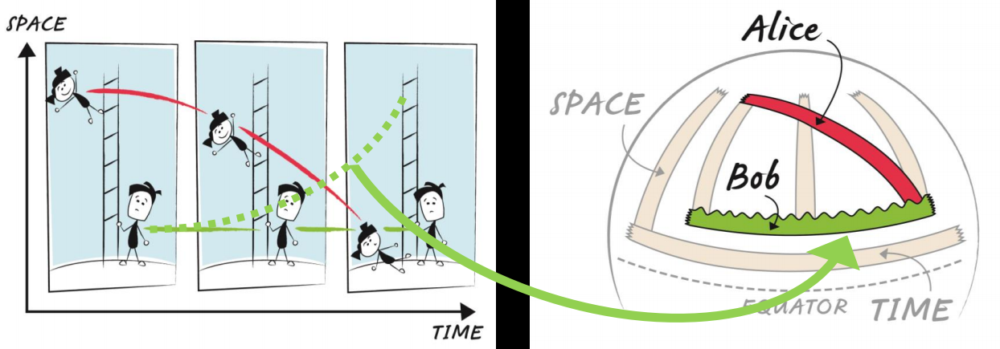
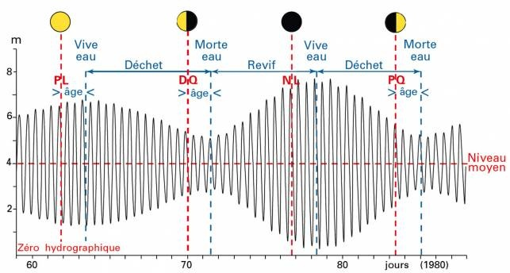
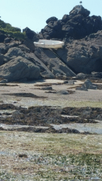
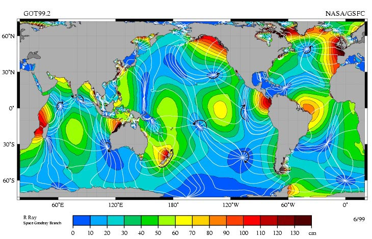
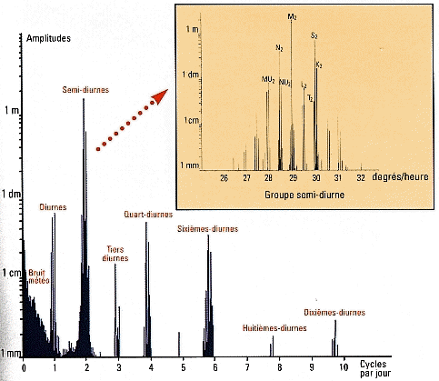
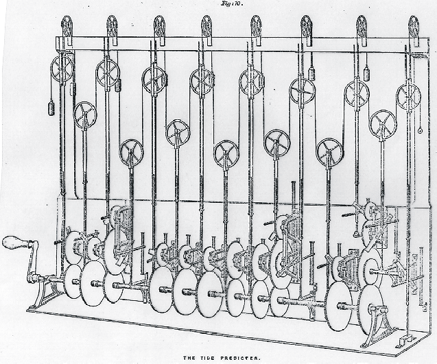

Cet été, les Goulus ont exploré le pays des grandes marées : la Bretagne et la Normandie. Notre périple a d'ailleurs commencé aux [iles Chausey](https://fr.wikipedia.org/wiki/iles_Chausey), un des rares endroits au monde où l'amplitude des marées peut atteindre 14 m, changeant le paysage de manière spectaculaire en quelques heures. Devant un tel spectacle on ne peut que se demander "mais comment donc est-ce possible" ?

Iles Chausey à pleine mer et à basse mer . Photos d'Éric Guillemot extraites du livre "Marée basse" [[1]](#ref-1)

## Les marées pour les nuls.

Le mécanisme des [marées](https://fr.wikipedia.org/wiki/marée)  est habituellement expliqué comme ceci :

1. L'attraction de la Lune déforme les océans en créant une "bosse d'eau" dans la région qu'elle survole. Comme la Terre tourne sur elle-même en 24h et que la Lune tourne autour de la Terre en 27 jours, la Lune repasse au dessus de la même région\* toutes les 24h et 50 minutes environ.

3. Mais puisque la Terre est ronde\*\* et que le système Terre+Lune tourne en réalité autour d'un centre de gravité qui n'est pas au centre de la Terre, la force centrifuge crée une deuxième bosse à l'opposé de la première, ce qui fait qu'il y a deux marées par jour, plus précisément toutes les 12h et 25 minutes environ. On appelle cette marée "semi diurne lunaire", notée M2 (M pour Moon)

5. L'attraction du Soleil crée aussi deux bosses plus petites\*\*\*, là où le Soleil est au zénith (forcément à midi) et au [nadir](https://fr.wikipedia.org/wiki/nadir_(astronomie)) (à minuit), donc avec une période de 12h. C'est la "semi-diurne solaire", S2

7. Comme ces deux périodes sont proches, la somme des marées M2+S2 varie avec les phases de la Lune. En effet, à la Nouvelle Lune, la Lune est approximativement alignée dans la direction du Soleil, à la Pleine Lune elle est alignée à l'opposé du Soleil, et aux quartiers elle est dans une direction perpendiculaire à celle du Soleil, donc M2 et S2 sont en opposition de phase et leur effet se soustrait plutôt que de s'additionner:  
    

<figure>

<figcaption>

illustration SHOM

</figcaption>

</figure>

Comme la Lune ne tourne pas autour de la Terre dans le plan de l'[écliptique](https://fr.wikipedia.org/wiki/écliptique), que l'axe de la Terre est incliné, et que les orbites de la Terre et de la Lune ne sont pas des cercles mais des ellipses, d'autres phénomènes astronomiques à longue période viennent encore moduler ceci, produisant par exemple les grandes marées d'équinoxe [[2]](#ref-2).

Tout ceci a été expliqué par le grand [Isaac Newton](https://fr.wikipedia.org/wiki/Isaac_Newton) en 1687 déjà dans son génial livre sur la gravitation universelle.

## En réalité, c'est plus compliqué ...

Il y a juste un léger détail  : ça ne colle pas du tout à la réalité ! Il y a notamment deux gros problèmes :

1. Selon Newton, quand la Lune est à son point le plus haut dans le ciel ce devrait être la pleine mer. Mais en réalité, à ce moment là c'est plutôt la marée basse !

3. Les amplitudes des ondes M2 et S2 calculées par Newton valent respectivement 34 cm et 16 cm [[3]](#ref-3). Son modèle n'explique donc pas les marées supérieures à 50 cm, sans parler de celles de plus de 10 mètres ...

En 1747, [Jean le Rond D'Alembert](https://fr.wikipedia.org/wiki/Jean_le_Rond_D'Alembert)**** se pose une question qui survient tout naturellement lorsqu'on se balance dans sa baignoire : quelle est la [fréquence propre](https://fr.wikipedia.org/wiki/fréquence_propre) des océans ? Il la calcule comme si la Terre n'avait aucun continent et était recouverte d'un océan d'une profondeur uniforme de 4000m, et trouve une période d'environ 23 heures. Or nous avons vu que S2 force l'océan à osciller avec une période plus courte, de 12h25. Dans un tel cas, comme très bien expliqué dans [[3]](#ref-3) , l'oscillation se produit en sens inverse de l'excitation, ce qui résout le premier problème.

[Pierre-Simon de Laplace](https://fr.wikipedia.org/wiki/Pierre-Simon_de_Laplace) résolut le second dans son "Traité de Mécanique Céleste" en 1799. Le modèle "statique" de Newton considère que l'eau de l'océan se dilate verticalement, se gonfle quasi instantanément pour former les "bosses". C'est évidemment faux pour l'eau des marées qui se déplace à la surface des océans en créant des courants. Mais la vague de d'Alembert n'est pas possible non plus car elle devrait se déplacer de 40000km en 23h soit à environ 1700 km/h. Laplace considère les marées comme un phénomène "dynamique" : l'attraction de la Lune et du Soleil excitent  la surface de l’océan en créant des vagues qui se propagent, rebondissent contre les côtes, et se combinent pour provoquer à certains endroits d'énormes marées par [résonance](https://fr.wikipedia.org/wiki/résonance).

## Le modèle dynamique

L'animation ci-dessous montre comment la marée se propage réellement dans les océans du monde :

  
Remarquez qu'il n'y a PAS de "bosses" et de "creux" espacés régulièrement de 90° ! Il faut bien retenir que l'explication de Newton décrit correctement les forces qui excitent l'océan, mais pas du tout sa réponse dynamique qui donne l'amplitude des marées.

La figure ci-dessous est une autre représentation de ceci :

Amplitude et phase de la marée M2 selon mesures Topex Poseidon.  
image CC Wikipedia

On voit qu'il y a très peu d’endroits  sur Terre (en noir) où les marées dépassent 1m30, mais aussi qu'il y a des endroits où les marées sont quasi nulles (en bleu foncé). Ce sont d'une part des mers fermées comme la Méditerranée ou la mer des Caraïbes qui ne sont pas assez vastes pour qu'un phénomène de résonance s'établisse, et d'autre part les [points amphidromiques](https://fr.wikipedia.org/wiki/point_amphidromique). Ces "nœuds" de la vibration des océans se trouvent à plusieurs exemplaires dans le Pacifique et l'Atlantique, mais curieusement près des côtes de l'Indien. Entre ces nœuds sont tracées les [lignes cotidales](https://fr.wikipedia.org/wiki/ligne_cotidale) qui indiquent les lieux où les pleine mers ont lieu simultanément.

## Comment calculer les marées

La mésaventure du "débutant" de ma photo fait rigoler, mais les rois européens riaient moins lorsqu'un vaisseau revenant chargé de richesses d'une de leurs colonies se fracassait sur des rochers invisibles à cause de la marée.  Ils ont vivement encouragé leurs scientifiques à trouver une solution, mais la prédiction de la marée est un problème très difficile.

Comme on l'a vu, la marée en un endroit donnée est influencée par la forme des côtes à 10'000 km de là, le relief des fonds marins qui freine les courants, la direction des vents dominants qui peut amplifier le flux et freiner le reflux ou vice-versa etc.. Pour prédire correctement la marée, on doit avoir recours à [ce barbare de Fourier](/2010/03/06/succes-hollywoodiens-et-transformee-de-fourier/) pour obtenir le [spectre fréquentiel](https://fr.wikipedia.org/wiki/spectre_fréquentiel) de la marée à cet endroit à partir de [mesures précises](https://fr.wikipedia.org/wiki/marégraphe) sur de longues périodes.

(source [[4]](#ref-4))

A Brest par exemple on connait désormais plus d'une centaine de fréquences et harmoniques de la marée que l'on additionne pour [prédire la marée](https://fr.wikipedia.org/wiki/calcul_de_marée) au millimètre près !

Aujourd'hui on fait ça sur n'importe quel ordinateur, mais en 1873 c'était si important que [Lord Kelvin](https://fr.wikipedia.org/wiki/Lord_Kelvin) himself avait construit cette [machine à prévoir les marées](https://fr.wikipedia.org/wiki/machine_à_prévoir_les_marées) au Centre de l'Univers, Londres [[5]](#ref-5):

Les trains d’engrenages en bas  déplacent verticalement des poulies au rythmes des 15 harmoniques les plus importantes, et la ficelle serpentant entre ces poulies effectue l'addition.

## L'énergie marémotrice

L'[usine marémotrice de la Rance](https://fr.wikipedia.org/wiki/usine_marémotrice_de_la_Rance) datant de 1966 et quelques nouveaux [projets d'hydroliennes](/2008/09/07/energie-hydrolienne/) notamment  tentent d'utiliser l'[énergie marémotrice](https://fr.wikipedia.org/wiki/énergie_marémotrice) pour produire de l'électricité. C'est très bien, mais il ne faut pas oublier que les fortes marées (et leurs courants) sont produits par un phénomène de résonance qui accumule une puissance relativement faible fournie par la mécanique céleste. En absorbant de l'énergie à certains endroits on risque de modifier les marées, et à l'extrême d'amortir carrément la résonance en créant de nouveaux points amphidromiques...

Car le potentiel n'est pas aussi élevé que l'on peut croire:

> L'ordre de grandeur de l'énergie naturellement dissipée annuellement par les marées est évalué à 22 000 TWh soit l'équivalent de la combustion de moins de 2 [Gtep](https://fr.wikipedia.org/wiki/Tonne_d%27%C3%A9quivalent_p%C3%A9trole "Tonne d'équivalent pétrole"). Ce chiffre est à comparer à la consommation d'énergie de l'humanité, de l'ordre de 10 Gtep .
> 
> Seule une fraction de l'énergie des marées étant récupérable, l'énergie marémotrice ne pourra fournir, à l'avenir, qu'une faible part des besoins mondiaux. \[[Wikipedia](https://fr.wikipedia.org/wiki/%C3%89nergie_mar%C3%A9motrice#Potentiel_de_l.27.C3.A9nergie_mar.C3.A9motrice)\]

## Les marées solides

Newton avait un peu trop simplifié les marées océaniques, mais pour le reste il avait raison : la Lune et le Soleil déforment non seulement les océans, mais toute la Terre ! Vous montez et descendez d'environ 30 cm deux fois par jour, et cette fois en phase avec la Lune sous l'effet de cette marée "solide" qui a des effets plus ou moins sensibles:

- L'énergie dissipée [réchauffe la planète](https://fr.wikipedia.org/wiki/Réchauffement_par_effet_de_marée) ! Je ne parle pas de l'atmosphère, mais de l'entier du volume solide ou pâteux de notre globe. Je n'ai pas trouvé la puissance de ce chauffage, mais ça doit être beaucoup plus que celle de la marée liquide. Et nous ne sommes pas une exception : [Io, une lune de Jupiter](https://fr.wikipedia.org/wiki/IO_(lune)), est l'astre le plus volcaniquement actif de notre Système Solaire et il est chauffé par environ 130 TW d'effet de marée.

- La marée ralentit la rotation des lunes et planètes. Ainsi le jour terrestre se rallonge d'environ 2.3 microsecondes par siècle. Le même effet eu le temps d'arrêter totalement la Lune par rapport à nous: elle est désormais en [rotation synchrone](https://fr.wikipedia.org/wiki/rotation_synchrone) avec la Terre. C'est le cas d'autres petites lunes du Système Solaire, mais pas de Mercure comme je le croyais. Mercure est en [résonance spin-orbite](https://fr.wikipedia.org/wiki/résonance_spin-orbite), mais je n'ai pas compris si c'est un effet de la marée du Soleil.

- Mais si la rotation de la Terre ralentit, comment le [moment cinétique](https://fr.wikipedia.org/wiki/moment_cinétique) peut-il se conserver ? Et bien la Lune accélère en proportion !  Et en accélérant, elle "monte" dans le [puits gravitationnel](/2012/09/05/un-petit-pas-pour-lhomme/) de la Terre, et donc s'éloigne de nous de 3.8 cm par an.

- La marée solide perturbe même les mesures du CERN, qui ont du en tenir compte!

C'est quand même surprenant que les énormes marées des îles Chausey et le fait que la Lune nous montre toujours la même face ont la même cause, non ? La science est comme ça : elle unifie, elle décrit de manière cohérente des faits apparemment distincts. J'y vois une différence fondamentale avec les pseudo sciences dont on parle beaucoup (trop) ces temps-ci : il me semble qu'elles ont plutôt tendance à formuler au moins une hypothèse (chacune...) pour chaque fait \*\*. Mais ceci est une autre histoire...

Bonne rentrée à tous, et surtout : restez curieux !

### Notes:

\* Plus précisément au dessus du même méridien, mais en deux passages successifs l'élévation ne change pas beaucoup...  
  
\*\* Viens de découvrir que les platistes doivent inventer des phénomènes électromagnétiques pour expliquer les marées... (arf arf arf ! ... et désespoir...)  
  
\*\*\* Pas vraiment compris pourquoi la marée solaire est plus faible que la lunaire... d'après [mes calculs](/2004/06/30/astrologie/) l'attraction solaire est plus forte...  
  
\*\*\*\* Voilà ce qui arrive quand votre mère vous abandonne devant l'[église Saint-Jean-le-Rond de Paris](https://fr.wikipedia.org/wiki/église_Saint-Jean-le-Rond_de_Paris) ...

### Références :

1. Eric Fottorino and Eric Guillemot (2006) : *Marée basse*. 2006, ISBN: 2742416552.
2. Dominique Bourgeois (2015) : [*Syzygie, périhélie, périgée, équinoxe, saros, écliptique…*](http://www.voilesetvoiliers.com/cultures-voiles/syzygie-perihelie-perigee-equinoxe-saros-ecliptique/). Voiles & Voiliers (Ed.): 2015.
3. Frédéric Chambat (2015) : [*Déformation des océans sous l'effet de la force de marée*](http://culturesciencesphysique.ens-lyon.fr/ressource/maree-chambat.xml). CultureSciences Physique (Ed.): 2015.
4. S. Speich, B. Blanke, V. Thierry, G. Roullet, E. Da Costa, T. Huck, L. Hua, Ph. Le Bot (2015) : [*L'océan en mouvement - cours d'océanographie*](http://stockage.univ-brest.fr/~speich/Enseignement/Master1/Poly_Maree_web.pdf). Laboratoire de Physique des Océans (DRO/LPO) Unité mixte de recherche CNRS-IFREMER-UBO n° 6523 (Ed.): 2015.
5. P. Rocher and B. Mosser : [*Promenade dans le système solaire - les marées*](https://promenade.imcce.fr/fr/pages4/438.html). IMCCE - Observatoire de Paris (Ed.).
