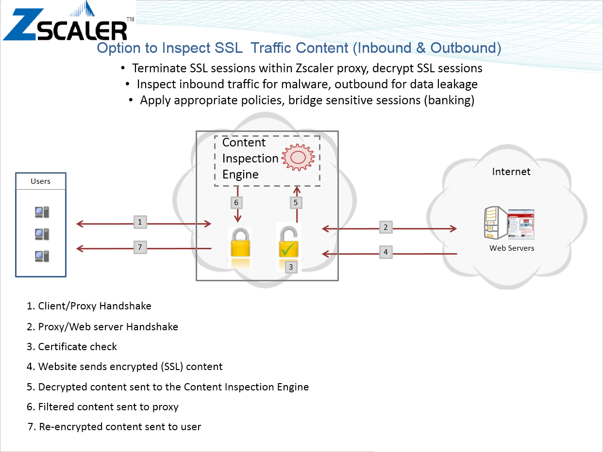
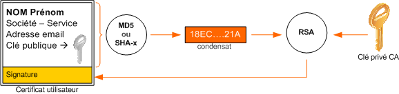
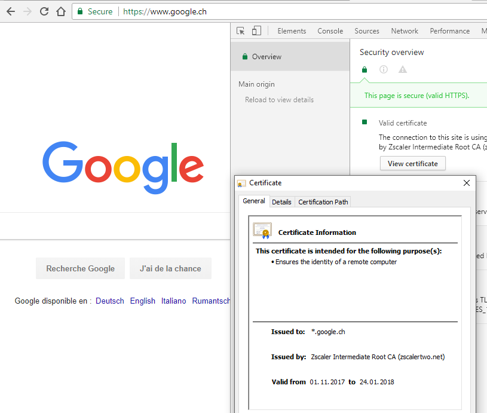

Dans [un précédent épisode](http://drgoulu.local/2017/02/15/alice-et-bob-et-les-cles-asymetriques), nous avons vu comment Alice et Bob peuvent empêcher Eve la curieuse d'écouter leurs messages secrets. Mais ils doivent encore se protéger de [Mallory](https://fr.wikipedia.org/wiki/Alice_et_Bob#Adversaires), un puissant adversaire qui, s'il se place entre Alice et Bob, peut effectuer la fameuse [attaque de l'homme du milieu](https://fr.wikipedia.org/wiki/attaque_de_l'homme_du_milieu) :

1. quand Alice envoie à Bob un premier message en clair du type "Bob, donne moi stp ta clé publique que je puisse t'envoyer des messages chiffrés. La mienne est Ea. Bisous Alice", Mallory l'intercepte et envoie : "Bob, donne moi stp ta clé publique que je puisse t'envoyer des messages chiffrés. La mienne est Ema. Bisous Alice". Il a juste remplacé la clé publique d'Alice par une de ses clés publiques à lui.
2. Bob renvoie "Chère Alice, voici ma clé publique : Eb" en l'encryptant avec ce qu'il croit être la clé publique d'Alice, mais qui est en réalité celle de Mallory ! Celui-ci n'a donc aucune peine à déchiffrer le message, et à envoyer à Alice le message "Chère Alice, voici ma clé publique : Emb", encrypté avec la vraie clé publique d'Alice Ea. Alice n'a aucun moyen de savoir que ce message n'est pas authentique !
3. Alice envoie à Bob son premier message vraiment confidentiel "Pour notre premier rendez-vous, viens dans la grange à foin à 17h", avec sa signature numérique faite à partir de sa clé privée, le tout encrypté avec Emb qu'elle croit être la clé publique de Bob. Mallory peut donc le déchiffrer, changer l'heure du rendez-vous à 18h et remplacer la signature numérique par une nouvelle correspondant à son nouveau message, et faite avec sa clé privée Dma à lui. Il encrypte le tout avec Ema. Bob recevra le message sans se douter de la supercherie, même s'il vérifie la signature. Et il ira tout joyeux rencontrer enfin Alice à 18h.
4. Mais à 17h, Mallory est déjà passé voir la belle Alice dans la grange à foin ...

## Mais qui est donc Mallory ?

En pratique, Mallory doit contrôler physiquement un élément de l'infrastructure de communication entre Alice et Bob. Il doit vraiment être "au milieu", un vrai "man in the middle", MITM pour les intimes. Il peut être un hacker particulièrement futé ayant piraté une "box", routeur ou serveur entre Alice et Bob, mais c'est pas simple. Ou il peut appartenir à [une puissante organisation](https://donotlink.it/Q0Mx) ayant un contrôle sur les câbles transatlantiques ou de très importants centres du réseau...

Beaucoup plus facilement, il peut vous offrir un WiFi gratuit et installer un petit soft de hacker, pardon d' "audit de réseau" qui réalisera des attaques MITM sur toutes les communications de toutes les personnes connectées à son WiFi...

Ou ça peut être un service que l'employeur d'Alice paie, par exemple [ZScaler](https://en.wikipedia.org/wiki/ZScaler). Cette entreprise propose aux entreprises un [proxy web](https://fr.wikipedia.org/wiki/Proxy#Proxy_web)/[SSL/TLS](https://fr.wikipedia.org/wiki/Transport_Layer_Security) permettant de limiter l'accès à internet à leurs employés, en visant en particulier la fuite de données sensibles. Pour ce faire, ZScaler a besoin de décrypter toutes les informations sécurisées entrant et sortant de chez ses clients, ce qu'ils font en réalisant [ouvertement](https://help.zscaler.com/zia/about-ssl-inspection) une "attaque de l'homme du milieu" :

## D'où les certificats ...

Pour débusquer l'infâme Mallory, Alice et Bob auraient du demander à leur ami Nestor de leur fournir des [certificats électroniques](https://fr.wikipedia.org/wiki/certificat_électronique).

Ils auraient envoyé à Nestor leur clé publique avec des éléments prouvant leur identité réelle. Nestor aurait encrypté ces informations avec sa clé privée (oui, privée!) à lui, exactement comme Alice et Bob avaient fait pour [créer leurs propres signatures](http://drgoulu.local/2017/02/15/alice-et-bob-et-les-cles-asymetriques/) et envoyé à Alice et Bob à chacun son certificat. Ensuite:

1. Alice envoie à Bob un premier en clair "Bob, donne moi stp ta clé publique que je puisse t'envoyer des messages chiffrés Bisous Alice".
2. Bob renvoie, en clair aussi "Chère Alice, voici mon certificat Cb" en le signant  avec Sb, sa signature.
3. Alice peut alors déchiffrer le certificat avec la clé publique de Nestor (oui.. un peu de patience...) pour obtenir la clé publique Eb de Bob. Avec Eb, elle peut alors aussi vérifier la signature Sb du message comme [expliqué la dernière fois.](http://drgoulu.local/2017/02/15/alice-et-bob-et-les-cles-asymetriques/) Si l'opération réussit, c'est que la clé Eb est bien celle de Bob, certifiée par Nestor
4. Totalement rassurée, Alice peut alors lui transmettra son invitation confidentielle, chiffrée avec Eb, et contenant éventuellement son certificat Ca à elle pour que Bob soit sur qu'elle est bien l'Alice qu'elle prétend être...
5. ... et Mallory [ne peut rien faire](https://security.stackexchange.com/a/81873/108108) car pour fabriquer un faux certificat Cmb avec une fausse clé Emb il doit disposer de la clé privée de Nestor.

Nestor doit donc être un [tiers de confiance](https://fr.wikipedia.org/wiki/tiers_de_confiance) en qui Alice et Bob ont une confiance totale:

1. Mallory ne doit pas pouvoir usurper l'identité de Bob pour obtenir un faux certificat, donc Nestor doit être une [autorité de certification](https://fr.wikipedia.org/wiki/autorité_de_certification) parfaitement sérieuse et fiable
2. et la (fameuse) clé publique de Nestor doit avoir été communiquée à Alice et Bob de manière parfaitement sûre. Une manière de le faire serait de fournir le certificat de Nestor comme [certificat racine](https://fr.wikipedia.org/wiki/certificat_racine) directement avec les ordinateurs d'Alice et Bob, ou alors que le certificat de Nestor soit lui-même signé par une autorité de certification encore plus sérieuse, et ainsi de suite jusqu'au certificat racine.

## Et voilà enfin le fameux petit cadenas vert ...

Il y a depuis quelques temps une forte tendance, voire incitation à crypter toutes les communications sur internet. Je vous avais expliqué ici [pourquoi et comment drgoulu.com est passé au HTTPS](http://drgoulu.local/2017/01/11/drgoulu-com-passe-en-https/).

Malheureusement pour l'utilisateur lambda (vous...), ceci peut donner une fausse impression de sécurité. Le fameux petit cadenas vert rassurant à côté de votre barre d'adresse ne fait QUE de dire que le certificat utilisé est valide. Il ne garantit pas du tout que c'est bien le certificat du propriétaire du site !

Voici pour preuve le certificat utilisé lorsqu'Alice google depuis un poste de travail d'une entreprise cliente de ZScaler :

Caramba ! L'infâme Mallory, le gentil Nestor et ce cher ZScaler ne sont en réalité que les 3 visages de [Big Brother](https://fr.wikipedia.org/wiki/Big_Brother)  ! ZScaler/Mallory a créé un pseudo certificat de google, validé par ZScaler/Nestor qui dispose d'un certificat racine sur les machines mises à disposition du personnel de l'entreprise, et Alice n'y a vu que du feu ! Toutes ses recherches, mais aussi ses mots de passe ainsi que ses e-mails qu'elle croyait confidentiels, rassurée par la présence du petit cadenas vert, tout ça transite **en clair** quelque part "dans le nuage" ...

## Le prix du danger

Pour l'employeur d'Alice, ZScaler est un excellent moyen de s'assurer qu'Alice la bavarde ne divulgue pas d'informations confidentielles à son ami Bob qui pourrait travailler pour un concurrent, ou plutôt de virer Alice si elle le fait. Mais est-il pleinement conscient des risques supplémentaires qu'il prend pour ceci ?

- Si ZScaler était piraté, ou si [une puissante organisation](https://donotlink.it/Q0Mx) y avait ses entrées, tous les échanges confidentiels de l'entreprise seraient en réalité servis sur un plateau...
- Comme certaines applications contiennent le certificat de leur auteur et le vérifient avant toute mise à jour automatique, elles détectent la présence d'un proxy SSL et refusent de se mettre à jour. L'employeur d'Alice doit donc charger son département IT de maintenir à jour toutes les applications, et/ou tolérer des applications obsolètes...
- Alice pourrait être tentée de mettre elle-même à jour certaines de ses applications en désactivant manuellement la vérification des certificats SSL, créant ainsi des brèches dans la sécurité...
- Ou pire encore, utiliser son téléphone portable comme point d'accès...
- Mais même si Alice est une employée modèle qui respecte scrupuleusement les consignes de sécurité de son employeur, et ZScaler 100% fiable,  la simple présence d'un "homme du milieu" multiplie les risques puisque chaque connexion sécurisée est remplacée par deux connexions sécurisées [[1]](#ref-1).

S'il y a un prochain épisode aux aventures cryptographique d'Alice et Bob, ce sera celui où ils voteront par internet. Ou celui où Alice prouvera à Bob qu'elle a résolu un problème sans lui fournir la solution. Ou encore celui ou Bob effectuera des opérations sur des données fournies par Alice sans qu'il puisse voir ces données. Je ne sais pas encore...

## Références

1. Durumeric Z, Ma Z, Springall D, Barnes R, Sullivan N et. al. "The Security Impact of HTTPS Interception" 2017, NDSS [DOI > 10.14722/ndss.2017.23456](http://dx.doi.org/10.14722/ndss.2017.23456) ([pdf](https://jhalderm.com/pub/papers/interception-ndss17.pdf)) ([video](https://www.youtube.com/watch?v=AXnDY07ydTo))
