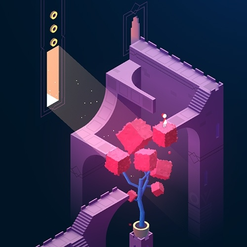
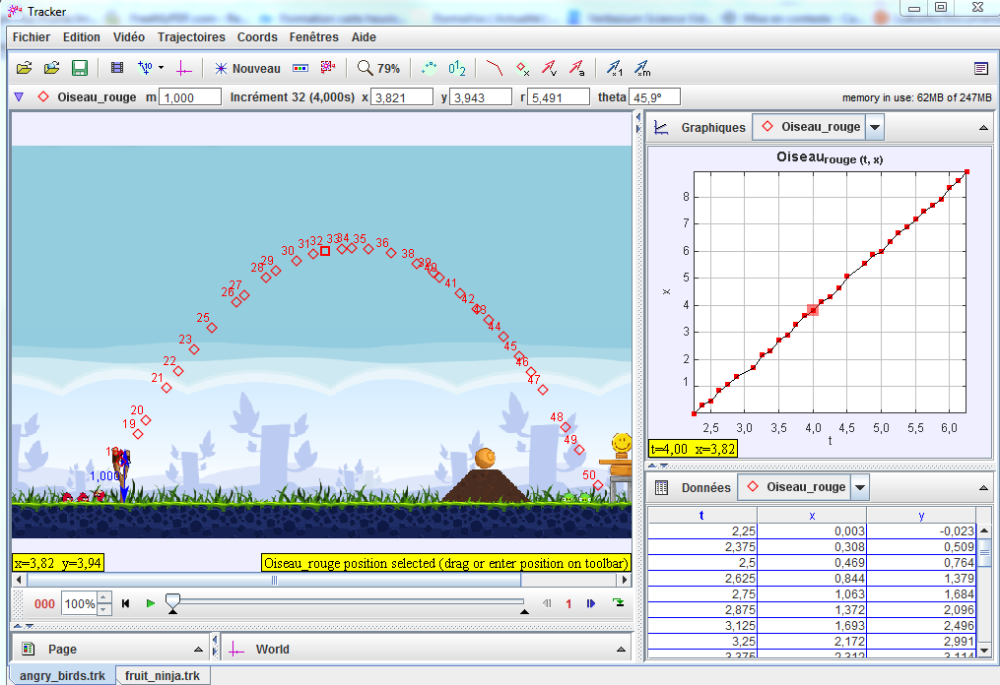

Pour finir l'année sur une note plus ludique, voici les jeux qui m'ont le plus empêché d'écrire encore plus d'articles passionnants sur ce blog cette année :

## Monument Valley 2

Digne suite du "1" dont je vous avais [brièvement parlé](/2016/07/17/dansez-avec-les-etoiles-a-la-maison-dailleurs/) l'année passée, [Monument Valley 2](https://www.monumentvalleygame.com/) est encore plus magnifique. Cette fois il faut réunir la magicienne du "1" et sa fille, parfois séparées, parfois présentes dans le même tableau Escheresque animé par des mécanismes aussi impossibles que surprenants. Par exemple dans le tableau ci-contre, le curseur agit sur la taille de la fenêtre lumineuse et l'arbre réagit à la quantité de lumière en se développant ou se ratatinant, permettant au passage au personnage de monter sur ses feuilles.

La [video "Behind the Scene" d'ustwo](https://www.youtube.com/watch?v=6gzygG3MTgk) montre le travail des concepteurs de ce jeu qui vaut ses €5.5 sans la moindre hésitation, sur [Pomme-Phone](https://itunes.apple.com/fr/app/monument-valley-2/id1187265767?mt=8) ou [Google-Phone](https://play.google.com/store/apps/details?id=com.ustwo.monumentvalley2&hl=fr). Seul bémol : il est trop court.

## Life Is Strange (Before the Storm)

[Life Is Strange](w:) est sorti en 2015, mais mes filles ne m'en ont parlé que cette année. En apparence c'est un "jeu de filles" (alerte sexisme...) où on incarne une jeune étudiante en école d'art, avec ses petits problèmes de copains/copines et de professeurs. Et puis tout change ... (spoiler alert...). Sans dévoiler ce qui m'a réellement fait aimer ce jeu, je souligne tout de même sa très belle réalisation, notamment au niveau des effets de lumière que l'on devine dans le trailer. Disponible pas cher [sur Steam](http://store.steampowered.com/app/319630/) et sur beaucoup de consoles. Le premier des 5 épisodes est même gratuit.

Par contre j'ai été un  peu déçu par la "suite" Before the Storm, à laquelle il manque la chose qui m'avait plu dans le "1", donc redevient un  "jeu de filles" un peu trop linéaire.



 

## Lifeless Planet

Un "petit" jeu très sympa financé [sur Kickstarter](https://www.kickstarter.com/projects/davidboard/lifeless-planet-a-new-cinematic-sci-fi-adventure-g) et [disponible pas cher sur Steam](http://store.steampowered.com/app/261530/Lifeless_Planet_Premier_Edition/). Il s'agit d'explorer une planète apparemment déserte, aux décors spectaculaires, d'abord pour survivre, ensuite pour parvenir à revenir sur Terre. Finalement, le jeu n'est pas si petit que ça et suffisamment varié pour occuper quelques heures



## Bridge Constructor Portal

[Bridge Constructor](http://www.headupgames.com/conpresso/_rubric/index.php?rubric=EN+Games+Bridge-Constructor) est un jeu datant de 2013 encore disponible [sur Steam](http://store.steampowered.com/app/250460/Bridge_Constructor/), mais aussi sur tablettes et smartphones (où il est difficile à jouer avec mes gros doigts). Il s'agit de construire des ponts entre deux rives à l'aide de divers matériaux afin de faire traverser deux camions. Ou pas. Car la simulation du passage est basée sur la physique de la résistance des matériaux, et qu'un pont mal conçu ne tiendra pas. Ce petit jeu a un aspect didactique certain, mais il n'est pas très marrant, il faut bien l'avouer.

Mais en cette fin d'année, les éditeurs de ce jeu ont eu la lumineuse idée de le combiner avec le génial [Portal](w:Portal_(jeu_vidéo)) dont [je vous ai causé il y a 10 ans](/2007/11/11/portal-le-jeu-hyperspecial/). Dans Bridge Constructor Portal, il faut construire des ponts, mais aussi parfois de rampes ou des tremplins pour permettre à des véhicules de test de traverser chaque zone de test, parsemée de pièges mortels, mais aussi de portals de téléportation à utiliser à bon escient, le tout imbibé de l'humour grinçant de [GLaDOS](w:) :



Si vous avez aimé Portal ou Bridge Constructor, vous aimerez ce jeu délirant disponible pour une somme très modique [sur Steam](http://store.steampowered.com/app/684410/Bridge_Constructor_Portal/), mais aussi sur tablettes et smartphones si vous avez des doigts de fée.

## EVE  - Project Discovery

Je vous ai [déjà parlé ici](/2017/07/12/eve-et-les-exoplanetes/#.WkVF7mjT6Co) de l'extension de ce jeu colossal permettant de chercher de vraies exoplanètes, mais peu ont suivi [mon lien](http://secure.eveonline.com/signup/?invc=98678cbd-7ead-43c1-9592-949aca436563&action=buddy) pour y jouer gratuitement (pour commencer...) alors j'en remets une couche.

## Angry Birds 2

_Ici j'ai une confession à faire : ce paragraphe est un brouillon de 2013 qui devait être une introduction à la simulation physique dans les jeux et que je n'avais jamais terminé, entre autres car le soufflé Angry Birds était un peu retombé. Mais comme je viens de commencer à jouer à Angry Birds 2 sorti en 2015, le revoilà tel un cheveu sur la soupe._

Depuis 2009, des milliards d'oiseaux ont été catapultés sur des cochons verts par les joueurs d' [Angry Birds](w:). Les différentes versions de ce jeu extrêmement addictif ont envahi les smartphones, tablettes et ordinateurs, rapportant gloire et millions aux fondateurs de [Rovio](http://www.rovio.com/).



Les trajectoires des Angry Birds ainsi que leurs collisions destructrices sont calculées par un "[moteur physique](w:)", en l’occurrence [Box2D](w:), qui n'est pourtant même [pas crédité officiellement](http://www.geek.com/articles/mobile/box2d-creator-asks-rovio-for-angry-birds-credit-at-gdc-2011032/). Restait à Rovio à réaliser de beaux graphismes, des tableaux variés et un marketing efficace. Et aussi à paramétrer Box2D pour que la physique du jeu produise sur un petit écran des événements nombreux, variés et amusants.

Rhett Allain a consacré une [dizaine d'articles dans Wired](http://www.wired.com/wiredscience/tag/angry-birds/) à analyser ce jeu à l'aide de [Tracker](http://physlets.org/tracker/), un logiciel d'analyse vidéo puissant, gratuit et relativement facile d'utilisation. Il a aussi réalisé un [tutoriel vidéo](http://youtu.be/qpejtV4UXRY) montrant comment procéder [[10]](#ref-10). [Pour commencer](http://www.wired.com/wiredscience/2010/10/physics-of-angry-birds/), Allain a déterminé la taille des Angry Birds à partir de la trajectoire parabolique d'un tir, et en supposant  qu'il a lieu sur Terre (g = 9.81 m/s). Il a ainsi trouvé que la hauteur de la fronde est d'environ 5m, et les que les oiseaux mesurent environ 1m de diamètre [[1]](#ref-1). Sa mesure a été reproduite [en français par Science FGA](http://sciencefga.blogspot.com/2012/01/la-physique-dans-le-jeux-videos.html) [[14]](#ref-14)

Dans d'autres articles, Allain montre que les Angry Birds prennent quelques libertés avec les lois de la physique, par exemple:

- que la fronde tendue à fond éjecte tous les oiseaux à la même vitesse de 22 m/s [[3]](#ref-3). Un véritable élastique leur fournirait la même énergie cinétique, donc les oiseaux lourds iraient moins loin que les légers.
- que lorsque l'oiseau bleu se divise en 3, ses petits sont chacun environ 10x plus lourds que l'oiseau initial [[2]](#ref-2)
- que la gravitation ne s'exerce que dans l'atmosphère des planètes d'Angry Birds Space [[8]](#ref-8) et qu'il existe une "vitesse limite" d'environ 30 m/s que les oiseaux ne dépassent pas même s'ils devraient continuer à accélérer sous l'effet de la gravitation [[9]](#ref-9).

Ces entorses à la physique rendent le jeu beaucoup plus facilement jouable et intéressant : sans elles, il serait très difficile de catapulter les oiseaux avec précision pour démolir les défenses des cochons verts. Or ce qui rend les Angry Birds si addictifs, c'est justement la simulation des collisions et des destructions qui en résultent. Et là, pour faire vrai, il faut exploiter au mieux la puissance limitée des processeurs de smartphones en utilisant des algorithmes plus futés qu'on ne l'imagine de prime abord.

C'est là que Eric Catto, le créateur de Box2D a innové. Son algorithme de [détection de collision](w:) entre les oiseaux catapultés et les différents objets, ainsi qu'entre les objets eux-mêmes n'examine que les collisions possibles entre les objets dotés d'une certaine vitesse relative [[15]](#ref-15). En particulier, il ne gaspille pas de temps processeur à gérer les objets immobiles en contact les uns avec les autres.

## A vos manettes. claviers. doigts !

J'ai encore testé plein de jeux différents comme WordBrain et je reste accro à [Ingress,](/2014/07/30/trop-plein-de-juillet/) mais mes jeux préférés de 2017 sont décidément empreints de physique à des degrés divers. Si vous y trouvez votre bonheur, ça nous fera un point commun :-)

# Bonnes Fêtes à tous !

 (avec un peu de retard...)

### Références:

Rhett Allain sur Wired :

1. "[The Physics of Angry Birds](http://www.wired.com/wiredscience/2010/10/physics-of-angry-birds/)", October 8, 2010
2. "[Does the Angry Blue Bird multiply its mass?](http://www.wired.com/wiredscience/2010/10/does-the-angry-blue-bird-multiply-its-mass/ "Permanent Link to Does the Angry Blue Bird multiply its mass?")",October 18, 2010
3. "[Is the Launch Speed in Angry Birds Constant?](http://www.wired.com/wiredscience/2011/05/is-the-launch-speed-in-angry-birds-constant/ "Permanent Link to Is the Launch Speed in Angry Birds Constant?")", May 23, 2011
4. "[How Does the Green Angry Bird Work?](http://www.wired.com/wiredscience/2011/04/how-does-the-green-angry-bird-work/ "Permanent Link to How Does the Green Angry Bird Work?")", April 25, 2011
5. "[Physics of the Yellow Angry Bird](http://www.wired.com/wiredscience/2011/11/physics-of-the-yellow-angry-bird/ "Permanent Link to Physics of the Yellow Angry Bird")_",_ November 10, 2011
6. "[Another Look at Launch Speed in Angry Birds](http://www.wired.com/wiredscience/2012/01/another-look-at-launch-speed-in-angry-birds/ "Permanent Link to Another Look at Launch Speed in Angry Birds")", January 9, 2012
7. "[Angry Birds in Space](http://www.wired.com/wiredscience/2012/03/angry-birds-in-space/ "Permanent Link to Angry Birds in Space")", March 12, 2012
8. "[The Gravitational Force in Angry Birds Space](http://www.wired.com/wiredscience/2012/03/the-gravitational-force-in-angry-birds-space/ "Permanent Link to The Gravitational Force in Angry Birds Space")", March 29, 2012
9. "[Another Gravitational Experiment in Angry Birds Space](http://www.wired.com/wiredscience/2012/04/another-gravitational-experiment-in-angry-birds-space/ "Permanent Link to Another Gravitational Experiment in Angry Birds Space")", April 4, 2012
10. "[How to Make Your Own Angry Birds Experiment](http://www.wired.com/wiredscience/2012/04/how-to-make-your-own-angry-birds-experiment/ "Permanent Link to How to Make Your Own Angry Birds Experiment")", April 16, 2012
11. "[Superposition of Gravitational Forces in Angry Birds Space](http://www.wired.com/wiredscience/2012/04/superposition-of-gravitational-forces-in-angry-birds-space/ "Permanent Link to Superposition of Gravitational Forces in Angry Birds Space")", April 18, 2012
12. "[Why Do I Love Angry Birds Analysis?](http://www.wired.com/wiredscience/2012/04/why-do-i-love-angry-birds-analysis/ "Permanent Link to Why Do I Love Angry Birds Analysis?")", April 24, 2012
13. "[A Bouncing Angry Bird](http://www.wired.com/wiredscience/2012/09/a-bouncing-angry-bird)", September 3, 2012
14. Alexandre Gaudreau "[La physique et Angry Birds](http://sciencefga.blogspot.ch/2012/01/la-physique-dans-le-jeux-videos.html)", 2012 sur Science FGA
15. Erin Catto, "[Iterative Dynamics with Temporal Coherence](http://erwincoumans.com/ftp/pub/test/physics/papers/IterativeDynamics.pdf)", 2005
