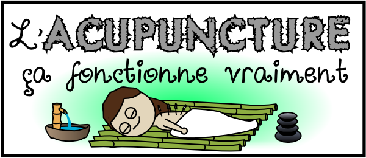
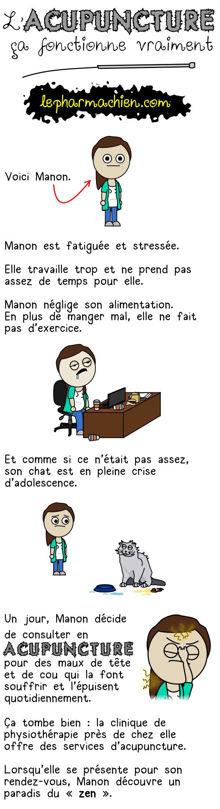
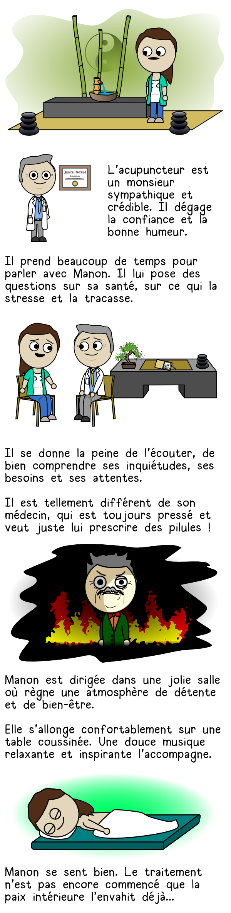
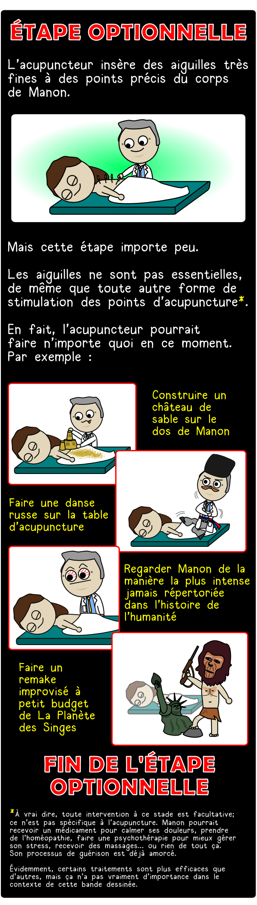
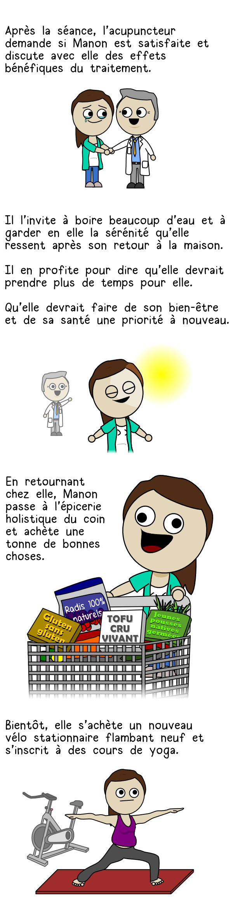
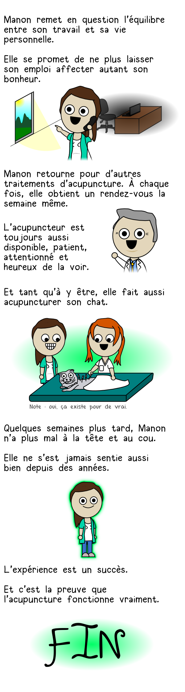
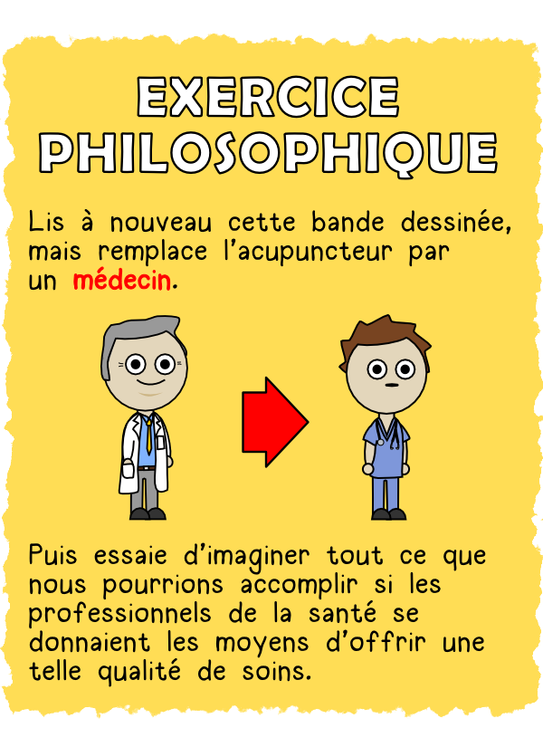

L’exercice de certaines professions est cadré par des associations professionnelles dotées de [codes de déontologie](w:code_de_déontologie), et c’est très bien ainsi.  Que ces codes comprennent des articles demandant le respect et la collaboration avec les autres professions organisées de manière similaire, par exemple les médecins envers les pharmaciens semble logique aussi. Mais un gros problème apparaît lorsque les “professionnels” des [pseudo-sciences](w:pseudo-science) comme les [médecines non conventionnelles](w:médecine_non_conventionnelle) parviennent à obtenir un statut identique.

## Le Pharmachien et les acupuncteurs

C’est ce que montre la mésaventure d’Olivier Bernard, “[Le Pharmachien](http://lepharmachien.com/) impertinent qui simplifie la science et anéantit la pseudoscience”.

Le 27 juillet 2014, il a publié [une excellente BD](https://web.archive.org/web/20150429020402/http://lepharmachien.com/acupuncture) sur l'[acupuncture](w:), qui a [disparu de son site](http://lepharmachien.com/acupuncture/) en mai 2015, suite à une demande d’enquête en déontologie déposée par des acupuncteurs québécois auprès de l'[Ordre des pharmaciens du Québec](w:). Ils estimaient qu’en publiant cette BD, Olivier Bernard violait l’[article 86 du code de déontologie des pharmaciens](http://legisquebec.gouv.qc.ca/fr/ShowDoc/cr/P-10,%20r.%207/#se:86) qui stipule que:

> Le pharmacien doit, dans ses rapports avec les autres pharmaciens, les étudiants, les stagiaires **et les autres professionnels**, se comporter avec dignité, courtoisie, respect et intégrité; il doit notamment:
> 
> - collaborer avec les autres pharmaciens **et les membres des autres ordres professionnels**, ainsi que chercher à établir et à maintenir des relations harmonieuses;
> - (...)
> - s’abstenir de dénigrer un autre pharmacien **ou un autre professionnel;** (...)

Or justement, les acupuncteurs du Québec ont également [un Ordre professionnel](w:Office_des_professions_du_Québec#Liste_des_ordres_professionnels), avec un [code de déontologie doté d’un article similaire](http://legisquebec.gouv.qc.ca/fr/ShowDoc/cr/A-5.1,%20r.%203/?#se:51), et ont estimé que le Pharmachien dénigrait leur profession.

L’enquête menée par l’Ordre des Pharmaciens a finalement conclu qu’il n’y avait pas eu d’infraction ou de manquement à l’éthique professionnelle, mais a appris à Olivier Bernard que son appartenance à un Ordre “restreint sa liberté d’expression”. Il a donc tout de même décidé de retirer son oeuvre de son site dans un souci d’apaisement.

## Un problème québécois ou canadien ?

Il faut dire qu’au Québec, [la loi définit 25 “professions d’exercice exclusif”](https://professions-quebec.org/les-ordres-professionnels/les-professions-reglementees/types-de-professions-et-d-ordres/) dont celles de médecin, de pharmacien, d’ingénieur, et d’acupuncteur  dont l’exercice n’est possible que si on est membre de l’Ordre correspondant, régi par un code de déontologie qui a force de loi. S’il avait été exclu de son ordre pour violation du code de déontologie, Olivier Bernard n’aurait plus pu exercer sa profession !

Il est évident qu’un médecin qui prétendrait soigner un cancer par imposition des mains, un pharmacien qui vendrait délibérément des contrefaçons de médicaments ou un acupuncteur qui utiliserait des aiguilles infectées doit être empêché d’exercer pour la protection du public. La plupart des pays industrialisés disposent de réglementation en ce sens.

En France par exemple, l’[Article 39 du Code de déontologie de l’Ordre National des Médecins](https://www.conseil-national.medecin.fr/article/article-39-charlatanisme-263) (article R.4127-39 du code de la santé publique) paraît même particulièrement clair :

> Les médecins ne peuvent proposer aux malades ou à leur entourage comme salutaire ou sans danger un remède ou un procédé illusoire ou insuffisamment éprouvé.
> 
> Toute pratique de charlatanisme est interdite.

Reste à définir le charlatanisme, puisqu’en France, seuls des médecins diplômés peuvent devenir acupuncteurs ou homéopathes, sans que la validité scientifique de ces disciplines ne soit reconnue pour autant…

Ce qui semble particulier au Québec, voire au Canada c’est :

1. le statut légal des Ordres professionnels, dont les codes de déontologie ont force de loi.
2. la présence dans ces codes de déontologie d’un article imposant le respect envers tous les autres professionnels constitués en Ordres.

La combinaison de ces deux particularités permet non seulement à des pseudo-sciences d’obtenir un statut légal égal aux professions scientifiques établies, mais en plus de se mettre à l’abri des critiques des personnes les plus qualifiées pour porter un jugement éclairé et éclairant sur leurs disciplines.

C’est déjà le cas des acupuncteurs et des chiropraticiens au Québec, mais il existe déjà un [Ordre des homéopathes en Ontario](http://www.collegeofhomeopaths.on.ca/), dont les membres, non médecins, ont le droit de traiter des cancers [[1]](#ref-1) ! Et il est impossible aux médecins et pharmaciens de dénoncer ceci, **au risque de diverses sanctions, amendes et menaces à la possibilité d’exercer leur métier !**

## Retour sur l’acupuncture

Autant le préciser tout de suite : en Suisse je peux exercer ma profession d’ingénieur sans être membre d’une association professionnelle et même si je l’étais, [le Code d’Honneur de la SIA](http://www.sia.ch/fileadmin/content/bilder/SIA_allg/151_Standesordnung_f.G%C3%BCltigAbAnfang2015.pdf)  (Art 3) ne m’engagerait que face à mes "collègues et partenaires".

Je suis donc parfaitement libre et à l’aise pour affirmer qu’en l’état actuel des connaissances scientifiques, l’acupuncture n’est pas plus efficace que l’acupuncture “simulée”, où on planterait les aiguilles ailleurs que dans les “méridiens” définis par la médecine chinoise [[2]](#ref-2), [[3]](#ref-3), [[4]](#ref-4), [[5]](#ref-5).

Et comme de nombreuses études montrent un faible effet positif de l’acupuncture (chinoise ou simulée) comparé au placebo, je soutiens à 100% la position du Pharmachien, qui dit très clairement:

1. dès le titre, que “l’acupuncture, ça fonctionne vraiment “.
2. et il le répète à la première phrase : “_Si tu as un doute quelconque au sujet de l’efficacité de l’acupuncture, efface ça immédiatement de ton esprit. Car l’acupuncture ça fonctionne pour de vrai._”
3. Puis il défend l’idée selon laquelle l’environnement de soins personnalisés typique de l’acupuncture, mais aussi d’autres médecines “douces”, amplifie l’effet placebo, et qu’il devrait être utilisé par la médecine scientifique.

Il précise encore sa position dans plusieurs des [189 commentaires collectés jusque fin avril 2015](https://web.archive.org/web/20150429020402/http://lepharmachien.com/acupuncture/#comments) , tous polis et constructifs:

> Où exactement ai-je dit que les acupuncteurs sont des charlatans ? J’ai dit que c’est une approche efficace, peu importe le mécanisme. Les acupuncteurs n’ont aucune raison de m’en vouloir. Comme je l’ai mentionné dans l’intro, c’est une approche spirituelle, pas une approche scientifique. Or, je ne fais pas dans la spiritualité ici, mais je ne m’y oppose pas non plus.
> 
> Et je trouve ça très bien que l’acupuncture aie un ordre professionnel, car ça permet de protéger le public.
> 
> Si jamais la science (…) prouve que l’énergie “Qi” existe, je me rétracterai joyeusement.

La BD du Pharmachien est une excellente vulgarisation de l’état des connaissances actuelles sur l’acupuncture, parfaitement respectueuse de l’[Art 18 de son code de déontologie](http://legisquebec.gouv.qc.ca/fr/ShowDoc/cr/P-10,%20r.%207/#se:18):

> Dans ses déclarations publiques traitant de l’exercice de la pharmacie, le pharmacien doit s’appuyer sur des données scientifiquement acceptables et des normes professionnelles reconnues; il doit éviter le recours à l’exagération.

A l’inverse, le code de déontologie des acupuncteurs du Québec ne fait aucune référence à la science et la page de l’ordre sur [les "preuves scientifiques"](https://web.archive.org/web/20171027052904/http://www.o-a-q.org/fr/acces-public/l-acupuncture/les-preuves-scientifiques.aspx) ne contient qu’un lien cassé vers une [publication épuisée](https://web.archive.org/web/20180815114007/http://apps.who.int/bookorders/anglais/detart1.jsp?codlan=1&codcol=93&codcch=196).

## Conclusion

Les ordres professionnels ne devraient pas imposer le respect généralisé envers d’autres professions, ou alors les nommer explicitement pour éviter des conflits lors de la création de nouveaux ordres. En particulier l’article 86 du code de déontologie des pharmaciens du Québec restreint inutilement la liberté d’expression, voire le devoir des pharmaciens de travailler et s’exprimer en fonction des données de la science.

La pression des acupuncteurs contre l’excellente BD d’Olivier Bernard mérite un [effet Streisand](w:) : partagez et republiez cet article un max svp ! Pour le texte vous avez le droit,  il est publié sous [licence Creative Commons](/2013/01/26/acanthapis-petax-cc-et-wikipedia/). Et pour les images, récupérées de l'[Internet Archive](w:) sans autorisation d'Olivier Bernard, j'invoque le "[fair use](w:)" :

    

## Références:

1. "[Les homéopathes toujours autorisés à traiter le cancer en Ontario](http://beta.radio-canada.ca/nouvelle/1029763/homeopathes-autorises-traiter-cancer)", 2017, Radio Canada
2.  Cherkin D, Sherman K, Avins A, Erro J,Ichikawa L et. al. “A randomized trial comparing acupuncture, simulated acupuncture, and usual care for chronic low back pain.“ Archives of Internal Medicine, 2009 vol: 169 (9) pp: 858 [https://www.ncbi.nlm.nih.gov/pubmed/19433697](https://www.ncbi.nlm.nih.gov/pubmed/19433697) 
3.  Harris RE, Zubieta J-K, Scott DJ, et al. [Traditional Chinese acupuncture and placebo (sham) acupuncture are differentiated by their effects on μ-opioid receptors (MORs).](http://www.ncbi.nlm.nih.gov/pubmed/19501658)NeuroImage. 2009 ;47(3):1077–1085. 
4. [Colquhoun D, Novella SP. Acupuncture is theatrical placebo. Anesth Analg. 2013 Jun;116(6):1360-3.](https://www.ncbi.nlm.nih.gov/pubmed/23709076) 
5. ["Acupuncture" sur Science Based Medicine](https://sciencebasedmedicine.org/reference/acupuncture/)
