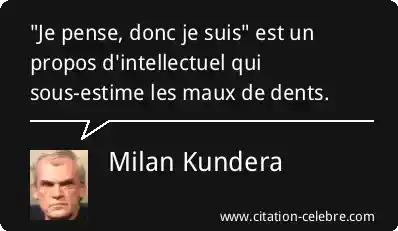

Je me fais parfois traiter de d' "esprit cartésien", quand ce n'est pas de "cartésien borné", incapable de saisir qu'il existe autre chose que le monde bassement matériel qui nous entoure. Pourtant le [cartésianisme](w:) est défini comme une philosophie [rationaliste](w:) et [métaphysique](w:) :

- La métaphysique désigne "la connaissance du monde, des choses ou des processus en tant qu'ils existent « au-delà » et indépendamment de l’expérience sensible que nous en avons",
- et le rationalisme "pose la raison discursive comme seule source possible de toute [connaissance](w:) réelle. Autrement dit, le réel ne serait connaissable qu'en vertu d'une explication par la raison déterminante, suffisante et nécessaire"[[1]](#ref-1)

Donc le Cartésien n'est justement pas [matérialiste](w:) ! Il croit que sa raison permet d'accéder à la vraie nature des choses, indépendante de ce que nos sens nous en révèlent. Et donc implicitement que sa [raison](w:) a une nature spirituelle, transcendante, ou du moins métaphysique elle aussi.

## "Je pense donc je suis."

> Ce principe de la philosophie cartésienne, je pense, donc je suis, est ce que les adversaires du cartésianisme ont attaqué avec le plus de persévérance; et cela se conçoit, car ce principe admis, l'autorité de la conscience et de la raison s'ensuit nécessairement. [[2]](#ref-2)

Personnellement, plus j'y pense, moins je le suis, notamment parce que l' "autorité de la conscience et de la raison" me semble avoir un effet pervers que je constate souvent dans certaines discussions:

## "J'y pense donc c'est possible"

La raison du rationaliste lui permet d'accéder à la réalité au delà du visible. Donc si sa raison lui dit des choses comme:

- Puisque la loi  de la gravitation produit une force négative si une masse est négative, alors l'[antigravité](w:) est possible.
- Si le temps s'arrête quand on va à la vitesse de la lumière, en allant plus vite on peut remonter le temps
- Si on entre dans un trou noir, certaines équations disent qu'on va ressortir par un autre à travers un [trou de ver](w:).
- etc.

C'est possible puisque la raison le permet, la même raison surpuissante que celle de [René Descartes](w:) (1596-1650), fondateur de la [méthode scientifique](w:). Et c'est même parfaitement conforme à sa méthode en 4 étapes:

1. Objet évident (sujet de l'étude ; problème à résoudre & hypothèses)
2. Diviser le plus possible
3. Recomposer
4. Réviser (vue globale ; confirmer ou réfuter les hypothèses)

Les idées listées plus haut en sont donc à l'étape 4 : yapluka confirmer ou infirmer les hypothèses. Et ça c'est pas un job digne d'un théoricien, il existe des esclaves expérimentateurs pour ça. Et ceux qui disent que ces théories sont du pipeau sont des imbéciles dépourvus de raison transcendante, ou pire...

## Des empiristes

En français courant, les "connaissances empiriques" ont une connotation un peu négative, ça fait un peu "trucs trouvés par hasard, ou appris sur le tas", et la "méthode empirique" quasi équivalente au bricolage.

Pourtant l'[empirisme](w:) est une méthode [David Hume](w:) (1711-1776)

 

## Références :

1. Morfaux Louis-Marie, "Vocabulaire de la philosophie et des sciences humaines", 2001, Armand-Colin (cité par wikipédia)
2. Jules Simon, "Œuvres de Descartes ", 1845, Edition Charpentier, Paris
