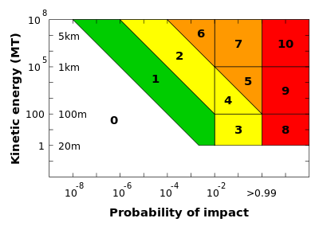

*Réponse publiée [sur Quora](https://www.quora.com/Would-an-asteroid-measuring-400-metres-in-length-wipe-all-life-on-earth-if-it-was-travelling-fast-enough/answer/Dr-Goulu)*

400m would be level 9 on [Torino scale](w:en:Torino_scale) :

level 9 would cause “unprecedented regional destruction for a land impact or the threat of a major tsunami for an ocean impact. Such events occur on average between once per 10,000 years and once per 500,000 years.”

So it’s not that exceptional.

Note the speed isn’t considered in the risks as asteroids in our solar systems orbit in the same direction as Earth and are mostly accelerated by their fall in Earth’s gravitational well. Extra solar objects such as last year’s [Interstellar Asteroid](https://www.nasa.gov/planetarydefense/faq/interstellar) are really exceptional. So exceptional they are ranked 0 on Torino scale : we don’t care of this risk.
