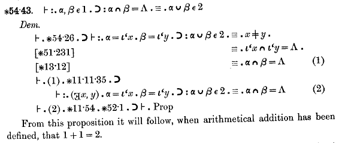

*Réponse publiée [sur Quora](https://www.quora.com/What-does-it-take-to-prove-that-0-isn-t-equal-to-1/answer/Dr-Goulu)*

It’s probably proven somewhere in Alfred North Whitehead, Bertrand Russell “[Principia Mathematica](w:en:Principia_Mathematica)" (1910) University Press

in a formal logic proposition similar to this one :

