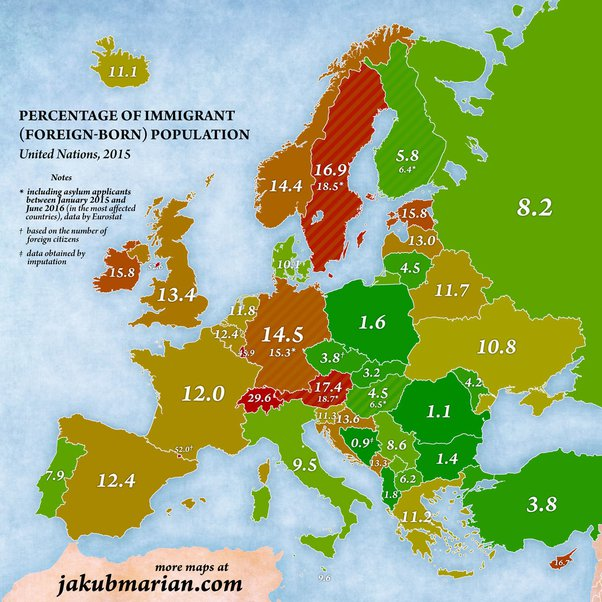

*Réponse publiée [sur Quora](https://www.quora.com/Why-is-Switzerland-so-exposed-towards-nationalism-into-and-beyond-continental-Europe-perhaps-it-s-the-reason-why-they-were-not-admitted-into-the-European-Union-as-a-member/answer/Dr-Goulu)*

Hahaha. Read about [Switzerland–European Union relations](w:en:Switzerland–European_Union_relations) : Switzerland never wanted to join EU. And people elected from the “nationalist” party govern together with socialists since we have proportional election from the local to the federal level.

But to answer your question “why” , maybe this map can help:

(source : [4 maps that will change how you see migration in Europe](https://www.weforum.org/agenda/2016/08/these-4-maps-might-change-how-you-think-about-migration-in-europe/) )
