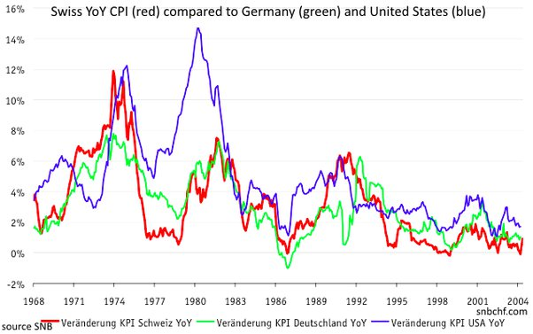

*Réponse publiée [sur Quora](https://www.quora.com/What-are-the-Swiss-financial-laws-which-enable-the-Swiss-banking-system-to-be-more-lucrative-and-safe-than-other-banks-in-other-western-countries/answer/Dr-Goulu)*

None. It’s all about the political stability and the stability of the Swiss Franc currency, which is managed by the very independent Swiss National Bank,.

SNB traditionaly fights inflation. Since 1975 the Swiss inflation (red line) was always lower than US inflation (blue line) :

Imagine this : the swiss government now borrows money at a negative interest rate, and investors buy this bonds, knowing they will get less Swiss Francs in 10 years than the price they paid. Why do they do this ? Because they expect the Swiss Franc to be stronger than their own currency in 10 years. On the long term, investing in CHF returns 0.5% simply because your currency drops …

And what does the swiss government do with this borrowed money ? well, they repay loads they made earlier at a positive interest rate, which makes Switzerland even more stable…

Source : [Swiss Franc History: The long-term view and the comparison with gold snbchf.com](https://snbchf.com/chf/chf-history/long-term-view/)
