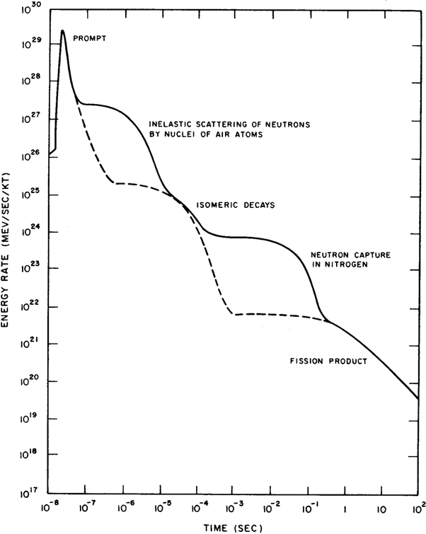
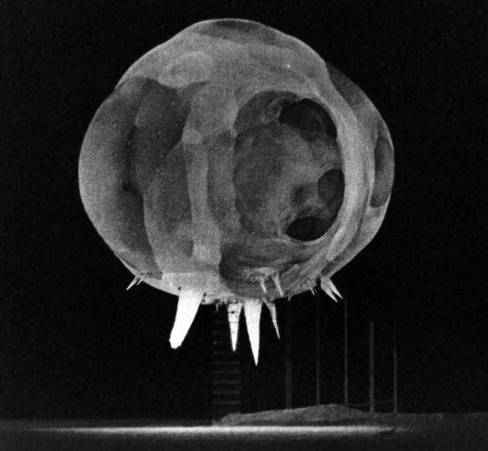

*Article initialement publié sur [Quora](https://fr.quora.com/L-%C3%A9quivalent-des-bombes-nucl%C3%A9aires-en-%C3%A9nergie-TNT-est-elle-pertinente-%C3%A0-partir-du-moment-o%C3%B9-la-puissance-%C3%A9lev%C3%A9e-du-nucl%C3%A9aire-devrait-causer-une-d%C3%A9tonation-initiale-beaucoup-plus/answer/Dr-Goulu)*

Sur [Explosion atomique — Wikipédia](w:Explosion_atomique) on trouve la description de ce qui se passe. En effet la [Réaction en chaîne](w:Réaction_en_chaîne_(nucléaire))produit un pic de puissance plus élevé que pour une explosion chimique, mais pendant moins d’une microseconde. Ensuite cette énergie est diffusée par différents phénomènes, notamment l’interaction avec l’atmosphère (cf. diagramme ci-dessous : la courbe en pointillés correspond à la même explosion en dehors de l’atmosphère, qui dégage étonnamment moins d’énergie):

Au final, c’est l’intégrale de cette courbe de puissance qui donne l’énergie totale de l’explosion.

En comptant que la [Vitesse de détonation](w:)dans un bon explosif solide est de l’ordre de 5 km/s et qu’un kilotonne de TNT représente un cube de 10m de côté, avec un détonateur au centre on a un temps d’explosion d’une milliseconde et on voit sur le graphique ci-dessus que c’est aussi l’ordre de grandeur des réactions nucléaires (chaîne + interactions), donc je dirais que oui l’équivalent en TNT me semble valide en première approximation.

Merci pour cette question qui m’a fait découvrir cette photo incroyable (sur la [page Wikipédia](w:Explosion_atomique)) : c’est la boule de feu d’un essai atomique atmosphérique américain en 1962, avec un temps d’exposition d’une microseconde. En bas on distingue encore la tour sur laquelle se trouvait la bombe. Les “pattes” lumineuses sont les haubans de la tour en train de se vaporiser …

