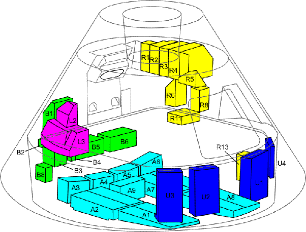

*Article initialement publié sur [Quora](https://fr.quora.com/Comment-les-pierres-de-lune-ont-elles-%C3%A9t%C3%A9-transf%C3%A9r%C3%A9es-dans-la-navette-spatiale/answer/Dr-Goulu)*

La [Navette spatiale américaine](w:) n’a jamais dépassé l’altitude de 1000 km, elle n’a rien à voir avec les missions lunaires.

Les 382 kg de [Roche lunaire](w:) au total ramenés par les 6 missions Apollo ont été collectés avec divers outils (détails et photos ici[[1]](#FJZRR)), mis dans des boîtes étanches et ramenés sur Terre à l’intérieur de [l’étage de remontée du module lunaire Apollo](w:Module_lunaire_Apollo) , puis transférées dans le [Module de commande Apollo](w:Module_de_commande_et_de_service_Apollo), aux emplacements B5 et B6[[2]](#mDDqz)

Notes de bas de page

[[1]](#cite-FJZRR)[Sample Collection Tools](https://www.lpi.usra.edu/lunar/samples/apollo/tools/)

[[2]](#cite-mDDqz)[Apollo 16 Stowage Locations](https://history.nasa.gov/afj/ap16fj/02stowage.html)
