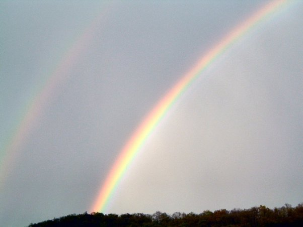
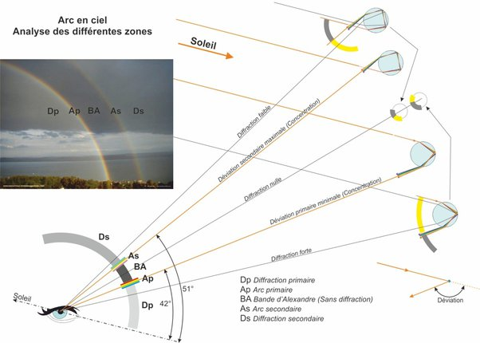

*Article initialement publié sur [Quora](https://fr.quora.com/Quest-ce-quun-arc-en-ciel-%C3%A0-lenvers/answer/Dr-Goulu)*

Je ne sais pas si c’est ce que vous voulez dire, mais il apparaît parfois un [Arc-en-ciel](w:)secondaire, dont les couleurs sont inversées (rouge à l’intérieur) par rapport au primaire (rouge à l’extérieur)

ça arrive lorsque les rayons du Soleil font deux réfractions+réflexions dans les gouttes d’eau en altitude, puis une seule (le cas normal) plus bas :

Notez la “bande d’Alexandre” plus sombre qui se forme entre les deux arcs-en-ciel dans ce cas là
