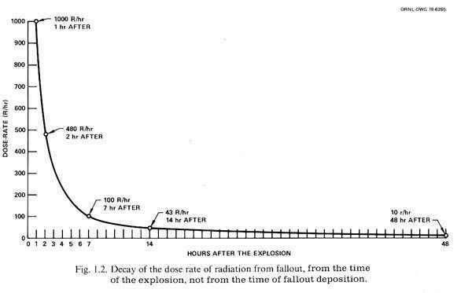

*Article initialement publié sur [Quora](https://fr.quora.com/Quest-il-arriv%C3%A9-aux-radiations-qui-%C3%A9taient-cens%C3%A9es-durer-des-milliers-dann%C3%A9es-%C3%A0-Hiroshima-1945/answer/Dr-Goulu)*

Elles sont toujours là, elles décroissent exponentiellement :

48h après l’explosion, elles étaient déjà 100 fois plus faibles qu’après une heure, mais les 10 r/hr (je pense que ce sont des [Röntgen equivalent man](w:) par heure) étaient encore une dose très dangereuse (équivalente à 100 mSv/h)

Aujourd’hui les isotopes à longue demi-vie produits lors de cette tragédie continuent à se désintégrer, atome par atome, mais le niveau est si faible qu’il est indiscernable[[1]](#ZlhEW) de [La radioactivité naturelle - Pourquoi Comment Combien](/2013/11/03/la-radioactivite-naturelle/).

Notes de bas de page

[[1]](#cite-ZlhEW)[Are Nagasaki And Hiroshima Still Radioactive?](https://zidbits.com/2013/11/is-nagasaki-and-hiroshima-still-radioactive/)
