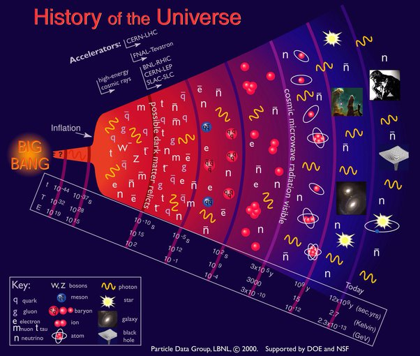

*Article initialement publié sur [Quora](https://fr.quora.com/Que-se-passe-t-il-entre-t0-et-tTp-Tp-temps-de-Planck/answer/Dr-Goulu)*

comment savez vous qu’il y a eu un t=0 ?

Grâce aux accélérateurs de particules on a une vague idée de l’état de la matière à 10^15 K, soit 17 ordres de grandeur en dessous de la [Température de Planck](w:) qui correspond à t=Tp avec une échelle linéaire du temps.

Pour raccommoder ceci avec la taille de l’Univers observé, on a du postuler une très étrange [inflation cosmique](w:) durant laquelle l’Univers a augmenté de volume exponentiellement.

Exponentiellement ? Et si ce que nous appelons le temps avait une nature[[1]](#AoiOB) différente de notre mesure en secondes ? Un peu comme la mesure de température a un zéro absolu alors qu’elle mesure en fait l’énergie cinétique de particules ? Si la nature temps était lié à la température (temps thermodynamique) ou à la “taille” de l’Univers (Relativité) et qu’il faille le mesurer en log ?

Dans ce cas il n’y a pas d’inflation, pas de singularité, pas d’origine du temps. Ou du moins le temps de Planck est rejeté très loin sur l’axe du temps logarithmique. Regardez : de 10^2 GeV à nos jours (2.3 10^-13 GeV), il y a eu 15 ordres de grandeur. Du temps/énergie de Planck (10^19 GeV) à 10^2 GeV, il y a eu 17 ordres de grandeur.

Avec un “temps logarithmique”, il s’est passé 100x plus de choses du temps de Planck à celui du “Big Bang linéaire” que depuis celui-ci à nos jours.

Cette idée est assez spéculative et peu étayée, j’en conviens. Mon but est juste de montrer que le “Big Bang” n’existe que dans notre vision linéaire du temps, alors qu’on ne sait pas ce qu’est vraiment le temps.

Pour une vision moins spéculative vous pouvez lire [The Big Bang Wasn't The Beginning, After All](https://www.forbes.com/sites/startswithabang/2017/09/21/the-big-bang-wasnt-the-beginning-after-all/), sur l’idée que l’inflation correspond à la conversion d’énergie en espace, et que c’est ce que nous appelons “Big Bang” mais que l’état précédent de l’Univers n’était pas infiniment chaud.

Donc il n’y a peut-être jamais eu de t=0, ni d’énergie supérieure à celle de Planck.

Notes de bas de page

[[1]](#cite-AoiOB)[La Nature du Temps - Pourquoi Comment Combien](/2008/12/24/la-nature-du-temps-2/)
