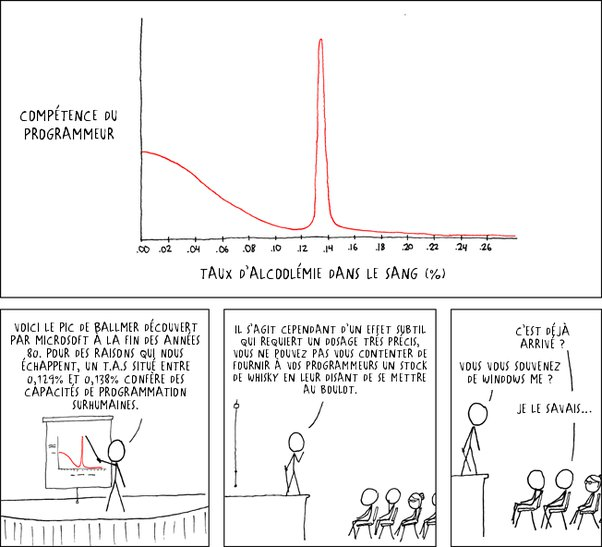

*Article initialement publié sur [Quora](https://fr.quora.com/Qu-est-ce-que-la-loi-de-Balmer/answer/Dr-Goulu)*

Vous voulez parler de la [Formule de Balmer](w:) qui permet de connaître la [longueur d'onde](w:) des [photons](w:Photon) émis lors des [transitions](w:Transition_électronique) des [niveaux excités](w:Niveau_excité) n > 2 de l'[atome](w:) d'[hydrogène](w:), ou du [Pic de Ballmer](https://xkcd.lapin.org/index.php?number=323) (avec deux L) qui détermine les compétences de programmation en fonction du taux d’alcoolémie ?

