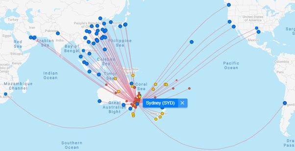

*Article initialement publié sur [Quora](https://fr.quora.com/Pourquoi-les-avions-ne-traversent-ils-pas-le-Pacifique/answer/Dr-Goulu)*

Un site découvert récemment dont je ne me lasse pas : [FlightConnections.com](https://www.flightconnections.com/)

En cliquant sur un aéroport il montre toutes les routes qui en partent. Rien que depuis Sydney il y a 6 vols trans-Pacifique, et 1 trans-Indien à peine moins long:

