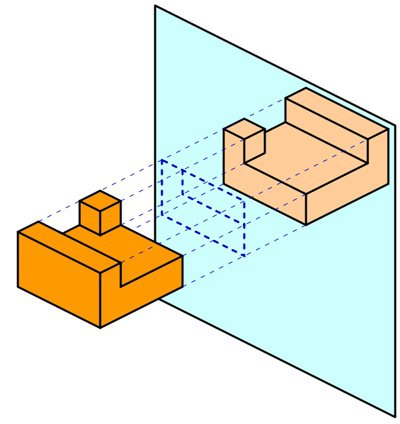

*Article initialement publié sur [Quora](https://fr.quora.com/Si-nous-tenons-une-page-dun-livre-devant-un-miroir-nous-voyons-les-lettres-lat%C3%A9ralement-invers%C3%A9es-Pourquoi-cela-se-produit-il/answer/Dr-Goulu)*

Excellente question. Je dirais même plus : pourquoi un miroir inverse la gauche et la droite, et pas le haut et le bas ?

En fait un miroir crée une image par [Réflexion](w:Réflexion_(mathématiques)), ou symétrie par rapport à un plan. Cette opération n’est pas une rotation, mais une “inversion de la profondeur”, un peu comme le “retournement” d’un gant droit donne un gant gauche :

Maintenant pour des lettres qui n’ont pas d’épaisseur, ben … c’est la même chose avec une épaisseur qui devient très très faible …

Illustrations tirées de mon article [MIROIR | ЯIOЯIM - Pourquoi Comment Combien](/2009/04/04/miroir/) consacré à la symétrie sous toutes ses fomes
