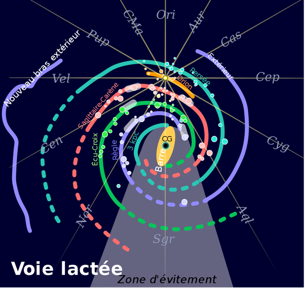

*Article initialement publié sur [Quora](https://fr.quora.com/Si-aucune-sonde-ne-voyageait-en-dehors-de-notre-galaxie-comment-%C3%A9tait-il-possible-didentifier-la-forme-de-la-Voie-Lact%C3%A9e/answer/Dr-Goulu)*

Aucune sonde ne voyage en dehors de notre galaxie. La plus lointaine , [Voyager 1](https://voyager.jpl.nasa.gov/mission/status/), est à 145 [Unités astronomique](w:Unité_astronomique)s, soit 0,00229281 années-lumière, même pas un jour lumière. Certains prétendent qu’elle a quitté le système solaire, mais les mêmes diraient que vous quittez Paris dès que vous sortez de la Place de l’Etoile… [[1]](#maCNm).

La Voie Lactée ayant 100′000 années lumière de diamètre et 1000 d’épaisseurs (notez la précision des chiffres qui signifie en fait “à un facteur 2 ou 3 près” …), on est à des millénaires, voire des millions d’années de pouvoir prendre une photo de la Voie Lactée de l’extérieur.

La [structure de la Voie Lactée](w:Voie_lactée) est tirée de nos observations astronomiques (masquées en partie par le centre galactique, d’où la “zone d’évitement” de la figure ci-dessous), extrapolées en fonction des observations d’autres galaxies. C’est très approximatif, très récent et encore âprement discuté.

Notes de bas de page

[[1]](#cite-maCNm)[Non, Voyager 1 n'a pas quitté le système solaire - Pourquoi Comment Combien](/2013/09/18/non-voyager-1-na-pas-quitte-le-systeme-solaire/#.XKTKs5iiGCo)
