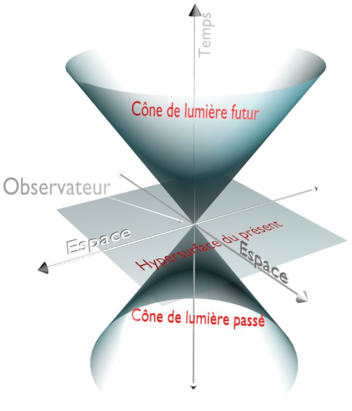

*Article initialement publié sur [Quora](https://fr.quora.com/Quelle-est-la-diff%C3%A9rence-entre-le-temps-et-l-espace-temps/answer/Dr-Goulu)*

90 degrés.

Le temps est une dimension orthogonale (perpendiculaire) à l’espace dans les équations d’Einstein, dont l’[Espace de Minkowski](w:) est la solution la plus simple.

