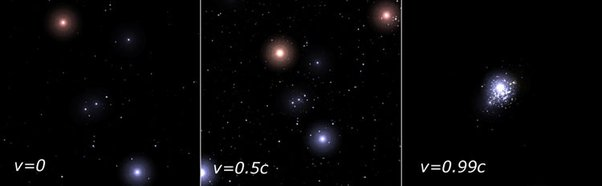

*Article initialement publié sur [Quora](https://fr.quora.com/Si-je-pouvais-voyager-%C3%A0-la-vitesse-de-la-lumi%C3%A8re-que-verrais-je/answer/Dr-Goulu)*

Ce site collecte de nombreuses simulations de déplacements à vitesse relativiste : [Visualization of special relativity](https://www.spacetimetravel.org/ueberblick/ueberblick1.html) .

Un jeu du MIT permet même de vous amuser un peu dans un univers où la vitesse du temps est (beaucoup) ralentie : [A Slower Speed of Light](http://gamelab.mit.edu/games/a-slower-speed-of-light/)

Dans l’espace, pendant qu’un vaisseau accélère à vitesse relativiste, la position apparente des étoiles se déplace vers l’avant du vaisseau et se décale vers le bleu. Avant que le temps ne s'arrête, vous ne voyez plus qu’un petit point très lumineux devant vous.

source : [What would a relativistic interstellar traveller see?](http://math.ucr.edu/home/baez/physics/Relativity/SR/Spaceship/spaceship.html)

Bref, vous voyez exactement l’inverse de ce que montre le passage en vitesse lumière de Star Wars …
