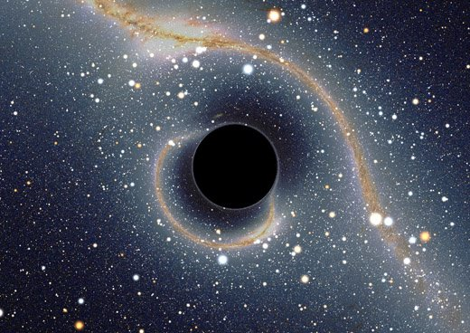

*Article initialement publié sur [Quora](https://fr.quora.com/La-lumi%C3%A8re-avance-t-elle-tout-droit-%C3%A0-linfini/answer/Dr-Goulu)*

Tout droit dans un espace courbé par les masses, mais oui.

image © Alain Riazuelo /IAP janvier 2008 La voûte céleste telle que la verrait un observateur situé près d'un hypothétique trou noir devant le centre de notre galaxie. À cause de la déflexion de la lumière passant près du trou noir, l'image de la Voie lactée n'est plus rectiligne, et les principales constellations sont très déformées. Une image secondaire de toute la voûte céleste se trouve enroulée dans un cercle à proximité immédiate de la silhouette du trou noir.
