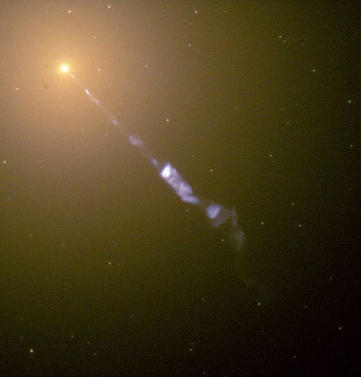
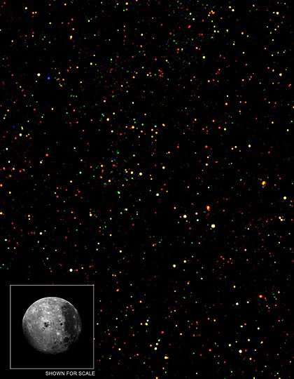

*Article initialement publié sur [Quora](https://fr.quora.com/Comment-les-astronomes-ont-ils-appris-lemplacement-du-trou-noir-M87/answer/Dr-Goulu)*

[M87](w:) est l’une des [Radiosources](w:Radiosource) les plus puissantes du ciel. Impossible de la manquer avec un radiotélescope. En 1947 déjà, la source a été localisée au centre de M87. On a assez vite compris que cette émission était due à de la matière accélérée par objet si gros que ça ne pouvait être qu’un trou noir.

En 1918, l'astronome américain [Heber Doust](w:Heber_Doust_Curtis)avait déjà remarqué « *un curieux rayon droit… apparemment connecté au noyau par une fine ligne de matière*». On le voit super bien sur des images de Hubble:

En 1970, une équipe a montré que ce [Jet relativiste](w:Jet_(astrophysique)) provient exactement de la source radio. Enfin, le [télescope spatial Chandra](w:Chandra_(télescope_spatial)) a permis de localiser avec une grande précision le trou noir par son émission de rayons X, typique des trous noirs.

Grâce à Chandra on connaît désormais la position de millions de trous noirs , M87 n’est que le plus facilement observable.

(image Chandra : chaque point est une source de rayons X, très probablement un trou noir)

Voir :

- Chandra [Photo Album :: M87 :: April 10, 2019](http://chandra.si.edu/photo/2019/black_hole/)
- [How to hunt for a black hole with a telescope the size of Earth](https://www.nature.com/news/how-to-hunt-for-a-black-hole-with-a-telescope-the-size-of-earth-1.21693)
