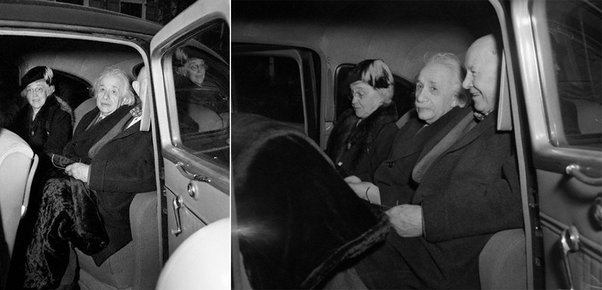
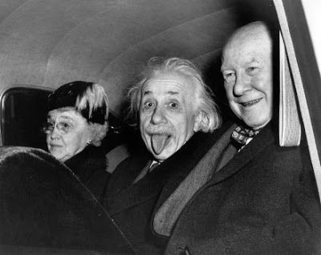

*Article initialement publié sur [Quora](https://fr.quora.com/Pourquoi-Albert-Einstein-tire-la-langue/answer/Dr-Goulu)*

C’était le soir de ses 72 ans, il était dans une voiture avec des amis, il était fatigué

et il en avait marre d’être harcelé par les journalistes, alors quand l’un d’eux a demandé qu’il sourie par la photo, il a fait ça:

Bref, c’était un être humain normal.

source : [Mais pourquoi Einstein tire-t-il la langue ?](https://www.nouvelobs.com/photo/20160804.OBS5841/mais-pourquoi-einstein-tire-t-il-la-langue.html)
