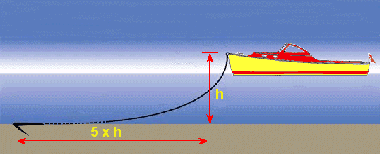

*Article initialement publié sur [Quora](https://fr.quora.com/Comment-une-ancre-emp%C3%AAche-t-elle-un-navire-de-bouger-quand-son-poids-est-beaucoup-plus-l%C3%A9ger-que-le-bateau-lui-m%C3%AAme/answer/Dr-Goulu)*

Le poids de l’ancre n’a que peu d’importance. Ce qui est important c’est le poids et la longueur de la chaîne. Il faut que sous tension, la chaîne soit posée horizontalement au fond pour que l’ancre, qui peut être très légère, se plante dans le fond comme une charrue. D’ailleurs les ancres ont une forme de soc de charrue, et souvent une barre pour que l’ancre soit forcée de se planter.

L’erreur du débutant quand son ancre ne tient pas, c’est de la relever et de la mettre ailleurs. Le pro rajoute de la chaîne.
