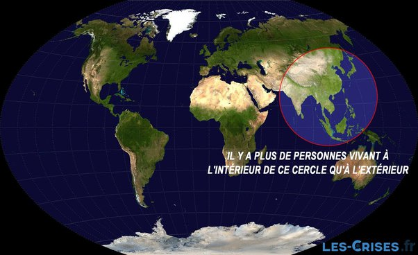

*Article initialement publié sur [Quora](https://fr.quora.com/Quel-est-le-probl%C3%A8me-avec-l-id%C3%A9e-d-un-gouvernement-mondial-Chaque-fois-que-je-lis-sur-le-sujet-cela-est-consid%C3%A9r%C3%A9-comme-n%C3%A9gatif-mais-cela-semble-%C3%AAtre-un-moyen-positif-de-g%C3%A9rer-la/answer/Dr-Goulu)*

Vous partez évidemment du principe que vous seriez président, ou que vous seriez dans la majorité qui a élu un gouvernement qui partage vos valeurs, vos principes démocratiques etc. n’est-ce pas ?

Alors commençons par un petit détail :

Pour respecter les minorités, dont vous faire partie, on a rien inventé de mieux que la décentralisation. En plus, elle permet de “voter avec ses pieds” en allant s’établir ailleurs si on est persécuté, ruiné ou simplement malheureux là où on est.

Déjà avec de petits gouvernements locaux on voit de la corruption, du népotisme, des gens de pouvoir déconnectés de la vie quotidienne des citoyens, alors un “gouvernement mondial”, j’ose même pas imaginer.

Ou plutôt je veux voir une “constitution mondiale” avec un système électoral accepté disons par 90% des humains avant.
