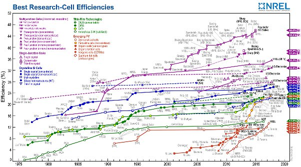
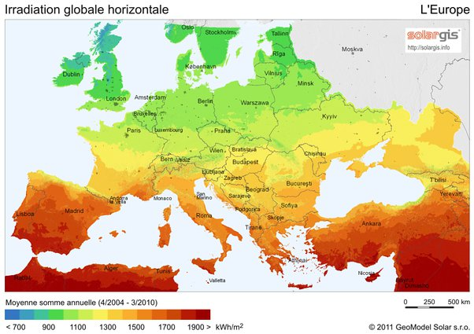

*Article initialement publié sur [Quora](https://fr.quora.com/Quels-sont-les-diff%C3%A9rents-rendements-des-panneaux-solaires-%C3%A0-travers-le-monde/answer/Dr-Goulu)*

Le tableau suivant montre l’évolution des rendements des cellules photovoltaïques[[1]](#MUHku) .

Mais attention:

1. Les rendements “record” annoncés à ~46% sont obtenus avec des [cellules photovoltaïque à concentration](w:Panneau_photovoltaïque_à_concentration) qui nécessitent des miroirs suivant le soleil etc. Ce n’est pas adapté aux petites installations sur le toit
2. Les technologies dominantes (bon marché) actuellement sont le Silicium cristallin (bleu) et le “thin film” (vert), avec des rendements annoncés **de 20 à 25%**.
3. La manière de mesurer ces rendements est normalisée et la norme ne correspond pas à une utilisation “normale” de grandes surfaces [[2]](#zItzg) . La norme surestime le rendement réel de 5 à 10% environ.
4. De plus, comme la Terre tourne, a des saisons etc, sous nos latitudes, on reçoit un rayonnement solaire moyen d’environ 15% du max du 21 juin à midi. ce que confirme une carte comme celle-ci :

En une année l’éclairement n’est que de 1300 kWh/m2 au centre de la France, ce qui fait 150 watt de moyenne d’éclairement alors que le Soleil éclaire avec une puissance de 1300 W/m2… Et votre (bon) panneau va capter 25% de ces 150 watt donc dans les 40 watt par m2 en moyenne sur l’année.

Et si c’était votre question, vous voyez aussi que l’éclairement varie du simple au triple entre l’Afrique du Nord et l’Europe du Nord …

Notes de bas de page

[[1]](#cite-MUHku)[A Review of the Energy Performance and Life-Cycle Assessment of Building-Integrated Photovoltaic (BIPV) Systems](https://www.mdpi.com/1996-1073/11/11/3157/htm)

[[2]](#cite-zItzg)[Comment on mesure le rendement des cellules solaires - Pourquoi Comment Combien](/2010/05/09/comment-on-mesure-le-rendement-des-cellules-solaires/#.XLYug-iiGCp)
