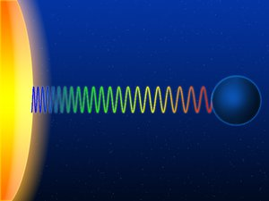

*Article initialement publié sur [Quora](https://fr.quora.com/Pouvez-vous-expliquer-la-physique-dun-trou-noir-%C3%A0-un-enfant-de-5-ans-ou-%C3%A0-mon-cerveau-inepte/answer/Dr-Goulu)*

J’essaie.

Sur la Lune , les astronautes ont pu gambader alors qu’ils avaient une combinaison de 70 kg :

[https://www.youtube.com/watch?v=...](https://www.youtube.com/watch?v=HKdwcLytloU)

Ensuite ils ont pu décoller avec une toute petite fusée

[https://www.youtube.com/watch?v=...](https://www.youtube.com/watch?v=9HQfauGJaTs)

C’est parce que la Lune est plus légère (on dit plutôt “moins massive”) que la Terre. Elle attire presque 6 fois moins fort les objets qui s’y trouvent. Pour qu’une fusée échappe à la gravité de la Terre, il faut qu’elle aille à 40320 km/h alors que pour échapper à la Lune il suffit de 8640 km/h. Cette vitesse qui permet de s’échapper d’un astre s’appelle la [Vitesse de libération](w:).

Pour un astre beaucoup plus massif, la vitesse de libération est beaucoup plus grande. Pour le Soleil, c’est 2223000 km/h. Pour des vitesses si élevées, on préfère les km par seconde. Pour le Soleil c’est 617.5 km/s. Ca semble beaucoup, mais ce n’est que 2 millièmes de la vitesse de la lumière. Pourtant on arrive à voir ceci dans la lumière qui nous parvient du Soleil : elle ne ralentit pas, mais elle est plus rouge qu’elle ne devrait. Ca s’appelle le [Décalage d'Einstein](w:)

Alors que se passerait-il si un astre était 500x plus massif que le Soleil ? La vitesse de libération serait supérieure à celle de la lumière, et rien, même pas la lumière ne pourrait s’échapper de cet astre.

Un trou noir, ce n’est rien d’autre que ça.

Bon en vrai, ce n’est que la première chose étonnante à propos d’eux, il y en a beaucoup d’autres. La deuxième est qu’ils peuvent être moins massifs que 500 Soleils, mais beaucoup plus petits.

La troisième et les suivantes sont sur un article que j’ai écrit sur KidiScience pour les enfants : [Tout savoir sur les trous noirs](http://kidiscience.cafe-sciences.org/articles/tout-savoir-sur-les-trous-noirs/)

Compris ?
