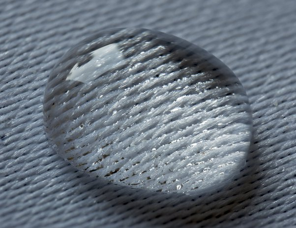

*Article initialement publié sur [Quora](https://fr.quora.com/Quand-leau-monte-sur-un-morceau-de-papier-qui-ne-fait-que-l%C3%A9g%C3%A8rement-leffleurer-do%C3%B9-provient-l%C3%A9nergie/answer/Dr-Goulu)*

La [Capillarité](w:) est un phénomène du à la [Tension superficielle](w:) de l'eau (et de presque tous les liquides).

La tension superficielle est due à la cohésion des molécules en surface et se traduit par une énergie surfacique (en J/m2), un peu comme une surface de caoutchouc étirée. Elle tend donc à minimiser la surface. C'est ce qui donne une forme sphérique aux gouttes notamment.

Si des molécules d'eau “mouillent” un autre matériau en s'attachant à lui, la tension de surface va former un “ménisque” pour minimiser l'énergie de surface. Mais dès qu'une surface de liquide est courbe, il se produit une différence de pression entre l'eau et l'air, dirigée vers le centre de courbure. C'est la [Pression de Laplace](w:). Dans le cas de la capillarité, cette différence de pression est orientée vers le centre du ménisque, dans l'air.

Cette différence de pression va donc aspirer l'eau vers le haut jusqu'à ce qu'elle s'équilibre avec la différence de pression atmosphérique. La hauteur est donnée par la [Loi de Jurin](w:) et peut dépasser le mètre dans des tubes très fins ou une structure poreuse comme du papier.

C'est donc l'énergie de tension superficielle qui fournit l'énergie “mécanique” qui fait monter l'eau.

Voir aussi [TENSION Superficielle](https://femto-physique.fr/mecanique_des_fluides/tension-de-surface.php) sur femto physique
