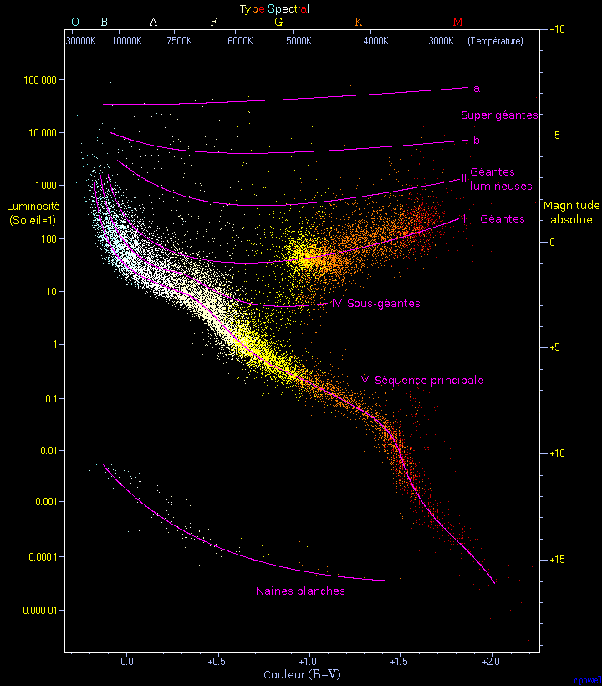

*Article initialement publié sur [Quora](https://fr.quora.com/Comment-pouvons-nous-savoir-avec-certitude-que-le-soleil-va-exploser-ou-que-lunivers-se-terminera-dans-nimporte-quel-sc%C3%A9nario/answer/Dr-Goulu)*

Le Soleil ne va pas exploser. Son [évolution](w:Soleil) en géante rouge puis naine blanche est connue parce qu’on connaît des milliers d’étoiles qu’on a pu placer dans le [Diagramme de Hertzsprung-Russell](w:) et retracer leur évolution. Le Soleil est une des très nombreuses étoiles suivant la [Séquence principale](w:).

Pour la fin de l’Univers, c’est moins certain parce qu’on ne comprend encore pas bien son expansion, notamment l’ “énergie noire”, ni la durée de vie des protons et des trous noirs, mais aussi parce qu’on ne connaît pas la courbure de l’Univers (s’il en a une…) ni, plus fondamentalement, ce qu’est vraiment le temps.

Le consensus actuel tourne autour de variations de [Mort thermique de l'Univers](w:), déduite des observations

> L'état final de l'univers dépend des suppositions au sujet de son [destin ultime](w:Destin_de_l'univers), qui ont considérablement varié des dernières années du xxe siècle aux premières du xxie siècle. Dans un [univers fermé](w:Big_Crunch), caractérisé par un effondrement final, la mort thermique se produit avec l'univers se rapprochant d'une température arbitrairement élevée et de l'entropie maximale à l'approche de la fin de l'effondrement. Dans le cas d'un Grand Gel, c'est-à-dire d'un [univers ouvert](w:Courbure_de_l'univers) ou d'un [univers plat](w:Courbure_de_l'univers), dont l'expansion continue indéfiniment, une mort thermique est également prévue, lorsque l'univers se refroidit jusqu'à ce que la température se rapproche du [zéro absolu](w:) et que l'entropie atteigne un état maximal pendant une très longue durée. Il y a discussion sur le fait qu'un univers en expansion puisse approcher un état d'entropie maximale. On a proposé l'idée que dans un univers en expansion, la valeur de l'entropie maximale augmente plus rapidement que le gain en entropie de cet univers, ce qui l'éloignerait progressivement de la mort thermique.

De toutes façons en science on ne peut jamais “savoir avec certitude”. On sait “jusqu’à preuve du contraire”. Mais quand il n’y a pas l’ombre d’une preuve du contraire, le degré de confiance augmente jusqu’à approcher la certitude …
