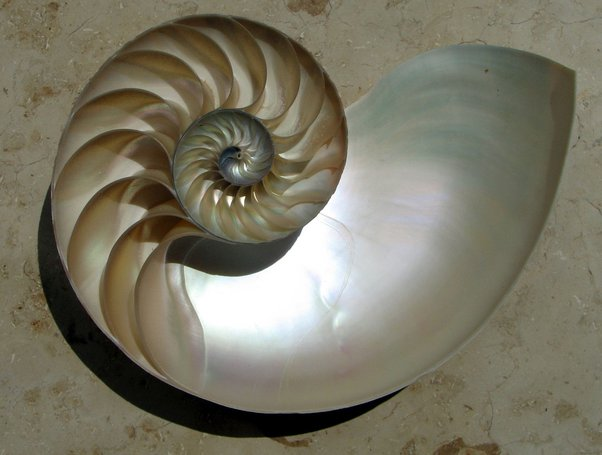

*Article initialement publié sur [Quora](https://fr.quora.com/Existe-t-il-des-relations-math%C3%A9matiques-qui-d%C3%A9finissent-les-formes-rencontr%C3%A9es-dans-la-nature/answer/Dr-Goulu)*

Qui définissent, non. Qui décrivent, oui.

Avant de revenir à la question, laissez-moi dire pourquoi cette distinction est importante. Si vous dites que les relations mathématiques “**définissent**” des phénomènes naturels, alors ces relations mathématiques doivent être “écrites” quelque part et la nature doit avoir une manière de les “lire” et de les exécuter.

Or à part peut-être l’ADN, il n’y a strictement rien dans la nature qui ressemble à des informations qu’un système peut lire et exécuter. Un atome radioactif n’a pas de fonction `random(time/halflife)` pour décider quand se désintégrer, la Lune ne calcule pas sa force de gravitation universelle avec la Terre pour savoir où aller, un tournesol n’a pas de programme calculant la séquence de Fibonacci pour savoir comment arranger ses graines, etc.

Par contre nous, humains, mathématiciens, physiciens, et probablement toute autre espèce intelligente, sommes capables de **décrire**ce que nous observons sous forme de “modèles”, de regrouper ces “modèles” par similitude (par exemple la [Loi en carré inverse](w:)) pour en tirer des “lois” plus générales, et, grâce aux mathématiques, de faire des calculs prévisionnels : quand aura lieu le prochain solstice, à quel angle incliner le canon pour zigouiller l’ennemi, combien de personnes faut-il vacciner pour éradiquer la variole etc.

Mais là, les relations mathématiques sont dans nos bouquins, dans nos cerveaux et nos ordinateurs. La nature n’en a rien à battre, elle continue à faire ce qu’elle a toujours fait et que je ne peux justement pas décrire sans utiliser les “relations mathématiques” ci-dessus puisque c’est justement à ça qu’elles servent : décrire.

Par exemple, plein de gens s’émerveillent de ce que la coquille du Nautile suive une [Spirale logarithmique](w:) (et pas forcément une [Spirale d'or ou de Fibonacci,](w:Spirale_d'or) en passant.. )

C’est vrai que c’est beau, mais c’est le contraire : c’est la spirale logarithmique qui suit la coquille du Nautile !

Le Nautile ne fait que grandir dans sa coquille et l’agrandit en utilisant le moins de matière possible, en évitant de créer des discontinuités de courbure qui fragiliseraient sa coquille. C’est nous qui, en observant le Nautile, avons compris qu’il est un gros flemmard qui minimise l’énergie comme nous tous et même pratiquement tout dans l’Univers (“loi plus générale” obtenue en regroupant de nombreuses observations distinctes) et que ceci conduit à l’apparition de spirales logarithmiques.

Vous saisissez la nuance ? Alors je vous ai converti au [Nominalisme](w:) :-)

Et un [idéaliste platonicien](w:Idéalisme_(philosophie))de moins, un !

voir aussi : [Nombre d'or et abeilles - Pourquoi Comment Combien](/2016/07/03/nombre-dor-et-abeilles/)
