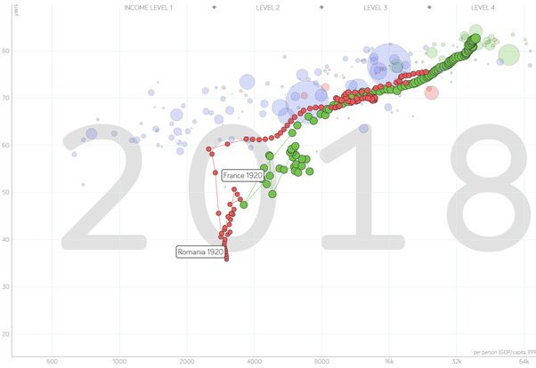

*Article initialement publié sur [Quora](https://fr.quora.com/La-Roumanie-est-elle-encore-un-pays-pauvre/answer/Dr-Goulu)*

Tout est relatif. L’outil que j’utilise pour répondre à ce genre de questions c’est [Gapminder Tools](https://www.gapminder.org/tools/#$state$time$value=2018;&marker$select@$country=rou&trailStartTime=1920;&$country=fra&trailStartTime=1920;;&color$data=data_fasttrack&which=g77_and_oecd_countries&spaceRef=entities;;;&chart-type=bubbles), qui permet de comparer toutes sortes de données entre pays et leur évolution au cours du temps. En comparant le PIB par habitant et l’espérance de vie du Roumain et du Français depuis 1920 on voit ça:

En gros à part des périodes de l’histoire troublées, les deux pays ont suivi des évolutions comparables : ils avaient ~10 ans d’espérance de vie de différence en 1920, il y a toujours le même écart en 2018, et l’écart de PIB s’est un peu accru, mais pas notablement.

La Roumanie actuelle correspond grosso-modo à la France de 1981. A vous de voir si ça la définit comme “pays pauvre” …
