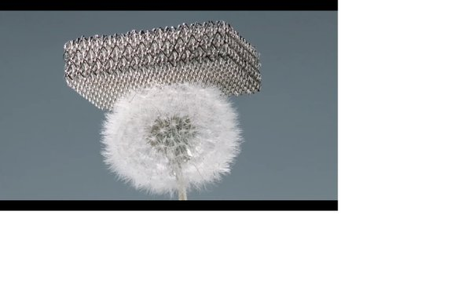
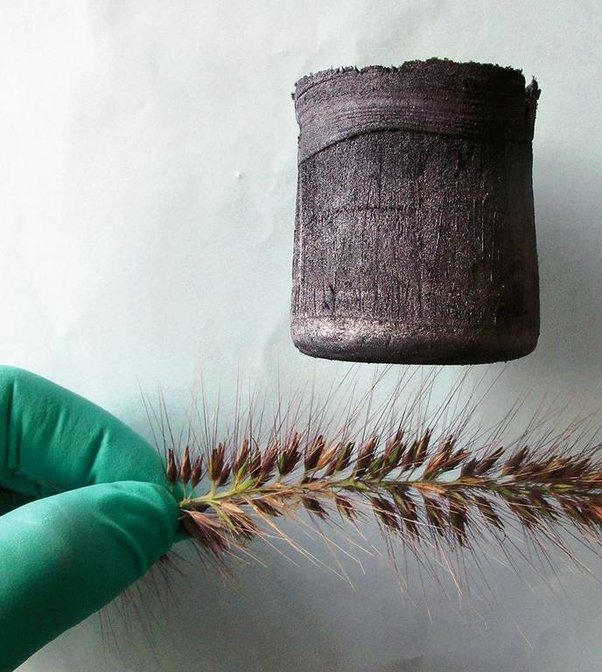

*Article initialement publié sur [Quora](https://fr.quora.com/Quels-sont-les-mat%C3%A9riaux-artificiels-les-plus-l%C3%A9gers-du-monde/answer/Dr-Goulu)*

La bulle de savon, ça doit être pas loin du record…

Mais j’imagine que vous voulez un “solide”… Alors il y a:

- Le “microlattice” de Boeing et General Motors, composé de 99,99% d’air et de 0.01% de petits tubes d’acier:

- L’aérographite chinois, d’une densité de 0,16 mg/cm , soit 7,5 fois inférieure à celle de l'air :

- Sinon le MIT a fait un matériau imprimable en 3D ayant une densité de 5% de celle de l’acier, mais 10x plus résistant:

[https://www.youtube.com/watch?ti...](https://www.youtube.com/watch?time_continue=17&v=VIcZdc42F0g)
