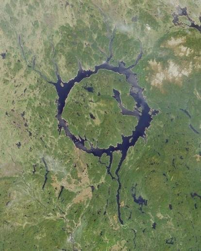
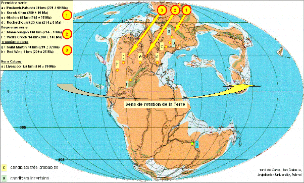

*Article initialement publié sur [Quora](https://fr.quora.com/Quels-sont-les-plus-gros-crat%C3%A8res-provoqu%C3%A9s-par-des-m%C3%A9t%C3%A9orites-sur-Terre/answer/Dr-Goulu)*

La [Liste est là :](w:en:List_of_impact_craters_on_Earth)

1. [Vredefort](w:en:Vredefort_crater), diamètre de 160km, 2023 millions d’années
2. [Chicxulub](w:en:Chicxulub_crater), 150 km, 66 MA
3. [Sudbury](w:en:Sudbury_Basin), 130 km , 1849 MA
4. [Popigai](w:en:Popigai_crater). 100 km, 35 MA
5. mon préféré : [Manicouagan](w:en:Manicouagan_crater), 100 km, 215 MA

extraordinairement visible depuis qu’un barrage a été construit (en bas sur la photo) ce qui forme un lac dans le cratère :

Il semblerait que cet impact ait pu se former en même temps que 3 à 8 autres lorsqu’un gros objet se serait fragmenté à la [Limite de Roche](w:) et que les morceaux auraient frappé la Terre en chaîne lorsqu’elle ressemblait à ça:

Un de ces impacts est à Rochechouart : [de Manicouagan à Rochechouart - Pourquoi Comment Combien](/2009/04/16/de-manicouagan-a-rochechouart/)
