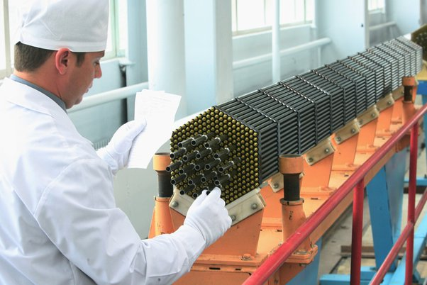
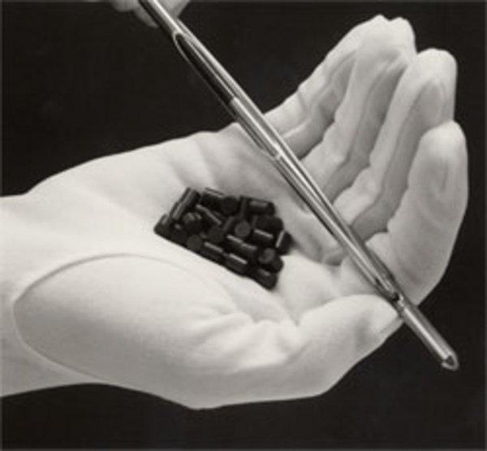

*Article initialement publié sur [Quora](https://fr.quora.com/Une-personne-peut-elle-se-tenir-en-toute-s%C3%A9curit%C3%A9-%C3%A0-c%C3%B4t%C3%A9-d-une-barre-de-combustible-nucl%C3%A9aire/answer/Dr-Goulu)*

Apparemment oui selon les photos de [Assemblage combustible — Wikipédia](w:Assemblage_combustible) :

Les opérateurs portent des gants car la [Radiotoxicité](w:Uranium) de l’Uranium faiblement enrichi (3% de U235) utilisé comme combustible est inférieure à sa [Toxicité chimique](w:Uranium), qui est comparable aux autres métaux lourds.
