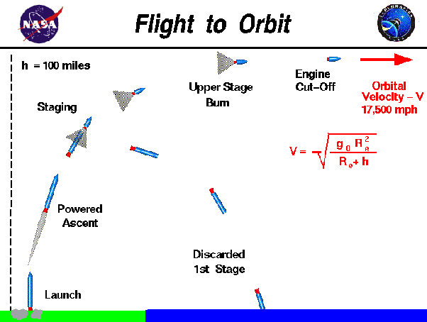

*Article initialement publié sur [Quora](https://fr.quora.com/Pourquoi-les-fus%C3%A9es-sont-elles-lanc%C3%A9es-verticalement/answer/Dr-Goulu)*

Elles ne le sont pas. Ou juste au début, mais leur trajectoire s’incurve rapidement vers l’est pour que leur vitesse s’additionne à celle de la rotation de la Terre (raison pour laquelle les bases de lancement sont proches de l’Equateur), le but étant d’atteindre une vitesse tangentielle (“horizontale”) permettant la mise en orbite.

